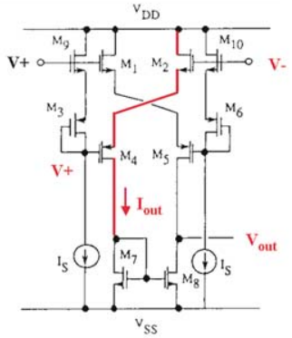
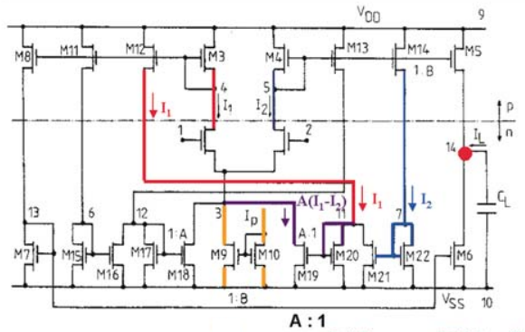
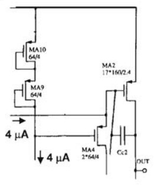
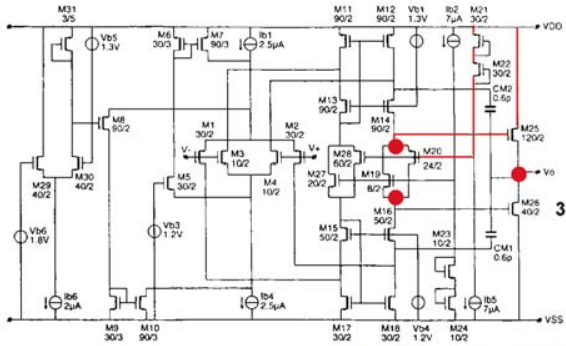
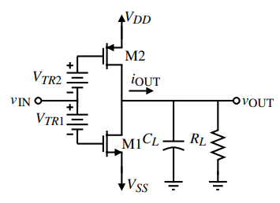
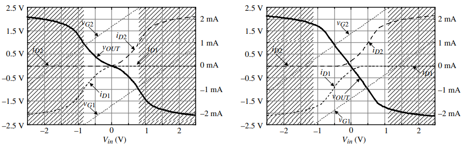

# Razavi《模拟CMOS集成电路设计》笔记

## 运算放大器

# Sansen《模拟集成电路设计精粹》笔记

## MOSFET模型

### 工作区域

- 截止区
- 线性区
- 饱和区：$V_{DS} > V_{GS} - V_{th}$，用作放大器。接下来几节都讨论MOSFET放大器
  - 弱反型区（指数区）：即拉扎维书中的亚阈值导电区。过驱动电压很小、电流很小时，$I_D = I_{D0} \cdot exp(V_{GS} / \xi V_T)$，其中$V_T = kT/q$
  - 强反型区（平方律区）：普通的饱和区，$I_D = \frac{1}{2} \beta (V_{GS} - V_{th})^2$
  - 速度饱和区：过驱动电压较大、电流较大时，电子速度饱和，$I_D \propto V_{GS} - V_{th}$

一些无关紧要的细节：$K = \mu C_{ox}$称工艺参数；$\beta = \mu C_{ox} \frac{W}{L}$

### 跨导

$$
\begin{aligned}
g_m &= K \frac{W}{L} (V_{GS} - V_{th}) \\
    &= \sqrt{2 K \frac{W}{L} I_D} \\
    &= \frac{2I_D}{V_{GS} - V_{th}}
\end{aligned}
$$

设计过程中，往往固定$I_D$和过驱动电压，宽长比可以随意改变，因此常用第三个表达式。第三个表达式同时也不包含工艺参数，是最精确的

这个式子同时也说明过驱动电压决定放大器电流效率$g_m / I_D$。注意，此跨导公式是近似值，仅适用于强反型区，因此不可能通过让$V_{GS} - V_{th} \to 0$获得无穷跨导

### 本征增益

$$
A_v = g_m r_o = \frac{2I_D}{V_{GS}-V_{th}} \cdot \frac{1}{\lambda I_D} \propto \frac{2L}{V_{GS}-V_{th}}
$$

若想提高增益，可以a) 增加沟道长度；b) 降低过驱动电压；c) 采用其他电路技术，如共源共栅

若想要高速度，则a) 减小沟道长度；b) 提高过驱动电压。与提高增益矛盾

### 放大器的工作区域

- 弱反型区：此区域$g_m / I_D$最大，但是$g_m$和$I_D$的值都很小，导致速度低、信噪比低，除非是低功耗设计，不应该进入此区域
- 强反型区：大多数设计都应该在此区域。同时，为了更大的$g_m$、更高的$g_m / I_D$，希望工作在接近弱反型区的地方，**典型的$V_{GS} - V_{th}$取值为0.15 ~ 0.2V**
- 速度饱和区：在此区域，增加电流不能增大$g_m$，很不划算，除非是高速设计，不会偏置到此区域。高速电路的典型取值是$V_{GS}-V_{th} = 0.5V$

补充1：弱反型区的边界大约在$V_{GS} - V_{th} = 70mV$，这个数值与工艺无关，因此典型过驱动电压的取值对目前的工艺仍然适用；速度饱和区的边界与工艺有关，随着沟道长度减小而变小，对130nm工艺它大约是0.6V。工艺小于65nm之后，强反型区变得很窄，可以说只是弱反型和速度饱和区之间的过渡区

补充2：弱反型区和强反型区的转变点电流定义为$I_{Dt}$，研究弱反型区电路时有时用它来归一化电流$i = I_D / I_{Dt}$。归一化的电流也称作反型系数。真实电路（以及一些比较复杂的模型）转变并不是突变，$0.1 < i < 10$时是转折区

### 特征频率

$$
\begin{aligned}
f_T &= \frac{g_m}{2 \pi C_{GS}} \\
    &= \frac{1}{2\pi} \cdot K\frac{W}{L}(V_{GS}-V_{th}) \cdot \frac{1}{WLC_{OX}} \\
    &= \frac{K}{2 \pi C_{OX}} \cdot\frac{V_{GS} - V_{th}}{L^2}
\end{aligned}
$$

可见，增大过驱动电压、减小沟道长度，能够获得更好的高频性能。（上式用了一些近似，不过趋势是相同的）

但是，进入速度饱和区之后，$f_T \propto 1/L$

## 驱动放大器

通常用Class-AB放大器：静态电流很小，但能驱动最大电流很大。通常需要电流扩展特性，随着$V_{in}$增大，输出电流增加比线性更快

**交叉耦合四重模块**

基本原理是通过源极跟随器+二极管接法的MOS管实现固定压差，再通过交叉耦合完成电流扩展

M9作为源极跟随器，跟随黑色$V_+$得到红色$V_+$，两个V+之间压差固定（记为$V_{AB}$）。对于红色支路，M2栅极电压为$V_-$，M4栅压为$V_+ - V_{AB}$

$V_+ = V_-$时，M2与M4处于亚阈值区，静态电流很小；$V_+ < V_-$时，M2与M4饱和，同时另一支路M1与M5截止，$I_{out} = \frac{1}{2} \beta_2 (V_- - V_{S2} - V_{TN})^2 = \frac{1}{2} \beta_4 (V_{S2} - V_+ + V_{AB} - V_{TP})^2$，可以证明$V_{S2} \approx const$，因此电流正比于输入电压的平方，输出电流大于静态电流，具有扩展特性

**自适应偏置**

若$I_1 > I_2$，红色支路复制$I_1$，蓝色支路复制$I_2$，再通过紫色支路复制得到$A(I_1 - I_2)$，尾电流为$I_P + A(I_1 - I_2)$；反之，则由M17、M18等MOS管复制，尾电流为$I_P + A(I_2 - I_1)$。输出电流是尾电流的复制，因此同样具有扩展效应

缺点是M11~M14在非主极点的节点，放大器速度变慢

**跨导线性环**

跨导线性环是提供线性关系的电路，比如电流镜能够提供线性电流增益

对下图的电路，$V_{GS2} + V_{GS4} = V_{GS9} + V_{GS10}$，代入$V_{GS} - V_{th} = \sqrt{\frac{I_DS}{K_p (W/L)}}$，得到$\sqrt{\frac{I_{DS2}}{W/L_2}} + \sqrt{\frac{I_{DS4}}{W/L_4}} = \sqrt{\frac{I_{DS9}}{W/L_9}} + \sqrt{\frac{I_{DS10}}{W/L_10}}$。和工艺有关的参数都被消掉了，$\sqrt{I_D}$的关系是线性的。在静态工作点，$I_{DS4} \approx I_{DS9,10}$，输出电流$I_{DS2}$较小；当$I_{DS4}$减小时，输出电流迅速增加，实现电流扩展

下图是一个两级运放，第一级为轨道轨输入的Cascode结构，第二级是跨导线性环输出级：M20、M21、M22、M25（即标红路径的四个晶体管）构成PMOS跨导线性环，与其对称的M16、M23、M24、M26构成NMOS跨导线性环，两个跨导线性环分别推拉电流

另外，可以证明M19、M20的源漏之间（即图中两个红点之间）是交流高阻，可以理解为给输出级推拉共源极之间提供了固定压差

**电流反馈型**

## 低功耗Σ-Δ ADC

### 开关运算放大器

对于传输门开关，若$V_{DD} < V_{TN} + V_{TP}$，在$V_{DD} - V_{TN} < V < V_{TP}$时，P、N管都不导通。因此，低电源电压时不可用。可以用开关运算放大器替代

只有放大器输入、输出端会在传输门开关失效的范围，开关运放就是在运放基础上加了一个控制是否工作的开关

# Allen《CMOS模拟集成电路设计》笔记

## 单级放大器

### 输出放大器

输出放大器具有驱动小电阻（50~1000Ω）和 / 或大电容（5~1000pF）能力。重要参数包括输出电流（驱动电容的能力）、输出电阻（驱动电阻的能力）、一般放大器的重要参数（带宽、摆幅等）

**Class-A**

最大的拉电流（sourcing current）或灌电流（sinking current）等于静态电流。普通的共源极、源极跟随器都属于Class-A。线性度较好，但提高驱动能力需要提高静态电流，驱动大负载时功耗非常大

定义放大器的效率（Efficiency）为输出功率与总功率之比。假设输出为正弦波，则输出功率为$\frac{V_{PP}^2}{8 R_L}$，其中$V_{PP}$为输出信号峰峰值；电路消耗功率为$(V_{DD} - V_{SS}) \times I_Q$，其中$I_Q$为尾电流。摆幅最大为$V_{PP} = V_{DD} - V_{SS}$，尾电流取最小值为$I_Q = \frac{V_{PP}}{2 R_L}$，此时效率取最大值$\eta = \frac{V_{PP}}{4(V_{DD} - V_{SS})} = 25 \%$

**Class-B & Class-AB**

Class-B和Class-AB的输出电流并不受限于静态电流。下图是推拉式共源放大器原理图

对于B类放大器，在静态工作点，$V_{TR1}$和$V_{TR2}$能让M1和M2都处于截止区边缘，静态电流为0；当$V_{in}$增大，M2截止，M1饱和，全部电流由M1提供；反之，全部电流由M2提供。假设输出信号为正弦波，则效率$\eta = \frac{V_{out} I_D}{V_{DD} I_D}$，类似Class-A的计算，可以得到效率$\eta = \frac{\pi}{4} = 78.5 \%$

对于AB类放大器，在静态工作点M1和M2都处在饱和区，有静态电流。下图是Class-B以及Class-AB的输出电压电流特性

简单的总结一下：

| 类型     | 功耗 | 线性度         |
| -------- | ---- | -------------- |
| Class-A  | 高   | 高             |
| Class-B  | 低   | 低（交越失真） |
| Class-AB | 中等 | 中等           |

# Gray《模拟集成电路的设计与分析》笔记

# 设计方法论

模拟电路中每个晶体管都有多个设计参数，沟道长度、宽长比、漏电流等等。哪怕是一个最简单的五管OTA，都有数十个参数，而且大部分参数与电路性能之间的关系是不明确的，需要一套设计方法论来指导如何调整晶体管

## $V_{ov}$设计方法

饱和区长沟道近似
$$
I_D = \frac{1}{2} \mu C_{ox} \frac{W}{L} (V_{gs} - V_{th})^2
$$

MOS管的主要性能参数有跨导效率$\frac{g_m}{I_D} = \frac{2}{V_{ov}}$和本征频率$f_T = \frac{1}{2\pi} \frac{g_m}{C_{gs}} = \frac{1}{2\pi} \frac{2 \mu V_{ov}}{3 L^2}$，可见提高过驱动电压$V_{ov}$就能提高$f_T$、降低$g_m$，反之亦然。$V_{ov}$设计方法就是把过驱动电压当作调整性能的“旋钮”

饱和区电流公式包括了4个设计参数（$I_D$，$W$，$L$，$V_{ov}$）、1个约束方程，因此一个MOS管有3个自由度。将参数变换到我们关注的指标，$g_m/I_D$、$f_T$、$g_m r_o$，各项指标要求就是参数空间内的三个平面，理想化的最优工作点就是三个平面的交点。调控$V_{ov}$和$L$，可以调到这个最优点附近；再通过仿真微调到想要的工作点

## $g_m / I_D$设计方法

此方法比$V_{ov}$方法有几项改进

1. 放弃用$V_{ov}$作为几项性能参数的中介，直接用$g_m/I_D$作为变量
2. 不用长沟道近似公式，使用查找表

使用此方法，需要如下几个查找表

- 本征频率：$f_T$ - $g_m/I_D$
- 本征增益：$g_m r_o$ - $g_m/I_D$
- 偏置：$I_D/W$ - $g_m/I_D$

由于$g_m$，$I_D$，$C_{gs}$都近似与$W$成正比、$r_o$与$W$几乎无关，只要有一个$W_0$的查找表，就能设计任意$W$的MOS管，误差不会超过几个百分点