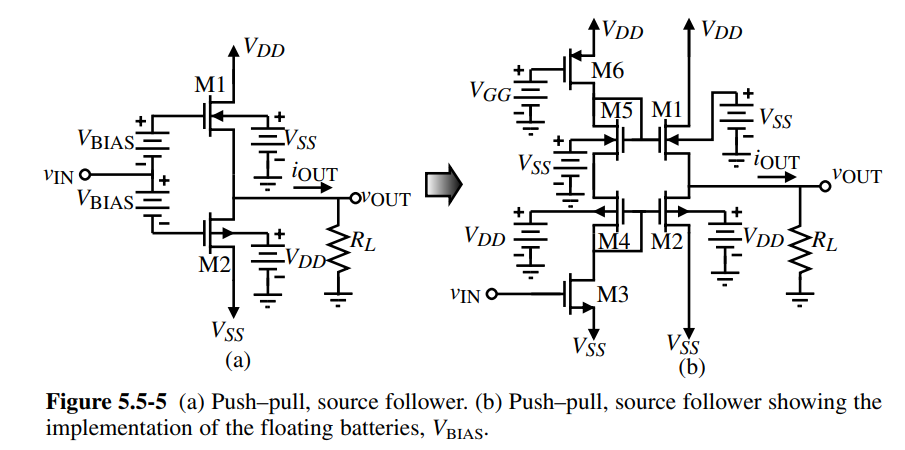

# 《模拟集成电路设计精粹》笔记

## MOSFET模型

### 工作区域

- 截止区
- 线性区
- 饱和区：$V_{DS} > V_{GS} - V_{th}$，用作放大器。接下来几节都讨论MOSFET放大器
  - 弱反型区（指数区）：即拉扎维书中的亚阈值导电区。过驱动电压很小、电流很小时，$I_D = I_{D0} \cdot exp(V_{GS} / \xi V_T)$，其中$V_T = kT/q$
  - 强反型区（平方律区）：普通的饱和区，$I_D = \frac{1}{2} \beta (V_{GS} - V_{th})^2$
  - 速度饱和区：过驱动电压较大、电流较大时，电子速度饱和，$I_D \propto V_{GS} - V_{th}$

一些无关紧要的细节：$K = \mu C_{ox}$称工艺参数；$\beta = \mu C_{ox} \frac{W}{L}$

### 跨导

$$
\begin{aligned}
g_m &= K \frac{W}{L} (V_{GS} - V_{th}) \\
    &= \sqrt{2 K \frac{W}{L} I_D} \\
    &= \frac{2I_D}{V_{GS} - V_{th}}
\end{aligned}
$$

设计过程中，往往固定$I_D$和过驱动电压，宽长比可以随意改变，因此常用第三个表达式。第三个表达式同时也不包含工艺参数，是最精确的

这个式子同时也说明过驱动电压决定放大器电流效率$g_m / I_D$

### 本征增益

$$
A_v = g_m r_o = \frac{2I_D}{V_{GS}-V_{th}} \cdot \frac{1}{\lambda I_D} \propto \frac{2L}{V_{GS}-V_{th}}
$$

若想提高增益，可以a) 增加沟道长度；b) 降低过驱动电压；c) 采用其他电路技术，如共源共栅

若想要高速度，则a) 减小沟道长度；b) 提高过驱动电压。与提高增益矛盾

### 放大器的工作区域 

- 弱反型区：此区域$g_m / I_D$最大，但是$g_m$和$I_D$的值都很小，导致速度低、信噪比低，除非是特别的低功耗设计，不应该进入此区域
- 强反型区：大多数设计都应该在此区域。同时，为了更大的$g_m$、更高的$g_m / I_D$，希望工作在接近弱反型区的地方，**典型的$V_{GS} - V_{th}$取值为0.15 ~ 0.2V**
- 速度饱和区：在此区域，增加电流不能增大$g_m$，很不划算，除非是高速设计，不会偏置到此区域。高速电路的典型取值是$V_{GS}-V_{th} = 0.5V$

补充1：弱反型区的边界大约在$V_{GS} - V_{th} = 70mV$，这个数值与工艺无关，因此典型过驱动电压的取值对目前的工艺仍然适用；速度饱和区的边界与工艺有关，随着沟道长度减小而变小，对130nm工艺它大约是0.6V。工艺小于65nm之后，强反型区变得很窄，可以说只是弱反型和速度饱和区之间的过渡区

补充2：弱反型区和强反型区的转变点电流定义为$I_{Dt}$，研究弱反型区电路时有时用它来归一化电流$i = I_D / I_{Dt}$。归一化的电流也称作反型系数。真实电路（以及一些比较复杂的模型）转变并不是突变，$0.1 < i < 10$时是转折区

### 特征频率

$$
\begin{aligned}
f_T &= \frac{g_m}{2 \pi C_{GS}} \\
    &= \frac{1}{2\pi} \cdot K\frac{W}{L}(V_{GS}-V_{th}) \cdot \frac{1}{WLC_{OX}} \\
    &= \frac{K}{2 \pi C_{OX}} \cdot\frac{V_{GS} - V_{th}}{L^2}
\end{aligned}
$$

可见，增大过驱动电压、减小沟道长度，能够获得更好的高频性能。（上式用了一些估算，不过趋势是相同的）

但是，进入速度饱和区之后，$f_T \propto 1/L$

# 输出放大器

主要参考资料：P. E. Allen, D. R. Holberg, CMOS Analog Circuit Design 3rd edition, 236-247 (section 5.5)

此处讨论的输出放大器（Output Amplifier）是单级放大器，主要用作运放输出级

输出放大器具有驱动小电阻（50~1000Ω）和 / 或大电容（5~1000pF）能力。重要参数包括输出电流（驱动电容的能力）、输出电阻（驱动电阻的能力）、一般放大器的重要参数（带宽、摆幅等）

## Class-A

最大的拉电流（sourcing current）或灌电流（sinking current）等于静态电流。普通的共源极、源极跟随器都属于Class-A。线性度较好，但提高驱动能力需要提高静态电流，驱动大负载时功耗非常大

定义放大器的效率（Efficiency）为输出功率与总功率之比。假设输出为正弦波，则输出功率为$\frac{V_{PP}^2}{8 R_L}$，其中$V_{PP}$为输出信号峰峰值；电路消耗功率为$(V_{DD} - V_{SS}) \times I_Q$，其中$I_Q$为尾电流。摆幅最大为$V_{PP} = V_{DD} - V_{SS}$，尾电流取最小值为$I_Q = \frac{V_{PP}}{2 R_L}$，此时效率取最大值$\eta = \frac{V_{PP}}{4(V_{DD} - V_{SS})} = 25 \%$

## Class-B & Class-AB

Class-B和Class-AB的输出电流并不受限于静态电流。下图是(a) 推拉式源极跟随器输出原理框图，(b) 其电路实现

当Vin很大时，M1饱和，充当源极跟随器，M2截止，电流从M1流向RL；Vin很小时，反之。对于Class-B，两种状态没有交叠，Vin不大不小时M1和M2都截止，输出电流为0；对于Class-AB，其偏置电压Vbias比Class-B的小，两种状态有交叠，交叠区M1和M2均有电流。降低功耗的代价是线性度降低，且摆幅受限

对于B类放大器，假设输出信号为正弦波，则效率$\eta = \frac{V_{out} I_D}{V_{DD} I_D}$，类似Class-A的计算，可以得到效率$\eta = \frac{\pi}{4} = 78.5 \%$

简单的总结一下：

| 类型     | 功耗 | 线性度         |
| -------- | ---- | -------------- |
| Class-A  | 高   | 高             |
| Class-B  | 低   | 低（交越失真） |
| Class-AB | 中等 | 中等           |

另一种常用的电路结构是推拉式共源放大器