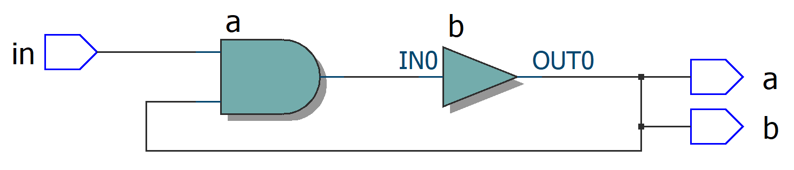
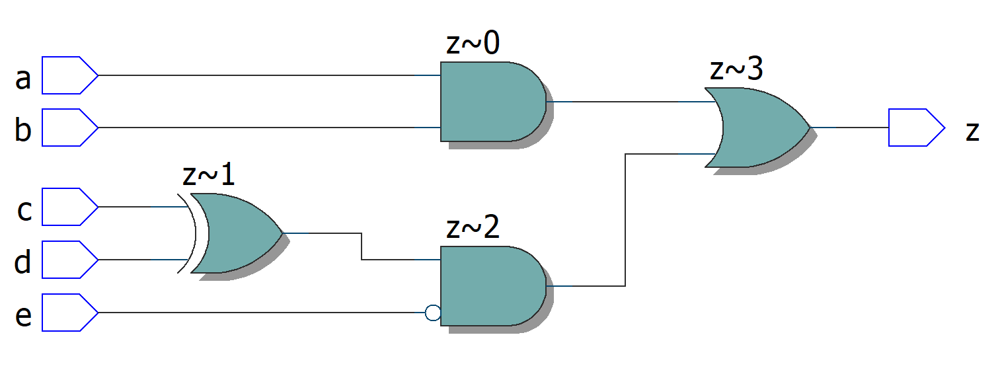
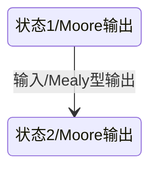

[参考教程1](https://www.chipverify.com/verilog/verilog-tutorial)，[参考教程2](https://vlab.ustc.edu.cn/guide/doc_verilog.html)，[在线练习&仿真](https://hdlbits.01xz.net/wiki/Problem_sets)

# Verilog简介

Verilog是一种硬件描述语言（Hardware Description Language，HDL），它的语法和C语言相似，但是本质是完全不同的：C语言编译后是顺序执行的指令，而Verilog综合（synthesize）后是一个电路。它可以从不同抽象级别描述一个硬件电路：

| level                                             | description                                                  |
| ------------------------------------------------- | ------------------------------------------------------------ |
| Switch Level，开关级                              | 控制各种mos器件实现功能                                      |
| Gate Level，门级                                  | 用各种门实现                                                 |
| Register Transfer Level，RTL，数据流级            | 描述寄存器数据流，是当前的”工业标准“，本笔记内容几乎全部是RTL描述 |
| Behavior Level / Algorithm Level，行为级 / 算法级 | 描述系统算法行为。通常不规定寄存器在每个时钟沿的行为，由综合工具找出哪些运算在哪个时钟周期完成。大多数综合器不能综合。本笔记包括一些利用行为级描述进行仿真的方法 |
| System Level，系统级                              | 描述模块性能的模型，一般无法综合                             |

# 语法基础

## 常量与标识符

常量的表示方式是`[size]'[base_format][number]`。number可以用下划线隔开以方便阅读。基数包括二进制b、八进制o、十进制d、十六进制h

```verilog
8'b0000_0000;     // 8bit，值为0
9'h1FA;           // 9bit，值为0x1FA = 506
-8'd3;            // 8bit，值为3的反码
"Hello, world!";  // 字符串，ascii，一个字符1字节（基本用不上）

// 几种不好的常量写法
'd132;            // 省略了位宽，综合器会给它分配一个默认位宽（与机器有关，通常是32位）
132;              // 省略了位宽和进制，会被当作十进制，并分配默认位宽
8'b1;             // 定义的位宽和数值宽度不同，不太确定verilog标准有没有规定这种情况

// x表示不定态，z或?表示和高阻态
8'b1x11_xxxx;
16'h4azz;         // 16bit十六进制数，低8位为高阻态

// 符号常量
// 标识符由数字、字母（区分大小写）、下划线、$组成，不能以$或者数字开头，不能与保留关键字重名
`define UART_CNT 10'd1024   // 在整个工程中有效。可以在别的模块使用
parameter MSB = unsigned integer 7;
parameter SIZE = MSB + 1;   // parameter作用于本模块，可用于模块间参数传递
localparam IDLE = 4'b0001;  // localparam不能用于参数传递，常用作状态机状态定义
```

## 数据类型

Verilog描述的是硬件，因此数据类型的定义和高级语言截然不同

### Nets and  Variables

Net是连线的抽象，比如逻辑门的输出。Net不能存储数据，它的值取决于其驱动器。最常用的Net类型是`wire`（实际上，几乎只会用到它）

```verilog
wire i1, i2;
wire [1:0] data;

// net赋值。综合出来通常是用组合逻辑驱动wire
assign data = {i2, i1};

// 声明的同时赋值
wire out = i1 & i2;
```

Variable是能存储数据的元件的抽象，比如寄存器、触发器。有时它也会被综合成组合逻辑（比如下文阻塞赋值的组合逻辑例子）。最常用的Variable类型是`reg`，名字来源于Register

Variable的赋值和Net不同：Net不能储存数据，其赋值（continuous assignment）描述了如何连接它的驱动器（通常是逻辑门）。Varialbe能储存数据，其赋值（procedural assignment）描述何时、如何更新里面的数据

Variable有阻塞赋值与非阻塞赋值两种连接方式

```verilog
a <= c;   // non blocking，不同非阻塞赋值并发执行，顺序无所谓
b = c;    // blocking，这一句执行完之前后面的不能执行（即：这一句的结果会影响之后的值）
```

通常的使用规则是

* 时序电路中使用非阻塞赋值。下面的例子中，时钟正跳变沿到来时b的D输入还是上一个周期的a，故输出始终有`b == ~a`

```verilog
always @(posedge clk) begin
    a <= ~a;
    b <= a;
end
```


* 组合逻辑电路中使用阻塞赋值

```verilog
always @(*) begin
    a = a & in;
    b = a;
end
```



如果违反以上两个原则，比如在时序逻辑电路中使用阻塞赋值`a = ~a; b = a;`，综合后就是a经过一个非门连到b的D端，当电路比较复杂的时候会产生一大坨难以理解的逻辑门 / 查找表。在组合逻辑使用非阻塞赋值或者在一个always块中混合使用两种赋值同理

### Scalar, Vector and Array

Scalar是宽度为1bit的数据，Vector是宽度大于1bit的数据，Array是多个数据的阵列

```verilog
wire clk;        // 声明wire scalar
reg [7:0] addr;  // 声明位宽为8的reg vector，方括号中是[msb:lsb]（1个8位寄存器）
reg y [7:0];     // 声明深度为8的scalar reg array（8个1位寄存器的寄存器组）
reg [7:0] mem [1:0][3:0]  // 声明vector reg array，2行4列，每个8bit宽

addr[0] = 1;     // 访问msb
addr[7:4] = 4'hF // part-select
addr = 8'hff     // 整体访问
y[7] = 1'b1;     // 访问Array，注意scalar array不能整体赋值而vector可以
mem[0][3] = 8'haa;  // 将0行3列元素赋值0xAA
```

### 补充

本段介绍一些其他的数据类型（基本不会用到它们，只是补充说明）

Wire是Net的子集，以下列出部分其他的Net类型：

| name      | description                                        |
| --------- | -------------------------------------------------- |
| tri       | 有多个驱动器的线。与wire完全一样，仅用来提高可读性 |
| wand, wor | 线与（wire and），线或（wire or）                  |

Reg是Variable的子集，其他部分Variable类型有

| name    | description                |
| ------- | -------------------------- |
| integer | 32 bits wide               |
| time    | 64 bits wide，好像不可综合 |
| real    | floating point，不可综合   |

## 运算符

和C的运算符基本相同。特别在此列出位运算符

| Symbol     | Performance |
| ---------- | ----------- |
| &          | 与          |
| \|         | 或          |
| ~          | 取反        |
| ^          | 异或        |
| `<<`, `>>` | 左移、右移  |

需要注意：`!`表示逻辑非，`~`表示取反。前者用于条件判断，后者用于位运算。1bit数据两者混用也能得到正确结果，但是为了避免多比特运算时弄错，还是分清楚为好。`&&`和`&`的区别、`||`和`|`的区别同理

还有几个特别的运算符

- 组合位运算符，例如`~&`与非，`~^`同或
- 不定态与高阻态判等：`==, !=`遇到不定态、高阻态时结果为不定态；`===, !==`在两边完全相同（如，都是x或都是z）时得到1，否则为0，不会得到不定态。注意`===, !==`是不可综合的
- 位拼接运算符`{}`，如`{1'b0, 1'b1}, {var_1, 4{var_2}, 2'b10}`。例1结果为`2'b01`，例2中将1个var_1、4个var_2、一个2'b10拼接到一起（拼接必须声明位数）
- 缩减运算符：&B，第一位与第二位与，结果与第三位与，如此类推直到最后一位

## 控制流

注意verilog中没有break和continue，因为电路不可能从一个触发器“跳出”

```verilog
// if分支
if (state == 2'b00) begin
    out <= in0;
    state <= 2'b01;
end else if (state == 2'b01) begin
    out <= in1;
end else            // 注意：必须有else，否则综合器可能会认为没有包含全部情况，综合出额外的寄存器
    out <= in2;
    state <= 2'b00;
end

// 另外一种书写格式：如果每个分支只有一行
// 不要两种格式混用
if (state == 2'b00) out <= in0;
else if (state == 2'b01) out <= in1;
else out <= in2;

// case分支
// 两种不可综合的case变种：casez比较z时判断为相等；casex比较x与z时判断为相等
case (state)
    3'b000: begin
        out <= in0;
        state <= 2'b01
    end
    3'b001: out <= in1;
    3'b010, 3'b011: begin
        out <= in1;
        state <= 2'b00;
    end
    default: begin       // 类似于if，必须有default
        out <= in2;
        state <= 2'b00;
    end
endcase

// for循环，也叫做generate construct。它会被展开，生成多块相似的电路
// generate和endgenerate可以省略，不过有它们的时候，如果出错了，综合器报的错一般更好懂
// generate不能放在always块里面
genvar i;     // genvar仅用于展开generate construct。生成网表之后它就”不存在“了
generate
    for(i = 0; i < 8; i = i + 1) begin
        op[i] <= op[7-i];
    end
endgenerate
```

行为级模型的循环

```verilog
// while循环
while (cnt < 10'h8ff) begin
    cnt <= cnt + 1'b1;
end

// for循环
integer i;
for (i=0; i<3; i=i+1) begin
    ;
end

// forever循环
forever begin
    #100 vin = ~vin;
end

// repeat循环
repeat (100) begin
    #100 vin = ~vin;
end
```

## 块语句

```verilog
begin: block1
    // this is a block
    integer i = 1;
end

// 在块外访问块里的局部变量（不可综合）
top.block1.i

// 禁用块（不可综合），可以在仿真时充当类似break的效果
while (1) begin: block2
    if (i == 0) disable block2
end
```

### Always Block

当信号跳变时将会触发，block中的语句顺序进行，不同的block并行执行。跳变条件可以是边沿敏感（正跳变或者负跳变）或者电平敏感（电平变化），但不能有的信号是边沿敏感、有的信号是电平敏感

```verilog
module tff(input d, input clk, input rst_n, output reg q);
    always @(posedge clk or negedge rst_n) begin
        if (!rst_n)
            q <= 1'b0;
        else
            q <= q;
    end
endmodule
```

可以用always block实现组合逻辑电路：

```verilog
module combo (input a, b, c, d, e,
              output reg z);
    always @ (*) begin
        // 或者写成always @ (*)，自动包含对组合逻辑所有输入的电平敏感
        // 注意：z是reg，但综合出来是一个组合逻辑输出，不是寄存器
        z = ((a & b) | (c ^ d) & ~e);
    end
endmodule
```



仿真时可以用always块产生波形

```verilog
always #10 clk = ~clk;
```

### 并行块

不可综合，常用于仿真的时序控制。并行块所有语句同时执行，因此所有延时都以0开始

```verilog
fork
    vin = 1'b0;
    #10 vin = 1'b1;
    #50 vin = 1'b0;
join
```

### 初始化块

有的硬件可以综合初始化块，有的硬件不能。而且一般也只能综合寄存器初始化的代码

```verilog
initial begin
    // 初始化寄存器
end
```

# 模块

模块描述了一个具有特定逻辑功能的电路模块，它包含若干输入和输出端口（Port）以及内部的逻辑电路。一般来说，代码都要包含在模块（module）中。以下是一个同步清零的D触发器module：

```verilog
// 旧风格verilog-95的模块声明
module dff(d, clk, rst_n, q);
    // 声明IO
    input        d;
    input        clk;
    input        rst_n;
    output reg   q;

    // 逻辑功能
    always @ (posedge clk) begin
        if (!rst_n)
            q <= 0;
        else
            q <= d;
    end
endmodule
```


一个module中可以包含其他的module，比如下例是一个4bit移位寄存器：

```verilog
// verilog-2001风格的模块声明
module shift_reg(
    input    d,
    input    clk,
    input    rst_n,
    output   q
);  // 不要忘了模块声明语句的分号！！

    // 声明内部连线
    wire [2:0] q_net;

    // 实例化(instantiate)D触发器
    dff u0 (d, clk, rst_n, q_net[0]);   // Port connection by ordered list
    dff u1 (.d(q_net[0]), .clk(clk), .rst_n(rst_n), .q(q_net[1]));  // by name
    dff u2 (.d(q_net[1]), .clk(clk), .rst_n(rst_n), .q(q_net[2]));
    dff u3 (.d(q_net[2]), .clk(clk), .rst_n(rst_n), .q(q));
endmodule
```


端口连线时，可以用如`.name()`的方式表示引脚悬空

`input`和`inout`类型的端口要被外部电路驱动，因此不能是reg类型

开发时，会用一个top-level module包含整个系统，顶层模块不会被其他的模块实例化。模拟仿真时使用的testbench也算一种顶层模块

```verilog
// 定义带有parameter的模块
module counter #(
    parameter N = 10
)(
    input clk, rst_n, en,
    output reg[N-1:0] out
);

    always @(posedge clk) begin
        if (!rst_n) out <= 0;
        else if (en) out <= out + 1'b1;
        else out <= out;
    end
endmodule

// 实例化带有parameter的模块
counter #(
    .N(4)
) cnt4b (
    .clk(clk),
    .rst_n(rst_n),
    .en(en)
);
```

# 状态机

## 简述

时序逻辑电路都可以称作状态机。它的结构可以抽象成下图


一般将状态机分类为

- Mealy状态机：输出与输入有关，`O = O(I, S)`
- Moore状态机：输出与输入无关，`O = O(S)`

Moore状态机是完全同步的，因此稳定性和抗干扰能力都更强：状态S是与时钟同步的，因此`O(S)`和时钟不会同时跳变，亚稳态可控。反之，对于Mealy型，如果`I`在时钟沿附近跳变，`O(I, S)`有可能和时钟同时跳变，在下一级引入亚稳态

用状态图表示：



## 状态机的写法

```verilog
//------------------------------------------------------------------------------
// 一段式状态机
// 把状态转移条件、状态转换和输出写在一个块内
// 代码任意性较高，不好分析、难以约束时序，且容易写出不规范的代码
// 除非是几行就能写完的小状态机，尽量不要用
wire in;
reg state;
reg out;
always @(posedge clk) begin
    case (state)
        STATE_IDLE: begin
            if (start) begin
                state <= STATE_1;   // 状态转换条件 & 状态转换
                out <= 1;           // 输出
            end else begin
                state <= STATE_IDLE;
                out <= 0;
            end
        end
        STATE_1:
            state <= IDLE;
            out <= 0;       // 注意：是下一个状态的输出。在此对应IDLE态输出
        end
        default: begin
            state <= STATE_IDLE;
            out <= 0;
        end
    endcase
end

//------------------------------------------------------------------------------
// 两段式状态机
// 把时序电路（状态转换）写在一个块内，组合电路（状态转移条件、输出）写在另一个块内
// 代码最简洁，且比较规范。但有组合逻辑输出，输出有毛刺
reg state;
reg next_state;

always @(posedge clk) begin
    // 状态转换
    state <= next_state;
end

always @(*) begin
    // 状态转移条件
    case (state)
        STATE_IDLE: next_state = start ? STATE_1 : STATE_IDLE;
        STATE_1:    next_state = STATE_IDLE;
        default:    next_state = STATE_IDLE;
    endcase

    // 输出。注意这种写法的输出是组合电路，有毛刺
    // 把这个case放到第三个always块里面，看上去也像是三段式，但效果并不一样
    case (state)
        STATE_IDLE: out = 0;
        STATE_1:    out = 1;
        defualt:    out = 0;
    endcase
end

//------------------------------------------------------------------------------
// 三段式状态机
// 将状态转移条件、状态转换、输出分开在三个块中
// 最规范，且均为Moore输出
reg state;
reg next_state;

always @(*) begin
    // 状态转移条件
    case (state)
        STATE_IDLE: next_state = start ? STATE_1 : STATE_IDLE;
        STATE_1:    next_state = STATE_IDLE;
        default:    next_state = STATE_IDLE;
    endcase
end

always @(posedge clk) begin
    // 状态转换
    state <= next_state;
end

always @(posedge clk) begin
    // 输出
    case (next_state)   // 注意使用next_state做判断，否则会多一个周期的延迟
        STATE_IDLE: out <= 0;
        STATE_1:    out <= 1;
        default:    out <= 0;
    endcase
end
```

其他技巧

```verilog
//------------------------------------------------------------------------------
// 同步复位与异步复位

// 对于一段式状态机，区别在于复位信号是否列在敏感列表中
always @(posedge clk) begin                 // 同步复位
    if (rst) state <= STATE_IDLE;
    else ; // 状态机代码
end

always @(posedge clk or posedge rst) begin  // 异步复位
    if (rst) state <= STATE_IDLE;
    else ; // 状态机代码
end

// 对于多段式状态机，同步复位写在组合逻辑，异步复位写在时序逻辑
always @(*) begin                           // 同步复位
    if (rst) next_state = STATE_IDLE;
    else ; // 状态转换条件代码
end

always @(posedge clk or posedge rst) begin  // 异步复位
    if (rst) state <= STATE_IDLE;
    else ; // 状态转换代码
end

//------------------------------------------------------------------------------
// 快速的状态机：将状态与输出联系起来
module fast_fsm(
    input clk,
    input rst_n,
    input A,
    output [1:0] K
);
    reg [4:0] state;
    assign K = state[4:3];

    // 然后是状态机
endmodule
```

# 行为级描述

Verilog标准中定义了行为级描述，并且大部分仿真器也支持它们。但是大部分（目前的）综合器无法综合，因此主要用于仿真

## 任务与函数

任务（Task）和函数（Function）主要用于仿真。实现可综合的代码时，应该使用模块，不要使用任务与函数；在写不可综合的代码时，任务与函数比模块写起来方便一些。

```verilog
module testbench ();
    reg clk, done;
    parameter integer ticks = 1000;

    // 定义task
    // task可以用来做各种事情，比如实现电路功能
    task wait_ticks;   // 例：等待ticks个周期，然后翻转state
        input clk;
        input ticks;
        output state;
        begin
            repeat (tics) @ (posedge clk);
            state = ~state;
        end
    endtask

    // 定义function
    // 函数用于计算，不能使用时序控制，也不能调用任务
    // 至少一个输入，返回值是与函数名同名变量；函数不能递归调用，也不能在多处被同时调用
    function calc_parity(input [7:0] data);
        calc_parity = ^data;
    endfunction

    initial begin
        clk = 1'b0;
        done = 1'b0;
        wait_ticks(clk, ticks, state);      // 调用task
        wait_ticks(clk, ticks, state);
        parity = calc_parity(8'hAB);        // 调用function
        #100 $finish;
    end

    always #100 clk = ~clk;
endmodule
```

**系统任务与函数**


## testbench编写

一般定义一个专门用来仿真的testbench顶层模块，产生几个虚拟的信号提供给被测试的模块，观察测试输出是否正确。有许多只能在仿真时进行的操作，以下列出常用的几个

```verilog
`timescale 1ns / 1ps        // 时间单位（比如#1的延迟）1ns，时间精度1ps

module testbench();
    reg clk, foo, bar;              // 声明仿真时需要用到的变量
    some_sub_module sub(foo, bar);  // 被仿真的模块

    always #10 clk = ~clk;

    initial begin
        clk <= 0;        // 如果不赋初值，通常会被当做X
        foo <= 0;
        bar <= 0;
        #10 foo = 1;     // #10表示延时10个时间单位
        #20 bar = 1;
        #400 $finish;    // 结束仿真
    end

    always @(posedge clk) begin
        $display("%d", foo);
        $write("%d", bar);  // display输出完会自动换行，write不会
    end
endmodule
```

# Verilog-AMS

Verilog-AMS（Analog and Mixed Signal extension）是Verilog的混合信号扩展。语法上来说，可以理解为在Verilog的基础上加入了模拟信号、analog块（即模拟信号的always块）。另外，只有模拟部分的Verilog-AMS子集称作Verilog-A

```verilog
// Verilog-A模块示例：RLC器件的并联
module shunt_rlc (t1, t2);
    // 声明IO方向（input, output, inout）
    // input信号的值可以在表达式中使用，但不可被设置；output反之；inout均可
    inout t1, t2;
    // 声明信号类型（electrical, wire, reg等）
    electrical t1, t2;
    // 声明参数
    parameter real R = 1;
    parameter real L = 1;
    parameter real C = 1;

    // 定义局部变量
    integer res;
    real Vmax;

    // 定义模拟过程。大致相当于数字电路的always块。一个模块只能有一个analog块
    analog begin
        I(t1, t2) <+ V(t1, t2) / R;
        I(t1, t2) <+ idt(V(t1, t2)) / L;    // idt: 对时间积分(integral dt)
        I(t1, t2) <+ ddt(V(t1, t2)) * C;    // ddt: 对时间微分(derivative dt)
        // <+是贡献(contribution)算符，模拟信号只能用贡献算符赋值，不能用=赋值
        // 多个电流贡献相当于器件并联；多个电压贡献相当于器件串联
    end
endmodule

// Verilog-AMS示例：8bit DAC
```

## 电流与电压

```verilog
electrical t1, t2;

// 单端
I(t1);      // 从t1流向地的电流
V(t1);      // 对地电压

// 双端
I(t1, t2)   // 从t1流向t2的电流
V(t1, t2)   // V(t1) - V(t2)
// 正值表示t1电压高、流出电流

// 支路
branch (t1, t2) res;
I(res) <+ V(res) / R;   // V(res) = V(t1, t2), I(res) = I(t1, t2)

// 端口
I(<t1>);    // 从t1流入模块的电流
```

## 参数与变量

参数与verilog的parameter相同，用于描述模块性质，运行时不能更改；变量类似一般编程语言，可以在运行时更改（但是好像不能设置初始值，必须用analog模块的initial初始化）

```verilog
parameter real a = 1 from (0:inf);  // 取值范围(0, +inf)
parameter integer b = 15;
parameter real c[3:0] = '{-5.0, -1.0, 1.0, 2.0};  // Array

localparam real d = 1.0;

real x = 1 from [-5:5] exclude 0;  // 取值范围[-5, 5]且不能取0
integer y = 13 from (-75, 75) exclude [-5, 5] exclude 12;
```

## analog块

下例是一个运放模型，当增益小于1e12时让输出 = 输入×增益，否则用虚短求输出

```verilog
parameter real gain = 1e6;
parameter real offset = 0;

real vi;

analog begin
    // 变量赋值
    vi = V(VIP, VIN) + offset;

    // 控制流语法和Verilog基本一样，不再赘述
    if (gain < 1e12) begin
        // 支路贡献语句。同一个节点不能同时有电压和电流贡献
        V(VOUT) <+ gain * vi;
    end else begin
        // 间接支路贡献。寻找满足条件的值（条件必须是信号 == 表达式）
        // 例子中，仿真器会尝试求解令VIN=0的VOUT（此过程中不会驱动VIN）
        V(VOUT): V(VIP, VIN) == 0;
    end
end
```

## 事件

可以检测事件来模拟一些特殊行为，比如在仿真开始时初始化变量、在上升沿进行采样

```verilog
analog begin
    @(initial_step) begin
        // 在仿真的第一步执行，一般用于变量初始化
        a = 0;
    end

    @(final_step) begin
        // 仿真最后一步执行，一般用来打印结果
        $strobe("Bit error rate = %f", error/bits);
    end

    direction = +1;    // +1表示上升沿、-1下降沿、0任意边沿
    time_tol = 1;      // 两次过零时间间隔小于此不会触发
    expr_tol = 1e-9;   // 如果过零之后小于这个值，不会触发
    @(cross(V(CLK) - 0.9, direction, time_tol, expr_tol)) begin
        // 过零时触发。后三个参数必须是常数，这里写成变量是为了方便理解，实际不能这么写
        // time_tol和expr_tol的默认值挺靠谱的，除非噪声很大一般不用管
        V(VOUT) <+ V(VIN);
    end

    start = 2e-5;
    T = 1e-6;            // 触发周期
    time_tol = 1e09;     // 时间偏差不能超过这么多
    @(timer(start, T, time_tol)) begin
        // 从start开始，每周期触发一次
        a = -a;
    end
end
```

## 其他

```verilog
$abstime  // 获取仿真时间

// 噪声。仅在小信号噪声仿真有效
PSD = 4 * 'P_K * $teperature * R
white_noise(PSD);   // PSD单位是V^2/Hz
flicker_noise(power, exp);

// 随机数。之后有需要再看
$random;

// transition filter。用于（从数字信号）产生实际阶跃信号
delay = 0;
t_rise = 1e-9;
t_fall = 1e-9;
V(VOUT) <+ transition(vref, delay, t_rise, t_fall);

// slew filter。用于（从阶跃模拟信号）产生实际阶跃信号
max_pos_rate = 1e9;
max_neg_rate = -1e9;
V(VOUT) <+ slew(vref, max_pos_rate, max_neg_rate);
```

# 其他

**模块划分**

1. 尽量不要在两个时序模块间加组合逻辑。综合器优化通常是对各个模块分别优化，优化不到中间的组合逻辑，哪怕只是一个与门，也可能影响时序
2. 尽量把组合逻辑放在输入，输出端口直接连到寄存器。这样能简化时序约束，一般能优化得最好
3. 可以考虑让模块不要大小或太大。太小的模块优化效果稍差，太大的模块优化耗时很久。综合耗时太久的话可以把大模块拆分成小模块
