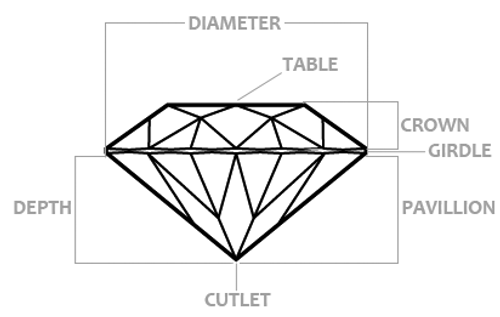

# 晶体学基础

## 晶格

构成晶体的粒子具有周期性结构，称作晶格。晶格包括了两大要素：

1. 点阵（Lattice，也叫格子）：将晶体周期性重复的单元抽象为一个点，就得到了点阵。它是周期排布的点，描述晶格的周期性。也可以用**基矢**$\vec{a}_1$，$\vec{a}_2$，$\vec{a}_3$表示，晶体中的物理量满足$\phi(\vec{r}) = \phi(\vec{r} + \vec{R})$，其中$\vec{R} = n_1 \vec{a}_1 + n_2 \vec{a}_2 + n_3 \vec{a}_3$为**格矢**
2. 结构基元：描述晶格周期性重复的单元（包括哪些粒子、它们的空间排布），用晶胞（Unit Cell）或者原胞（Primitive Cell）描述。原胞是最小重复单元，而晶胞可以是原胞的整数倍。大多数晶体结构都有**惯用晶胞**（Conventional Cell）

注意：晶胞不唯一，对应的基矢也不唯一。但是不管怎么取，它的对称性都是固定的。而且，给定晶胞之后点阵也确定下来了，所以很多地方不做明显区分。常用以下方法描述晶体结构以及晶体内几何关系：

- 晶格常数：轴长$a_0$，$b_0$，$c_0$、轴角$\alpha$，$\beta$，$\gamma$。轴长的比值称作轴率。轴率和轴角往往反映于晶体宏观结构
- 晶向：用晶向指数`[u v w]`表示。对称操作得到的一组等价晶向称作晶向族`<u v w>`
- 晶面：使用晶面指数`(h k l)`描述，hkl分别是晶面在各晶轴截距倒数比，如100表示在XYZ轴截距分别为1、无穷、无穷（即垂直于X轴）的平面。类似晶向族，对称的等价晶面称作晶面族`{h k l}`，习惯上选三个数字递减的晶面作为代表。注意，本笔记中晶面可能指微观上晶胞中的平面，也可能指宏观上的晶体表面，需要分辨

## 对称性

### 对称元素

表示对称元素主要有两种记号：

- **熊夫利记号**（Schoenflies notation）：表示方式与晶体宏观结构、物理性质有直接联系，在光谱学等领域更常用
- **赫尔曼-莫甘记号**（Hermann–Mauguin notation）：表达对称元素的方向比较清晰，容易加入平移、滑移等对称元素。在晶体学中更常用，也叫做国际记号

| 对称元素      | 熊夫利记号 | 赫尔曼-莫甘记号 | 备注                                                      |
| ------------- | ---------- | --------------- | --------------------------------------------------------- |
| 恒等          |            | $1$             |                                                           |
| 镜面          | $\sigma$   | $m$             |                                                           |
| n重旋转轴     | $C_n$      | $n$             | 旋转$2\pi/n$。C表示Cyclic                                 |
| n重旋转反射轴 | $S_n$      | $\overline{n}$  | 旋转$2\pi/n$然后沿轴上一点反演。$S表示Spiegel，德语的镜面 |
| 反演中心      | $i$        | $\overline{1}$  |                                                           |

独立的对称元素只有8个：$1$，$2$，$3$，$4$，$6$，$\overline{1}$，$m$，$\overline{4}$。其他对称元素要么和这些元素等价，要么可以写成它们的复合，比如$\overline{2}$等价于$m$

补充：晶体中只允许1，2，3，4，6重轴，称作晶体限制定理。证明可以看固体物理的笔记。准晶体允许其他次数的轴

### 晶体点群

群（Group）是一种代数结构。它的定义是，给定集合$G$，以及二元运算$\circ$，若它们满足封闭性、有结合律、存在单位元、存在逆元，则称$(G, \circ)$是一个群。晶体学中，定义$G$是某种晶体所有的对称操作构成的集合，运算$\circ$是两个对称操作的复合（例如，$2 \circ m$表示先沿二次旋转轴旋转，再沿镜面对称），则$(G, \circ)$构成了一个群，称作晶体点群

群是数学结构的高度抽象，它能揭示不同对象之间的深层联系，尤其是不变性、对称性。虽然晶格结构种类繁多，但是它们可以抽象为32种点群，对于晶体宏观对称性的研究可以归结到对这32种点群的研究

对称操作的集合有非常严格的限制，比如说，假设有两个二重轴，可以证明，必然有一个n重轴与它们垂直，且它们的夹角必须为$2\pi / n$（简单证明：假设在两个二重轴所在平面上建极坐标系，一个轴的角度为0，另一个的角度为$\alpha$。某点$(r, \theta)$为格矢。沿第一个轴旋转，得到对称点$(r, -\theta)$；再沿另一个轴旋转，得到对称点$(r, 2\alpha + \theta)$，可见旋转$2\alpha$度同样是对称操作）。进一步，可以证明**三维空间有32种点群**。若进一步引入螺旋轴、滑移面，形成**230种空间群**

点群的标记方式和对称元素的标记方式类似：

**熊夫利记号**

用字母+下标表示，字母表示旋转轴之间的几何关系，下标表示旋转轴是几重的、镜面和旋转轴的几何关系。这些字母包括

- $C_n$（Cyclic）：一条n重旋转轴
- $S_n$（Spigel，镜面）：一条n重旋转反射轴。n总是偶数（奇数$S_n = C_{nh}$）
- $D_n$（Dihedral，二面体）：一条竖直方向n重轴，加上n条水平的2重轴
- $T$（Tetrahedral，四面体）：三条2重轴、四条3重轴，对应正四面体
- $O$（Octahedral，八面体）：三条4重轴、四条3重轴、六条2重轴，对应正八面体

下标包括

- $i$：反演中心。仅用于$C_i$，表示只有一个反演中心的点群
- $s$：镜面。仅用于$C_s$，表示只有一个镜面的点群
- $v$：竖直（Vertical）方向，即穿过主轴的镜面
- $h$：水平（Horizontal）方向，即垂直主轴的镜面
- $d$：对角线（diagonal）方向，即穿过副轴的镜面

**赫尔曼-莫甘记号**

用若干对称元素表示。每一位表示一个方向上的对称元素，比如$n$表示n重轴，$\frac{n}{m}$表示一条n重轴和一个垂直于它的镜面。按照高次轴（3重或3重以上）数量，标记方式不同：

- 没有高次轴：三位分别表示XYZ方向
- 一条高次轴：第一位表示主轴方向（通常将它定义为Z轴），第二位是垂直主轴方向，第三位则是第三方向的
- 多条高次轴：第一位表示XYZ轴（它们是等价的），第二位表示对角$3$或者$\overline{3}$轴，第三位表示XYZ轴中任意两条之间的对角方向

注意，此记号有一些简写方式，详见[此处](https://en.wikipedia.org/wiki/Crystallographic_point_group)

### 晶系

晶体点阵有7种可能的对称性，即七大晶系。注意：一个点阵可能对应多个晶系，这就是为什么晶系数量比点群数量少。比如说三斜晶系（$a \ne b \ne c, \ \alpha \ne \beta \ne \gamma \ne 90^\circ$）若晶胞有反演中心就属于$S_2$群，否则属于$C_1$群

同一晶系的点群具有一些共通的对称元素，因此其晶体宏观性质具有相似性。比如，等轴晶系的晶体都有四条3重轴，其XYZ轴是等价的，因此晶体具有各向同性。下表列出了各晶系惯用晶胞的性质

| 晶系                 | 轴长            | 轴角                                          | 点群     |
| -------------------- | --------------- | --------------------------------------------- | -------- |
| 三斜晶系             | $a \ne b \ne c$ | $\alpha \ne \beta \ne \gamma \ne 90^\circ$    | $S_2$    |
| 单斜晶系             | $a \ne b \ne c$ | $\alpha = \gamma = 90^\circ \ne \beta$        | $C_{2h}$ |
| 斜方晶系（正交晶系） | $a \ne b \ne c$ | $\alpha = \beta = \gamma = 90^\circ$          | $D_{2h}$ |
| 四方晶系             | $a = b \ne c$   | $\alpha = \beta = \gamma = 90^\circ$          | $D_{4h}$ |
| 三方晶系（棱方晶系） | $a = b = c$     | $\alpha = \beta = \gamma \ne 90^\circ$        | $D_{3d}$ |
| 六方晶系             | $a = b \ne c$   | $\alpha = \beta = 90^\circ, \gamma=120^\circ$ | $D_{6h}$ |
| 等轴晶系（立方晶系） | $a = b = c$     | $\alpha = \beta = \gamma = 90^\circ$          | $O_h$    |

在七大晶系的基础上，组合四种晶胞（简单，体心，面心，底心），组成14种布拉维晶格（7×4 = 28，再删去所有相同的组合）。注意，虽然很多地方把它叫做布拉维格子，但是按照本笔记采用的定义，它不是格子（点阵），而是晶格，既包括周期性也包括了重复单元。布拉维晶格描述晶体结构的能力远不如晶体点群，现在仍在使用可能是历史遗留问题，也可能只是为了方便引入几种常见晶胞

## 晶体形态

Gibbs-Wulff规则基于热力学给出了晶体的稳定形态：晶体的平衡外形是其表面自由能最小的形态。表面自由能$\Delta G = \sum_j \gamma_j O_j$，其中$\gamma_j$是第j个面的单位面积自由能，$O_j$是其面积。一般而言，表面粒子密度越大、粒子之间的键越强，单位面积自由能就越小——稳定形态往往是密度最大的一两个晶面围成的单形或聚形

动力学上，则有层生长理论、螺旋生长理论、布拉维定律等。但是在多种多样的非理想生长环境下，目前不存在一个“完美”的理论

**理想晶体的形态**

- **单形**：此形状各表面属于同一个晶面族。它可以分为两类：晶面包围成封闭空间的称**闭形**，半封闭且可以无限延伸的称**开形**（如柱体、锥体）
- **聚形**：多个单形共同围成的形状

**实际晶体的形态**

晶体生长时往往受到外界因素影响，偏离热力学的理想形态。常见的形态有

- 歪晶：各晶面发育不等。但是晶面夹角仍与理想晶体一致，称面角守恒定律
- 凸晶：各晶面中心凸起
- 弯晶：呈弯曲形态

还会发生规则连生

- 平行连生：各部分晶格构造平行
- 双晶：也叫做孪晶，是多个晶体的连生体。通过某一面、轴或者中心进行对称操作可以使两个晶体重合或者平行。此对称元素称作双晶要素。双晶要素不可能与晶体对称要素重合，否则就会发育成平行连生

## 包体

# 宝石的物理性质

## 颜色

透明宝石的颜色是透射光的颜色。如，红宝石吸收光源中的黄绿光和蓝紫光，投射出红色光

传统上，将颜色分为三类：

- 自色：构成宝石的主要化学成分产生的颜色。自色宝石种类较少
- 他色：杂质（如同形置换的离子）等引起的颜色。纯净的他色宝石一般是无色的，含有不同微量元素时呈现不同颜色
- 假色：干涉、衍射等光学效应引起的颜色，如欧泊的变彩

现代科学对晶体的研究提出了晶体场、分子轨道、能带等几种理论，它们从不同出发点计算出了晶体中电子的能级、能带，解释了晶体吸收谱

## 硬度

硬度是抵抗外来压入、划刻、研磨等机械作用的能力。宝石通常用摩氏硬度衡量，摩氏硬度将十种标准矿物的硬度定义为1~10，用待测矿物与标准矿物比对得到其相对硬度。比如，若一个未知矿物能够划刻正长石（$H_M = 6$），且能被石英（$H_M = 7$）划刻，它的硬度就是6.5。常见物质硬度有：指甲 2.5、玻璃 5~5.5、刀片 5.5~6、灰尘 7

注意，因为宝石的各向异性，各面的硬度可能不同

# 宝石各论

# 合成与优化处理

# 加工

## 琢型

琢型指宝石加工后外表形状。宝石的琢型大致分为

- **弧面型**：表面呈弧形，截面呈流线型。主要用于不透明或半透明宝石，以及具有猫眼、星光、变彩等特殊光学效应的宝石
- **刻面型**：许多刻面构成的对称多面几何体。广泛用于透明宝石（包括无色和有色宝石）
- **链珠型**：中间有孔，可以串成手串、项链。主要用于中低档宝石
- **异型**：其他形状。多是结合宝石形状设计成

宝石切工对其外观的影响不亚于宝石本身品质的影响。例如在古印度，有人将八面体形态的钻石晶体抛光后直接用作珠宝，这样的钻石色泽黯淡，且很难观察到火彩；现代的明亮切则通过合理设计，使大部分入射光经全反射射出，并且能明显观察到色散，兼顾了亮度和火彩

**刻面型各部分的称呼**

- 台（Table）：最上面的平面
- 冠（Crown）：上半部
- 腰（Girdle）：中间一圈
- 亭（Pavilion）：下半部分。其名称Pavilion在古代指帐篷，推测因锥形亭部和帐篷形似而得名
- 底（Cutlet）：最底下的点或面。也叫底尖、底面

它是目前最常见的透明宝石琢型，有以下重要参数：亭角、冠角与台宽

- 亭角决定了亮度。从冠部入射的光线有一部分在亭部刻面经过两次全反射，从冠部射出。若亭角过小，第一次到达亭部刻面时无法发生全反射；若太小，第二次全反射更难发生。
- 冠角决定了火彩的强度。从同一个面射入、射出的光不发生色散，其余情况会发生色散，色散程度与入射、出射平面的夹角有关
- 台宽决定了亮度（白色反射光）和火彩（色散反射光）的比例关系

此外，刻面的大小、数量会影响宝石（或者光源、观察者）移动时的闪烁程度

根据从上往下看的形状，又可以细分为圆形、椭圆形、水滴型、心形、马眼 / 榄尖形等

祖母绿琢型

长方钻

公主型