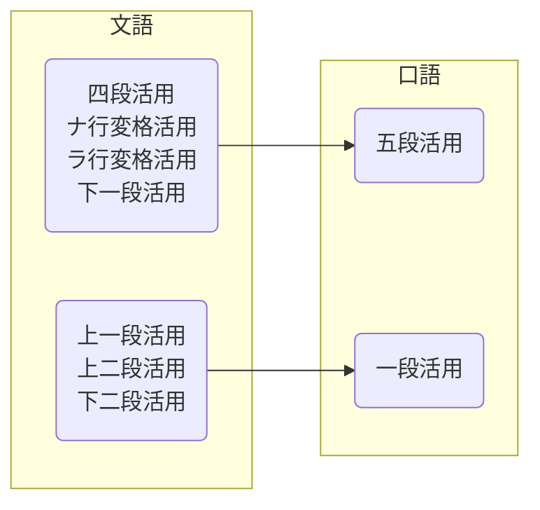

# 总论

日语是黏着语，通过在词根后面加上词缀表示语法功能。语法的基本单位是**文節**（ぶんせつ），由一个**自立語**、若干个**付属語**构成。词性进一步分为

- 自立語
  - **用言**：能作谓语、有活用
    - 动词、形容词、形容动词
  - **体言**：能做主语、无活用
    - 名词
  - **其他**：副詞（例：拟声词）、連体詞（例：大きな）、接続詞（例：だから）、感動詞（例：はい）
- 付属語
  - **助动词**：接续用言，有活用，比如「ます」、「です」，而且一般对前面的活用形态有要求
  - **助词**：通常接续体言，没有活用，比如「が」

能**活用**的词包括动词、形容词、形容动词、助动词这几类。活用型包括

- **連用形**：接续用言（主要是助动词）
- **連体形**：接续体言
- **終止形**：结句，或者接续终助词
- **未然形**：表示否定、假设、意愿等尚未发生的事情，也用于表现可能、被动、使役
- **仮定形**：表示假定，也叫做已然形。注意：未然形的假设强调主观意志，假定形是客观规律
- **命令形**：结句或者接续终助词，表示命令

## 「文語体」与「口語体」

文語体、口語体之于日文大致相当于文言文、白话文之于中文。以前日语书面文章和口语有很大区别，语法规则都相差不小。明治时代（19世纪后半叶）的[言文一致運動](https://ja.wikipedia.org/wiki/%E8%A8%80%E6%96%87%E4%B8%80%E8%87%B4)开始推行口语体，直到二战之后确定了现代的[標準語](https://ja.wikipedia.org/wiki/%E6%A8%99%E6%BA%96%E8%AA%9E#%E6%97%A5%E6%9C%AC%E8%AA%9E)，现代日语已经不再使用文語体，不过它的地位和文言文在中国差不多，阅读古文时仍需要用到，中学都会学习

现代日语中仍然有「文語」，它指现代的书面语，语法和口语完全相同，只是措辞更正式

# 名词

名词没有活用，后续「～だ」等助动词之后可以作谓语

> 学生だ。

# 形容词

形容词都以「～い」结尾。形容词本身可以作谓语，也可以作定语修饰名词

> 空は青い。
>
> 青い空

形容词活用形

| 未然形           | 連用形                               | 終止形                            | 連体形               | 仮定形           |
| ---------------- | ------------------------------------ | --------------------------------- | -------------------- | ---------------- |
| ～かろ           | ～く、かっ                           | ～い                              | ～い                 | ～けれ           |
| 接「う」表示推量 | 表示中顿或修饰动词、接「た」表示过去 | 结句（敬体需要后续   「～です」） | 后续体言，即修饰名词 | 接「ば」表示假定 |

# 形容动词

平安时代出现了以「名词 + なり」形容事物的用法，这些词演化为现代日本语的形容动词。“动词”得名于词尾「～なり」按照动词的方式活用，但是现代日本语中形容动词和动词已经毫无关系了

形容动词活用形

| 未然形           | 連用形                               | 終止形                     | 連体形               | 仮定形           |
| ---------------- | ------------------------------------ | -------------------------- | -------------------- | ---------------- |
| ～だろ           | ～で、～に、～だっ                   | ～だ                       | ～な                 | ～なら           |
| 接「う」表示推量 | 表示中顿、修饰动词、接「た」表示过去 | 结句  （敬体时用「です」） | 后续体言，即修饰名词 | 接「ば」表示假定 |

# 动词

日语的动词具有六种活用形（比形容词、形容动词多一种命令形），并且通过后续的助词、助动词表达时态、语态等信息。按照不同标准有以下分类方式：

**按照活用形式分类**

- 五段动词：词干（辅音结尾） + 「-u」。“五段”得名于动词活用时词尾的「-u」有五种变化（五十音图的アイウエオ五段）。例：書く、話す、飛ぶ
- 一段动词：词干（元音i / e结尾） + る。“一段”得名于活用时词干不变，总是同一段。例：見る、食べる
- 不规则动词
  - サ变动词：する或词干 + する。例：勉強する
  - カ变动词：只有一个词「来る」

区分五段和一段动词的简单方法是：「汉字 + イ段 / エ段假名 + る」一般是一段动词。不过也有少数例外，比如見る。例外产生的原因是一段动词是由古日语的二段动词、上一段动词演化而来。二段动词一段化的过程中留下了イ段 / エ段假名 + る；上一段动词则没有イ段 / エ段假名，成为了例外。幸好古日语的上一段动词只有十几个，作为特例记住就行

这些特例有：着（き）る、似（に）る、煮（に）る、干（ひ）る、嚏（ひ）る、見（み）る、廻（み）る、射（い）る、鋳（い）る、沃（い）る、居（ゐ）る、率（ゐ）る、その複合動詞（「顧（かへり）みる」「率（ひき）ゐる」「用（もち）ゐる」等）

**按照语法作用分类**

- 他动词：通常是有意志的行为。可以带宾语，相当于汉语的及物动词。例：朝ごはんを食べる
- 自动词：通常表示某个动作，状态，或者变化。不可带宾语。例：雨が降っています

## 动词活用

### 連用形

用法：

1. 连接用言，构成复合词。例：書き直す
2. 连用形名词。例：京都へ友達に**会い**に行く
3. 用在小句末尾，当作中顿（比较书面）
4. 后续「～て」、「～た」、「～ます」等助词、助动词

变形规则：

- 五段动词：词尾假名改成「イ」段
- 一段动词：去掉词尾的「る」
- サ变动词：将「する」改为「 し」
- カ变动词：来（き）

特别地，五段动词如果后续的词是「て」、「た」等，为了方便发音，发生音便（おんびん），词尾变成「イ」或者促音「ッ」或者拨音「ン」。音便规则见下表。如果发生了拨音便，或者原本词尾为浊音，则后续的「て」、「た」要浊化为「で」、「だ」

| 词尾 | 基本型 | 连用形 | 音便连用形+后续词 |
| ---- | ------ | ------ | ----------------- |
| カ   | 書く   | 書き   | 書いて            |
| ガ   | 泳ぐ   | 泳ぎ   | 泳いで            |
| サ   | 話す   | 話し   | -                 |
| タ   | 立つ   | 立ち   | 立って            |
| ナ   | 死ぬ   | 死に   | 死んで            |
| バ   | 飛ぶ   | 飛び   | 飛んで            |
| マ   | 読む   | 読み   | 読んで            |
| ラ   | 降る   | 降り   | 降って            |
| ワ   | 歌う   | 歌い   | 歌って            |

### 連体形

用于后续体言，作为定语修饰体言。与基本形相同

### 終止形

用于结句或者后续终助词。与基本型相同

### 未然形

未然形表达未发生的动作，比如否定、推量；也用于表达可能、被动、使役等语态。变形规则如下：

- 五段动词
  - 表示否定、语态：词尾改为「ア」段
  - 表示推量：词尾改为「オ」段

- 一段动词：词尾去掉「る」
- サ变动词：将「する」改为「し」
- カ变动词：来（こ）

### 仮定形

主要用途是后续助动词「ば」表示假定条件

- 五段动词：词尾假名改为エ段
- 一段动词：词尾「る」改为「れ」
- サ变动词：将「する」改为「すれ」
- カ变动词：来（く）れ

### 命令形

主要用途是表示命令

- 五段动词：词尾假名改为エ段
- 一段动词：词尾「る」改为「ろ」或「よ」（前者多用于口语，后者多用于书面语）
- サ变动词：将「する」改为「 しろ」或「せよ」（前者多用于口语，后者多用于书面语）
- カ变动词：来（こ）い

### 总结

| 种类     | 連用形   | 連体形、終止形 | 未然形     | 仮定形     | 命令形         |
| -------- | -------- | -------------- | ---------- | ---------- | -------------- |
| 五段动词 | 書き     | 書く           | 書か・書こ | 書け       | 書け           |
| 一段动词 | 閉じ     | 閉じる         | 閉じ       | 閉じれ     | 閉じろ・閉じよ |
| サ变动词 | し       | する           | し         | すれ       | しろ・せよ     |
| カ变动词 | 来（き） | 来る           | 来（こ）   | 来（く）れ | 来（こ）い     |

## 时与体

时（Tense）指动作发生的时间，体（Aspect）指动作的状态，它们主要通过动词连用形 + 助动词表现。时和体的详细说明参见助动词一节

现在时、将来时用动词本身表示。过去时用助动词「た」表示（注意一段动词发生音便）。例：

> 毎日本を読む。
>
> 明日本を読む。
>
> 3時間前に本を読んだ。

动词本身表示完成相，关注事件本身。継続相关注动作的过程、結果相表达动作状态一直持续，两者都用「ている」表示。另外，「ている」也可以表示习惯。例句：

> 本を読んでいる。
>
> 私は結婚している。
>
> 毎日本を読んでいる

## 语态

语态表达了主语和谓语之间的关系。它主要通过动词未然形 + 助动词来表现

### 可能

表示有能力做。用助动词「れる」、「られる」表示，前者用于五段动词，后者用于一段、カ变动词；サ变动词用できる表示

特别地，现代日语中五段动词可能态发生**约音**，即词尾假名和助动词合并，例如「話す」→「話される」→「話せる」，其中「され」被约音成了「せ」。有些理论也认为是构成了一类新的动词，称作**可能动词**。不约音的用法则用于尊敬、被动、自发（动作与人的意志无关，自然发生）

> 私は日本語が話せる。

能力的对象用「が」表示

后续「～ことが出来ます」、「～える」也可以表达可能的意思。用后者表达更强调某事能够自然发生，而不是人或物具有相应能力

> 音楽が聞こえます。

### 被动

表示主体受到另外事物的动作。和可能形相同，用助动词「れる」、「られる」表示，サ变动词用される表示。五段动词不发生约音

> エビフライが誰かに食べられた。
>
> みんなに反対されたので、行かなかった。
>
> 光の速さを超えるのは、不可能だと思われる。

动作发出者通常用「に」、「から」表示，也可以用「で」、「にっよて」

### 使役

表示主体命令他人做事。用助动词「せる」、「させる」表示，前者用于五段、サ变动词，后者用于一段、カ变动词

> 父は私を留学させた。
>
> 先生は、私に日本語を勉強させた。

当动词为自动词时，宾语为动作执行者，用「を」表示；他动词，宾语为动作对象，用「を」表示，动作执行者用「に」表示

### 复合语态

**「せられる」、「させられる」**

搭配方法和使役助动词相同，表示被迫做某事。接五段动词时，可以约音为「される」

## 情态

# 助词

助词是黏着在单词末尾，定义其语法功能的假名。简要总结可以参考[这里](https://www.sigure.tw/learn-japanese/mix/knowledge/particles.php)

## 格助词

格助词通常接在体言后面，表示其与其他文节的关系，主要有が、を、に、へ、と、から、より、で、の、まで十个

**主题助词「は」**

「は」提示句子的主题。

> 今日は水曜日です

注意：主题 ≠ 主语，例如「私はうなぎだ」，这句话可以表示（在饭店点餐）我要鳗鱼。句中的“我”不是主语，否则句意就变成“我是鳗鱼”了

**识别助词「が」**

「が」提示句子的对象。有的书也称为主语助词、主格助词，但「が」并不一定提示主语

> 太郎は寿司が好きだ

「が」和主题助词「は」类似，经常可以互换，但两者仍有区别：

1. 「が」引出新信息

> 鈴木さんは校長です。（听者已经知道鈴木さん）
>
> 鈴木さんが校長です。（听者不知道鈴木さん时应使用「が」。不过，即使听者已经知道，也可以用「が」，比如规则2、3的情况）

2. 「は」提示的主题持续到句尾，「が」提示的对象在従属節停止

> 父は晩酌をするとき、冷や奴を食べる。（后半句的主题仍然是父亲）
>
> 父が晩酌をするとき、つきあう。（后半句「つきあう」的主语不是父亲）

3. 「は」表示主观判断，「が」表示客观事实

> それは私の傘です。（主观判断。这句若用「が」，语法上仍正确，含义变成陈述客观事实，不容反驳，语气很强烈）
>
> 雨が降っている。

4. 其他：表对比、表排他（例： 私が責任者だ）、表总结

## 副助词

副助词也叫做取り立て助詞，接在各种品词（可以是体言、用言，还可以是助词）后面，用于补充句意

係助詞：は、こそ、でも、さえ、も、すら、しか
副助詞：だけ、ほど、ばかり、くらい、ずつ、まで

## 终助词

终助词放在句末，表达语气

## 接续助词

接续助词通常接在用言后面，连接两个句节或者两个小句，表达两个对象之间的关系。接续可以分类为

- 顺接：后面接续的事情是“理所应当”的，如因果关系、时间的先后、自然规律
- 逆接：后面接续的事情是“意料之外”的，如转折
- 并列：同类事物、同时发生等

# 助动词

助动词通常连接在能作谓语的词后面，共同构成谓语。它可以表达

- 情态（Modality / 法性）
- 语态（Voice / 態）：表达动作和对象之间的关系。能動、受身、使役、授受表現
- 时态（Tense / 時制）：动作发生的时间。过去、现在、将来
- 体（aspect / 相）：动作的进行状态。完成相、継続相、結果相

注意：助动词是表达这些含义的主要手段，但绝不是唯一手段。比如用「絶対に」等副词也可以表达情态

# 句子

- 単文：句子里只有一个谓语
- 重文：有多个对等的小句构成。例：風が吹き、雨が降る
- 複文：由多个不对等的小句构成，小句之间可以是原因、目的、条件等关系，用从句修饰主句，也可以是名词化小句
- 重複文：既有重文也有复文

## 连体修饰、连用修饰

连体修饰是用词语，词组或者小句修饰体言的用法。连用修饰则是修饰用言的用法

**连体修饰**：连体形 + 体言

**连用修饰**：连用形 + 用言

修饰的小句必须用「が」，不能用「は」

# 语法化

日语中有部分词语本身意义被削弱，用来表达语法现象，这种用法称作语法化（文法化）。被语法化的词语称作形式体言（形式名词）、补助用言（包括补助动词、补助形容词）。它们是这些词的特殊用法，比如「事（こと）」既可以当作实质名词表示事件，也可以当作形式名词表示小句名词化

语法化的词通常写作平假名，不写汉字。据说以前是写成汉字的，二战结束后去汉字化才逐渐变成现在这样

## 补助动词

补助动词通常接续在实质动词后面，表达动作状态

> 动词 + 接续助词て + 补助动词

有的教材也称作动词て形 + 补助动词。常用补助动词包括

- ～いる・～ある
- ～おく
- ～しまう
- ～みる・～みせる
- ～いく・～くる
- ～ください
- ～あげる・～くれる・～もらう

> 

## 形式名词

# 其他

## 授受表现

授受动词用于表达给予 / 接受，或者受益 / 受害。它大致分为三类：

- ～あげる・～差し上げる・～やる：己方给予外人恩惠
- ～もらう・～いただく：己方接受外人恩惠
- ～くれる・～くださる：外人给予己方恩惠（注意，主语是外人，和前两个相反）

> 林さんに本をあげた。
>
> 林さんに本をもらった。
>
> 林さんが本をくれた。

## 感情、感觉

表达感情、感觉的词只能表达自己的感受，或者询问他人感受；不可以用来陈述他人感情。比如嬉しい、悲しい、怖い、不思議、～たい

想表达他人的感情时，可用词干 + 「～がる」，此时相当于五段动词

## 需要注意的词

**いる・ある**

「いる」表示有生命、有意志的，「ある」表示无生命、无意志

