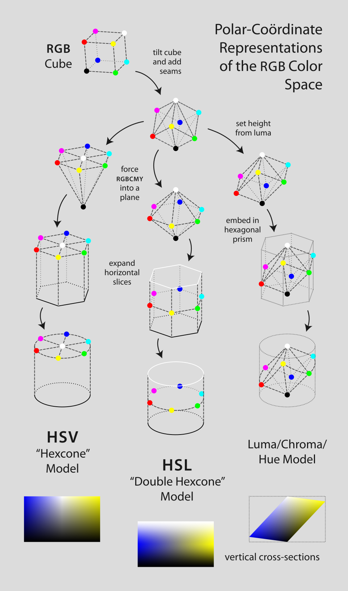

# SPI interface

串行外设接口（Serial Peripheral Interface）是一种同步串行通信接口规范，广泛用于IC控制。因为SPI是同步接口，它的速度比UART等异步协议（一般最高1MHZ）快，能到数十MHz。由于SPI是单端接口而不是差分接口，不适合长距离（比如远于1米）传输

SPI有一个Master和若干个Slave，一般Master就是MCU，Slave是各种IC，如存储器

有四个控制信号：

1. SCLK: Serial Clock
2. MOSI: Master Out Slave In
3. MISO: Master In Slave Out
4. <span style="text-decoration:overline">SS</span>: Slave Select

传输总是由Master发起，拉低SS之后就开始双向传输，没有其他的交流。根据MISO和MOSI在时钟的上升、下降沿传输，有四种模式，Master和Slave必须用同一种模式

# 阻碍音

阻碍音是音素种类之一，其调音方法为阻碍气流流出。所有辅音都是阻碍音，大多数阻碍音都是辅音

| 语言   | 国际音标  | 例字         |
| ------ | --------- | ------------ |
| 普通话 | t, tʰ     | 对，退       |
| 英语   | tʰ, t / d | train, drain |
| 日语   | t, d      | た，だ       |

补充：音素有很多种分类方法，比如按调音方法分为阻碍音、响音等，按调音部位分为唇音、齿音、舌音等

## 按照调音机制分

### 塞音

阻塞声道使气流停止，除阻时气流流出爆发成声（也有不爆发出声的情况，即无声除阻 No Audible Release / Unreleased Stop，比如 sad 中的 d，doctor 中的 k 音，粤语的“八”）

塞音英文是 Plosive，也称 Occlusive，Stop。其中 stop 强调气流停止阶段，Plosive 强调爆发阶段

| 国际音标 | 中文例字 | 日文例字 |
| -------- | -------- | -------- |
| kʰ       | 看       |          |
| k        | 干       | か       |
| g        |          | が       |

p、k、t 都是常见的塞音。上述例子的三行分别是送气清音、不送气清音、浊音。中文里没有浊音，日文没有强送气清音，详见后文清音与浊音

### 擦音

发声器官形成狭窄通道，气流通过时产生湍流发出摩擦音

| 国际音标 | 中文例字 | 英文例字 |
| -------- | -------- | -------- |
| s        | 思       | sip      |
| z        | 资       | zip      |

### 塞擦音

塞音后面跟着同一发声器官产生的擦音。塞擦音是一个音还是两个音好像有一定模糊性

## 按照清浊分

### 送气与不送气

送气（Aspirate）与不送气（Unaspirate）区别于阻碍音除阻时有没有强烈的气流喷出。国际音标用上标 h（ʰ）来表示送气音。一个简单的辨别方法是发音时将一张纸巾悬于口前，观察发音时纸巾被气流吹动的程度。可以回顾塞音的中文例子

注意：没有完全不送气的音（因为完全不送气就只能发咂嘴声），只有相对的送气强弱。更详细的定量分析可以参见后文 VOT 部分

- 普通话送气与否具有分辨音位的作用，比如“兔子跑了”中的兔和跑都送气、“肚子饱了”中的肚和饱都不送气，中文使用者能听出两者区别，但日文使用者往往不能
- 日语送气与否不能区分音位，比如わたし中间的た不送气，听来像中文的 da 音、たまご开头的た送气，像中文的 ta 音（但是送气程度仍然不如中文 ta），但日文使用者认为两者只是语调区别

### 清音与浊音

清音（Voiceless Sound）与浊音（Voiced Sound）区别于发音时声带震动与否。清浊与送气情况可以进一步组合为四种：送气清音、不送气清音、送气浊音、不送气浊音。其中送气浊音比较少见，多数辅音属于另三种

- 普通话没有浊音
- 日语有清浊之分，日语吴音保留了中古汉语的清浊区别
- 英语传统上分清浊，但现代已经清化，不以清浊而是（类似普通话）以送气与否来区分音位
- 印度语包含送气清音、不送气清音、送气浊音、不送气浊音四种，非常独特

### VOT

VOT（voice onset time），中文译作发声起始时间、浊音起始时间、初浊，指塞音除阻时刻到声带开始震动所经过的时间。它揭示了清与浊、送气与不送气之间的关联

- 送气清音在除阻之后会持续喷出气流一段时间，因此VOT较长（大于50 ms）
- 不送气清音在除阻之后马上开始发音，因此VOT较短（0~30 ms）
- 不送气浊音在除阻之前就开始发音，因此VOT小于0
- 送气浊音的VOT和不送气浊音相似，但是两者喉部运动不同。这说明VOT不足以完全解释清浊，但是由于送气浊音比较少见，一般可以无视

```
    浊音        不送气清音        送气清音
------------------------------------------> VOT
```

“普通话以送气与否区分音位”和“日语以清浊区分音位”的区别在VOT理论中得到统一。两种语言都通过VOT区分音位，但是普通话的分界线靠右，在不送气清音和送气清音中间；日语的分界线靠左，在浊音与不送气清音中间

# 菜刀

## 材料

### 编号

国标不锈钢编号：`<含碳量万分比><元素符号><含量百分比>`，比如说 60Cr19Ni10 含有万分之60的碳、19%的铬和10%的镍。而且，国标允许含量在一定范围内浮动，实际含量一般比这个数值低。旧版国标用千分比标注含碳量，比如5Cr18含千分之五的碳和18%的铬，有时会简称为五铬钢

美标：用数字标识，比如说304

### 成分

- 铁：基础
- 碳：提高硬度。同时降低韧性，降低抗腐蚀性
  - 低碳钢：含碳量小于0.4%，硬度低韧性好，制作的刀锋利度保持很差，需要经常磨刀
  - 中碳钢：含碳量0.5%~0.7%，硬度和韧性都适中
  - 高碳钢：含碳量0.8%~1%，硬度较高，用来锻刀锋利度保持很好。但是因为韧性不足，不适合斩骨
- 铬：提高耐腐蚀性。低碳钢要至少12%的铬，中碳钢15%左右，高碳钢16%~18%
- 镍：提高韧性
- 钨、钼、钒、钴等：一般只有高级钢材才会用到，提供特殊性能

注意成分不是一切，冶炼方法也会影响合金性能。有的刀会使用夹钢工艺——低端产品通过夹钢把好钢用在刀刃上，高端产品夹钢主要是为了外观

## 形制


# Voiceroid2

## 界面介绍


1. 音源：ボイスプリセット，选择朗读用的音源
2. 文本：テキストボックス，输入文本的地方
3. 调音：チューニング，主要的调音工作区域
   1. マスター：全局的声音（音声効果）、停顿（ポーズのの長さ）、停顿符号（記号ポーズ）设置。一般不在这里进行调音，最多调整一下音量和停顿符号
   2. ボイス：对音源进行调整，具体在工作流里面介绍
   3. フレーズ：对语句进行调整
   4. 単語：记录特殊词汇

## 常规工作流

音源调整

1. 创建自定义音源：ボイス ‐ ユーザ ‐ 新規/コピー
2. 音源调整：チューニング - ボイス
   1. プリセット名：音源名称，可以任意更改
   2. ボイス：音源种类，可以换角色。另外，据说创建一个琴葉茜的音源，然后把音源种类换成其他角色，就能让其他人说关西话了
   3. 音声効果：基本的声音调整滑条。调整方法：拖动；滚轮；输入数字；点击滑条轨道（点击增减0.01，shift+点击增减0.1）
   4. ポーズのの長さ：停顿，如果没有选中选框就不能编辑，不过一般不需要编辑它
   5. スタイル：只有v2角色才有此项，能做出更细致的情感调节
3. 保存（チューニング框左下角）。编辑后未保存的音源右上角会显示星号

语句调整

1. アクセント：以语句（アクセント句）为单位调整各单词的音调和停顿
   1. アクセント句：右键小圆点（アクセントマーク），选择アクセント句を結合 / アクセント句を分割。两个语句中间会显示一段空白，而同一个语句内的不同音节有一条细线相连
   2. 停顿：右键P符号删除停顿（ポーズを削除）或者更改停顿（未变灰的ポーズを挿入），或者右键语句间空白添加停顿。较小的P符号代表短停顿，较大的P符号代表长停顿，带有数字的P符号表示任意长停顿
   3. 音调：上下拖动小圆圈
   4. 更改读音（モーラ）：右键小圆点 - 読み編集。很多时候直接改文本更方便
   5. 无声化：右键小圆点 - 無声化，或者左键读音。无声化指元音不发音的现象，比如あした中间的し没有声带振动。默认自动无声化，一般不需要改。如果应该无声化的音没有无声化，听上去像是读得太用力了；如果不该无声化却无声化，会稍微有一点吞音（不太明显）；将不能无声化的音设置无声化好像没有效果
   6. 句末音调（語尾）：右上角的选单，句尾声调从低到高是断定、通常、呼びかけ、疑問
2. 音量、話速、高さ、抑揚：点击设置值，shift+点击增减0.01，ctrl+点击清除，滚轮滚动增减0.01，点击黑色方块清除。另外，此处的设置和ボイス的设置相乘得到真实值，比如音源高さ1.5，调音高さ1.8，得到1.5×1.8=2.7。但高さ最大值为2，因此朗读时的真实高さ为2
3. 保存（フレーズ框下方的登録）
4. 语句调整比较玄学，只要声音自然就好。如果不确定，可以找真人声音作为参考

朗读/保存：文本框下面的再生、音声保存。随便试试就懂了

## 其他功能

注音（ルビ）：选中文本 - 右键 - ルビ挿入，或者直接编辑文本（例：＜＜試作品｜プロトタイプ＞＞）。至多用16个，并且不能带标点。含注音词的句子不能登记为语句

分配朗读（割り当て）：将音源从ボイス菜单拖动到文本框，或者编辑文本（例：琴葉 茜 - カスタム＞），朗读时遇到这个标签就会切换到对应音源

词典优先度调到低可能有bug，用户最好只用标准/高优先度

# 护肤品

1. **洗面奶**：洁面。有效成分是**表面活性剂**，洁面用的基本都是阴离子表活，又可以细分为皂基（脂肪酸盐，比如硬脂酸盐、肉豆蔻酸盐、月桂酸盐、棕榈酸盐，在配料表中写成酸+碱的就是皂化配方）、硫酸酯类（比如SLS和SLES）和氨基（氨基酸盐，一般都是XX酰XX酸盐），三者的碱性、刺激性和清洁能力都递减。清洁能力过强的，有可能反而破坏正常油脂平衡，导致油脂腺负反馈调节分泌更多油脂，因此要根据肤质合理选择，切忌洗完后脸上紧绷的
2. 爽肤水：有效成分是水+保湿剂，有补水效果，但是一般比较鸡肋。有的商家宣传能够收缩毛孔，是没什么科学依据的，毛孔粗大原因很多种，比如油脂分泌过多（解决方法：合理清洁）、角质（解决方法：果酸，水杨酸，酵素）、衰老，不可能喷个水就解决了
3. 精华：各种包含护肤有效成分的产品的统称（其实没有明确定义，噱头众多）
4. **乳液/面霜**：保湿。有效成分是**水**+**保湿剂**（甘油、丙二醇、透明质酸等）+**封闭剂**（阻止水分蒸发，角鲨烷、油脂等），根据乳化工艺不同分为乳液（水包油）和面霜（油包水）。一般来说面霜油脂含量更高保湿能力更强，乳液反之
5. 眼霜：由于眼周皮脂腺少，提供额外保湿。必要性不那么大。商家宣传能够改善眼袋/黑眼圈，但是没有科学证据证明哪种成分是有效的
6. **防晒**：护肤品界将紫外线大致分成UVA（长波紫外线，与皮肤癌、皮肤老化有关）和UVB（中波紫外线，与晒黑、晒伤有关）。常用评价标准：SPF（**S**un **P**rotection **F**actor），防护晒伤（主要是UVB）的能力；PA（**P**rotection of UV**A**），防护UVA的能力。阳光强烈时应选择SPF 30或以上、PA++或以上（不过，高防晒能力必然伴随高浓度散射剂和吸收剂，带来皮肤刺激和安全隐患。而且随着散射剂和吸收剂浓度增加，紫外线透过率也应该是指数下降，随着浓度增加，屏蔽效果增长越来越不明显）有调查显示很多人涂得都不够，所以追求更高防护能力不如正确涂防晒（2mg/cm^2）

[成分查询分析](http://cosdna.com/chs/)

# Mugen隔离技术

[参考1](https://tieba.baidu.com/p/5092155802)，[参考2](https://www.bilibili.com/read/cv22699148)

隔离技术是利用了Mugen引擎漏洞的技术。使用了隔离技术的角色称为隔离组；不用隔离技术就杀不死的角色属于防御型论外；能杀死防御型论外角色属于攻击型论外（这个分类法应该是10年代前半的，现在用了隔离技术的角色几乎100%同时满足三个条件）

## 原理

**512超越**

Mugen同时运作的控制器上限是512个，但是，处于`hitpausetime`（击中对手时的停顿）时即使超过512个也不报错，多出来的控制器会覆盖原本内存的内容。第500~600个控制器的内存区域刚好是自己的角色参数，配置控制器参数可以给自己锁血，刷攻击等；大约7000多个控制器的内存是对手的参数，可以将对手`alive`设置0

使用512超越覆盖返回地址，就能执行任意代码

**`%n`漏洞与`%f`漏洞**

Mugen引擎调用剪贴板的代码缺少检查用户输入导致了这两个漏洞。利用`%n`漏洞可以写任意地址内存，进一步用`%f`漏洞执行任意代码

`%n`漏洞原理：`printf`等打印函数中，`%n`将已经打印的字符数量写到该地址。一般的编译选项禁用`%n`，但Mugen不知为何允许使用。下面的代码中，`%*d`输出了宽度为48个字符的数字0，`%n`向`0x4b4048`地址写入48，实现了任意写内存

```c
printf("%*d%n", 48, 0, 0x4b4048);  // %n漏洞：覆盖内存
```

进一步用`%f`漏洞执行任意代码的方式是

1. 通过`%n`漏洞劫持GOT表（储存各个函数地址的表），将某个会被`%f`调用的函数地址改写到别的地方
2. 在改写到的地方用`%n`漏洞写入恶意代码
3. 执行`printf("%f", 1)`，过程中会调用上一步的恶意代码。`%f`应该不是唯一方法，但它的触发非常稳定

补充：此漏洞属于字符串格式化漏洞。因为`printf`函数族不检查参数合法性，很多软件都有类似的漏洞，并且有很多利用方法，比如

```c
printf("%x");    // 给的参数少于输出的个数，会把栈的下一个数打印出来
printf("%s%s");  // 同上，但是字符串会打印下一个数指向的内存位置，可以用于读内存，也可以指向某些奇怪位置让程序崩溃
```

**`StateDef`溢出**

人物状态文件（定义以及控制人物画像、移动、数值等）中使用`StateDef`语句定义状态号。如果状态号超过64字节，在读取的时候会导致栈溢出，覆盖掉栈中部分内容。用此方法覆盖掉一个返回地址，就能执行任意代码

三种隔离技术相比，512漏洞需要战斗开始之后才能启动；`%n`漏洞在战斗开始那一帧就可以启动；`StateDef`溢出在人物选择时就已经启动了，三者能做到的事差不多但速度上天差地别

**zlib溢出**

利用zlib 1.1.4的漏洞实现。比Statedef溢出更快，但是需要特定的Mugen版本才能实现，触发稳定性问题也尚未解决，还处于研究阶段

## 应用

用法非常非常多，仅举一些常见的例子

- 按键操作，比如把当前按键改成F1，即秒杀P2的调试按键
- 直死：将对手`alive`值设为0
- Player消除：将对手`exist`值设为0
- CNS操作：CNS存放人物代码，将对手CNS修改为空，或者改成其他角色，能阻止对手使用隔离技术

# 药物

**药物分类**

- 非处方药（Over-the-Counter，OTC）：效果明确，副作用小的药物，可以自行购买服用
  - 甲类：红色OTC标志，仅在药店出售
  - 乙类：绿色OTC标志，可在一般商店出售，安全性更高
- 处方药：需要医生的处方才能购买

**家庭常用OTC药物成分**

| 名称         | 药效                         | 备注       |
| ------------ | ---------------------------- | ---------- |
| 布洛芬       | 消炎止痛、退热               |            |
| 对乙酰氨基酚 | 止痛、退热                   |            |
| 氯苯那敏     | 治疗过敏性疾病、晕车、流鼻涕 | 抗组胺药物 |

**常用OTC感冒药**

- 布洛芬
- 复方药：以乙酰氨基酚、咖啡因、氯苯那敏作为主要有效成分。对乙酰氨基酚和氯苯那敏能够缓解发热、头痛、流鼻涕、鼻塞等症状，同时咖啡因削弱嗜睡的副作用
  - 复方氨酚烷胺片
  - 氨酚咖那敏片

顺带一提，头孢、阿莫西林等抗生素也可用于治疗感冒，它们属于处方药

# 字幕

中文字幕每行不超过20字，英文字幕不超过40字符

## 时间轴

参考[Netflix指南](https://partnerhelp.netflixstudios.com/hc/en-us/articles/360051554394-Timed-Text-Style-Guide-Subtitle-Timing-Guidelines)。这个指南以0.5秒作为标准，两个吸引观众注意的事件（比如对话开始与字幕出现、前一句话字幕消失到后一句话字幕切入）要么同时发生，要么相隔0.5秒以上

根据个人经验，影响力从大到小排序是`画面 > 字幕 > 语音`。因此具体规则是：

- 字幕于音频开始的同时切入，于音频结束0.5秒（或者下一句话的开始）后消失
- 两段字幕之间的间隔应要么等于2帧，要么大于0.5秒
- 如果对话跨越镜头变化，字幕要么与镜头同时切换，要么错开至少0.5秒

# 柯里化

柯里化（Currying）是将一个多参数函数变成嵌套的单参数函数。柯里化的好处是，有的情况下使用单一参数的闭包较为方便，有时甚至不得不使用单参数函数。一个简单的例子是：

```javascript
// 普通的求和函数
function sum(a, b) {
    return a + b;
}

// 柯里化的求和函数。调用它返回函数plus_a，再次调用plus_a得到结果
function curry_sum(a) {
    const plus_a = (b) => (a + b)
    return plus_a
}

sum(1, 2)
curry_sum(1)(2)
```

用形式化数学语言描述，上述求和函数记作$f: (x, y) \mapsto z$；柯里化的求和函数为$h : (x \mapsto (y \mapsto z))$，即，输入变量$x$，返回值是$h_x: y \mapsto z$的函数。定义箭头右结合，则可以省略括号写作$h : x \mapsto y \mapsto z$

# 开源许可证

几种常用许可证（顺序从宽到严）

1. BSD、MIT：可以自由使用、复制、分发、修改，分发时必须包含版权提示。简洁，适合大部分中小规模的项目
2. Apacache：作者保留专利，比较容易转向商用
3. GPL：使用了GPL代码的项目都必须开源。适合传播开源福音

## GPL

[中文翻译](https://jxself.org/translations/gpl-3.zh.shtml)

1. 持有者可以运行、复制、分发、修改软件
2. 分发原始版本时不得修改GNU GPL声明；发布修改版时必须声明修改日期，并且除非版权所有者（所有贡献者）允许，必须使用GNU GPL许可证
3. 分发时，可以对分发服务、技术支持收费，但不能收版税、授权费、专利费等费用。而且分发时必须提供源码
4. 接收者自动获得来自初始授权人的授权，获得前述的权利
5. 软件输出结果不受GPL限制

有几个变种，限制从宽到严分别是

1. LGPL：闭源软件可以把LGPL代码作为库调用
2. GPL：如果项目包含GPL代码，整个项目都必须用GPL许可证
3. AGPL：使用AGPL代码的云服务也必须开源

# 代谢率

- 基础代谢率（Basal Metabolic Rate，BMR），又叫静息代谢率（Resting Metabolic Rate，RMR），指一般环境下维持生命机能所需的能量
- 总能量消耗（Energy Expenditure），常用每日总能量消耗（Total Daily Energy Expenditure，TDEE）衡量，包括BMR、运动、消化和其他生理活动消耗的能量

## 计算方式

**Mifflin-St Jeor公式**

$ BMR = 10.0 × 体重(kg) + 6.25 × 身高(cm) - 5 × 年龄(year) + 性别系数(男性+5，女性-161) \ kcal/day $

**Katch–McArdle公式**

$$ RMR = 370 + 21.6 × 体重(kg) × (1 - 体脂率) \ kcal/day $$

其中体脂率有很多[测量方法](https://en.m.wikipedia.org/wiki/Body_fat_percentage#Measurement_techniques)，最简单的是通过身高体重估算

**TDEE估算**

BMR的1.2至1.9倍。[TDEE计算器](https://tools.heho.com.tw/bmr/)

# 编码

## utf-8

采用1~4字节变长编码

|  Byte 1  |  Byte 2  |  Byte 3  |  Byte 4  |     Unicode码位     | 备注           |
| :------: | :------: | :------: | :------: | :-----------------: | -------------- |
| 0yyyzzzz |          |          |          |   U+0000 - U+007F   | ASCII          |
| 110xxxyy | 10yyzzzz |          |          |   U+0080 - U+07FF   | 西欧、中亚语言 |
| 1110wwww | 10xxxxyy | 10yyzzzz |          |   U+0800 - U+FFFF   | 东亚语言       |
| 11110uvv | 10vvwwww | 10xxxxyy | 10yyzzzz | U+010000 - U+10FFFF | emoji、其他    |

# 颜色

## 彩色视觉

人眼的L、M、S三种视锥细胞负责感受颜色。L型对长波长（564~580 nm，黄绿色）光最敏感，M型对中波长（534~545 nm，绿色）光最敏感，S型对长波长（420~440 nm，蓝紫色）光最敏感。需要注意，

1. 响应峰值、敏感度因人而异
2. 三种视锥细胞的感受范围有重叠，L细胞并不负责感受红色，S细胞也不负责感受蓝色——比如说，看到红色光时，L受到较强刺激，M受到较弱刺激，S几乎不受刺激，经过大脑处理，人感受到红色
3. 颜色是三种视锥细胞的输出在大脑中经过复杂处理实现的，环境光、移动和形状等原因都可能影响人感受到的颜色

## 色彩空间

将每种颜色映射到一个向量，所有人眼能感知的颜色就会映射到一个点集，该集合称作色彩空间

幸运的是，色彩空间可以近似看作线性空间——早在1853年，德国学者赫尔曼·格拉斯曼就通过试验总结出格拉斯曼定律：**人眼对颜色的感知近似线性**。如果用现代方法描述，一束功率谱为$I(\lambda)$的光，它引起S视锥细胞的响应是：
$$
R = \int_0^\infty I(\lambda) r(\lambda) \ d\lambda
$$
其中$r(\lambda)$为S视锥细胞对不同波长的光的响应强度；另外两种视锥细胞的响应G和B同理。$(R, G, B)$就是这束光在色彩空间中的坐标。从RGB的定义不难看出色彩空间是个线性空间（将$m \cdot I(\lambda)$代入上式，得到其坐标是$m \cdot (R, G, B)$，满足齐次性；$I_1(\lambda) + I_2(\lambda)$的坐标是$(R_1 + R_2, \, G_1 + G_2, \, B_1 + B_2)$，满足可加性）

以上定义帮助我们了解了色彩空间的结构——它是一个三维线性空间——但我们还需要选择三个颜色作为基向量，并设计实验方法来测量RGB值

### CIE空间

使用亮度可调的700 nm、546.1 nm和435.8 nm光源作为三原色（即三个基向量），将三原色光投射到屏幕左半边，待测光投射到屏幕右半边。调整三原色光的亮度，使其与待测光颜色相同，此时三原色光的功率即为该颜色的坐标（有的颜色坐标为负值，比如某颜色的R坐标为负值，这种情况下将红光投射到右半边，并用亮度的相反数作为R坐标）。此方法测量得到**CIE RGB色彩空间**

对CIE RGB空间做线性变换，使1. 所有颜色的坐标处于第一卦限；2. Y坐标等于该光束的亮度；3. 白色的坐标为$(\frac{1}{3}, \ \frac{1}{3}, \ \frac{1}{3})$，即得到**CIE XYZ色彩空间**。这种变换可以视作对三原色的变换（虽然此时的三原色已经不是物理上实际存在的光了），也可以视作对响应函数的变换。XYZ空间的坐标$X=\int_0^\infty I(\lambda) x(\lambda) \ d\lambda$，其中的$x(\lambda)$是视锥细胞响应$r(\lambda), \ g(\lambda), \ b(\lambda)$的线性组合

将CIE XYZ色彩空间中$X+Y+Z=1$的平面投影到XY平面上，便得到了**CIE xy色度图**，俗称马蹄图。在色度图上选择三个点，则它们围成三角形内任意颜色都可以用顶点的颜色组合而成

### RGB空间

以红、绿、蓝三色作为基向量的色彩空间称作RGB空间，CIE RGB空间就是最早的RGB色彩空间。常见的RGB空间还有sRGB、Adobe RGB等

RGB空间的最大价值就是显示颜色——使用红绿蓝三种发光元件，就能显示三种发光元件颜色张成的平行六面体中的颜色、也是CIE xy色度图中三原色围成的三角形中的颜色，覆盖了人眼彩色视觉的大部分

### HSV模型与HSL模型

前文描述的色彩空间已经能够描述所有颜色了，但它们与人脑的颜色认知仍有很大偏差。大脑对颜色的处理，尤其颜色之间关系的处理是非线性的，用线性空间无法准确描述。HSV和HSL模型通过旋转RGB空间，并对它作非线性变换，让它更符合人的色彩认知

注意，HSV和HSL是颜色模型，而不是色彩空间。颜色模型是描述颜色的特征的方法，需要配合具体的色彩空间才能表示颜色

- **Hue（色相）**：色彩的基本属性，用角度（0~360°）表示。在CIE色度图中，以白色为端点画一条射线，射线上的颜色都是相同色相；改变色相就相当于转动这条射线
- V和L：色彩的明亮程度
  - **Value（明度 / 浓度）**：$V = max(R, G, B)$
  - **Lightness（亮度）**：$L = mean(R, G, B)$
- **Saturation（饱和度）**：色彩的鲜艳程度。饱和度越高就越靠近色度图边缘，越低就越靠近中心。S=0时为黑白灰
  - 首先定义色度（Chroma）$C = max(R, G, B) - min(R, G, B)$，它表示颜色偏离白色的程度
  - $S_{HSV} = \frac{C}{V}$
  - $S_{HSL} = \frac{C}{1 - abs(2L - 1)}$

注：公式仅作示意。HSV、HSL依托于色彩空间，使用不同色彩空间时，公式需要相应调整



这两种空间都为了方便使用作出了一定妥协。比如，

1. HSL空间在L趋于0 / 趋于1时表现为黑色 / 白色，此时饱和度还是能任意调节，但哪怕把饱和度拉满也不会是鲜艳的颜色——换句话说，此时饱和度失去意义。HSV空间在V趋于0时也是如此
2. 人眼对绿光比其他颜色更敏感，因此即使是明度、亮度相同的颜色，色相更靠近绿色的看起来更亮（也有人用**灰度**$Gray = 0.3 \ R + 0.6 \ G + 0.1 \ B$，表示颜色明亮程度）

两者相比**HSV空间更常用**，因为HSV调高亮度时颜色鲜艳程度不会漂移、降低饱和度时颜色向白色过渡，符合颜色稀释时的生活常识；不过CSS原生支持HSL，因此网页前端用HSL较多

## 配色理论

单一颜色给人的印象是

- 高亮度、高饱和度：<span style="background-color: #FF0000">&nbsp;&nbsp;&nbsp;&nbsp;</span>，显眼、活泼；刺眼、廉价
- 高亮度、中饱和度：<span style="background-color: #FFADAD">&nbsp;&nbsp;&nbsp;&nbsp;</span>，柔和、单纯；轻浮
- 高亮度、无饱和度：<span style="background-color: #FFFFFF">&nbsp;&nbsp;&nbsp;&nbsp;</span>，简洁、素雅；无趣、死板
- 低亮度、高饱和度：<span style="background-color: #510000">&nbsp;&nbsp;&nbsp;&nbsp;</span>，稳重，成熟；脏，混乱
- 低亮度、中饱和度：<span style="background-color: #513737">&nbsp;&nbsp;&nbsp;&nbsp;</span>，稳重；阴沉
- 低亮度、无饱和度：<span style="background-color: #000000">&nbsp;&nbsp;&nbsp;&nbsp;</span>，厚重；压抑

多种颜色搭配时，要注重颜色之间的**对比**。可以是色相，明度，或者饱和度之间的对比，适度的对比显得画面融合，小面积的强烈对比能够突出主题，大面积的强烈对比则是灾难性的。经验法则如下：

- **色相对比**：$|H_1 - H_2| \cdot \frac{2 S_1 S_2}{(S_1 + S_2)} < 60°$，其中H是色相角度值，S是归一化的饱和度。此公式即：色相之差乘以饱和度调和平均数小于60°
  - 低饱和度颜色能接受的色相差较大，高饱和度颜色之间色相差不超过60度
- **明暗对比**：灰度（$Gray = 0.3 \ R + 0.6 \ G + 0.1 \ B$）相差128以上，方有明显阴暗区分
  - 需要注意，黄、绿、青的灰度比较高，用这些颜色需要同时控制好亮度和灰度
- **面积分配**：按照70%主色、25%辅助色、5%点缀色搭配，每一类尽量用相近色相
  - 主色不能用高饱和高亮度，否则刺眼
  - 如果点缀色灰度较低，是“收缩色”，可以适当加大一点面积。反之亦然

# AI

- AI：解决复杂问题的算法
  - 机器学习（Machine Learning）：不需人类设计算法就能提高智能的AI
  - 深度学习（Deep Learning）：使用多层神经网络的机器学习算法
  - 今天，几乎所有的AI都是深度学习，因此AI、机器学习、深度学习几乎可以等同
- 神经网络（Neuro Network）
  - CNN
  - RNN
  - Transformer
- 学习方式
  - 无监督
  - 有监督
  - 强化学习（Reinforcement Learning）

## 神经网络

### 结构

神经网络由若干“层”组成，每层可以看作一个函数$f: \mathbb{R}^m \mapsto \mathbb{R}^n$，它接受一个m维向量作为参数，返回一个n维向量。最基本的层是全连接层，它由权重矩阵和激励函数构成

1. **加权求和**：$\mathbf{z = W x + b}$，其中`x`是m维输入向量，`z`是n维输出向量；W是$n \times m$维的权值矩阵，`b`是m维偏置向量。W和b可以任意调节
2. **激励函数**：$\mathbf{a = \phi(z)}$，$\phi$是非线性的激励函数，将它作用于$z$的每个分量得到输出$a$

两步处理得到这一层的函数是$f(\mathbf{x}) = \phi(\mathbf{Wx + b})$。这个函数本身并不复杂，但将好几层连接起来就能得到一个非常复杂的函数。为了方便理解，首先研究这样一个Toy Model：一维输入层、n维全连接隐藏层、一维全连接输出层；隐藏层使用ReLU激活函数$\phi_{ReLU}(v) = max(0, v)$，输出层不使用激活函数

那么，隐藏层的输出就是$\mathbf{a}(x) = \phi(\mathbf{W_1} x + \mathbf{b_1})$；输出层的输出是$y = \mathbf{W_2 a} + b_2$。假设固定隐藏层的权值和偏置，调整输出层的$\mathbf{W_2}$和$b_2$，这时第二层的作用就是以$\mathbf{a}(x)$作为基函数进行曲线拟合！如果再去调整隐藏层的权值，就是在调整拟合使用的函数系！

这也是神经网络的数学本质——**函数拟合**。将现实问题抽象为数学意义上的函数，就能用神经网络拟合这个函数。大部分现实问题，哪怕是一般人都能轻松解决的问题，经过数学抽象后，都复杂到人脑无法理解、无法想象，但这丝毫不妨碍我们用神经网络拟合这个复杂得不可思议的函数

### 训练

寻找拟合参数的过程称作训练。训练前要先定下目标：是让神经网络输出$y$与“正确”输出$\hat{y}$的差距尽可能小，一般使用**损失函数**$\mathcal{L}$定量描述。最常用的损失函数是平方损失函数$\mathcal{L}(y, \hat{y}) = (y - \hat{y})^2$

例如，训练一个判断图片中有没有人脸的神经网络时，定义输出$y$是“图中有人脸的概率”，即，$y = 0$代表图中不可能有人脸，输出$y = 1$代表图中肯定有人脸。用一张有人脸的图作为参数，希望神经网络输出$\hat{y} = 1$，但实际输出为0.8，那么损失就是$\mathcal{L} = (1 - 0.8)^2 = 0.04$

训练过程通常使用**梯度下降法**。对于给定的输入，输出$y$是网络权值$W$的函数，因此$\mathcal{L}$也可以写作$W$的函数$\mathcal{L}(W)$。采用一阶近似，可得在这一点附近$\mathcal{L}(W+dW) = \mathcal{L}(W) + \frac{\partial \mathcal{L}}{\partial W} dW$，让W沿着梯度反方向移动时$\mathcal{L}$下降最快，因此将W调整为$W' = W - \eta \frac{\partial \mathcal{L}}{\partial W}$

实践中使用**反向传播算法**（其实就是链式法则）计算$\frac{\partial \mathcal{L}}{\partial W}$

理论上来说，梯度下降不保证能找到最优解。沿着梯度寻找最低点时，完全有可能陷进局部极小值，而找不到全局极小值。幸运的是陷入极小值几率很小：极小值点是每个维度一阶导都为0、二阶导都大于0的点，维度较高时几乎没有极小值点。实践中还可以加入一点随机性以避免陷入局部极小值

此外，让模型收敛到极小值时会带来过拟合风险。如果针对某些输入一直梯度下降到最小值，改变输入后这个模型几乎必然不管用

# 套接字

**Socket的历史**：Socket的字面意思是插座。英文使用“Socket”一词最早是1972年关于ARPANET的论文[Function-oriented protocols for the ARPA computer network](https://www.computer.org/csdl/proceedings-article/afips/1972/50790271/12OmNyQpgUc)，作者将网络连接比作插座，主机“插进”网络和其他主机通信。今天使用的Socket来源于1983年的4.2BSD Unix操作系统引入的**BSD Socket**。它将Socket用作进程间通信机制，应用程序可以通过写入或者读取Socket实现与其他进程、与网络设备的通信

**Socket怎么翻译为套接字**：中文翻译是怎么来的已经不可考，但可以推测，“套接”源自Socket的功能——封装网络连接，即“套”和“接”；“字”源自传输内容——字节。这个翻译其实很好的概括了Socket的作用，只不过不符合中文的习惯。”套接字“语法结构上是个动宾短语，”字“是动作承受者，表达的意思却是偏正短语，用”套接“修饰”字“（也可能是后补短语，用”字“作为补语）

# 黑灰产

“黑产”是违法互联网产业，比如网络诈骗、勒索软件、DDoS攻击等；“灰产”是游走在法律边缘或是利用法律漏洞的产业，比如刷单、引流、爬虫等

## 产业结构

黑灰产形成了完整的产业链条，各环节高度专业化分工。产业链大致可以分为三层：

- 上游：根据中下游需求**生产资源**，如开发爬虫工具、窃取用户数据、提供电话号码
- 中游：**整合**上游的工具，以平台或者服务的方式**销售**给下游
- 下游：负责直接**执行**黑灰产行为，将中上游的资源变现

## 形式

中上游提供了以下资源：

- **网络资源**

  - **代理IP池**：提供海量动态IP地址（包括住宅代理、数据中心代理），用于隐藏真实IP、绕过地域/IP限制、进行分布式攻击
  - **“肉鸡”/僵尸网络**：被黑客控制的计算机、服务器、IoT设备网络。用于发起DDoS攻击、发送垃圾邮件、挖矿、存储非法数据等
  - **被黑服务器/VPS**：被入侵或利用虚假身份租用的服务器，作为攻击跳板、C&C服务器、钓鱼网站托管、恶意软件分发点等

- **攻击工具与技术**

  - **恶意软件服务**：勒索软件、木马、间谍软件、挖矿木马、银行木马等的购买、租赁、定制服务
  - **漏洞利用工具/漏洞信息**：买卖未公开的漏洞（0day）、已知漏洞的利用工具（Exploit Kits）
  - **攻击平台租赁**：如DDoS攻击平台（压力测试平台）、钓鱼网站生成平台、短信/邮件轰炸平台等

- **账号资源**

  - **接码平台**：提供大量虚拟手机号，用于接收注册/验证短信，绕过平台实名制。是虚假账号的源头
  - **打码平台**：利用人工或AI破解图形验证码
  - **养号服务**：将注册好的账号“养熟”（模拟正常用户行为），提升账号可信度和价值
  - **自动化工具**：批量注册软件（注册机）、模拟器、群控软件等

- **数据泄露与交易**

  - **社工库：** 专门收集和交易泄露的用户信息（用户名、密码、邮箱、手机号、身份证号等）的数据库或平台。可能用于精准诈骗、营销等

  - **大规模爬虫**：未经授权爬取网站内容（商品信息、价格、评论、用户信息等），用于不正当竞争、价格监控、数据倒卖
  - **爬虫绕过技术：** 开发和使用专门工具绕过反爬虫机制

- **其他支撑服务**

  - **推广与引流**：通过黑帽SEO、垃圾邮件/短信、社交平台群控、网赚平台、色情/赌博网站广告位等渠道，将潜在受害者引导至诈骗或非法平台
  - **资金结算与洗钱**：专门提供非法资金转移、结算、兑换（尤其是虚拟货币）的服务。如跑分平台、四方交易

下游通过以下犯罪形式变现：

- **诈骗**：电信诈骗、网络钓鱼、杀猪盘、刷单诈骗、庞氏骗局……
- **赌博**：运营或推广网络赌博平台
- **敲诈勒索**：勒索软件、DDoS勒索、数据泄露勒索、裸聊敲诈……
- **刷量、刷单**：刷网站流量、视频播放量，刷虚假交易、虚假好评……
- **薅羊毛**：利用电商平台漏洞，或者利用恶意账号获利
- **侵犯知识产权与不正当竞争**
  - 盗版
  - **外挂**：游戏外挂、抢票软件、直播场控外挂
