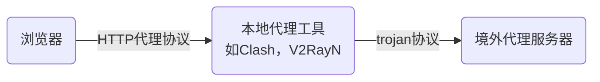

本笔记记录网络相关的底层知识

# 互联网协议

## 互联网

互联网（Internet）是遍布全球的一套网络设施，它由主机、路由器、交换机、传输介质等设备组成，不同设备间的连接遵循互联网协议套件（Internet Protocol Suite，IPS，也叫做TCP/IP协议族，TCP/IP Protocols）的规定。它由无数个小网络连接而成——每个家庭有各自的家庭网络，若干家庭网络相连形成覆盖整栋楼房的网络，这些网络再进一步连接，直至全球网络相连，构成互联网。因此，互联网也称作“**网络的网络**”

互联网只有一个，世界上其他网络都不能称作互联网。电话网络、工业以太网等网络不使用TCP/IP协议，独立于互联网之外；独立内网（如保密单位的内部网络）虽然使用TCP/IP协议，但未接入互联网，也是独立网络；家庭网络、学校网络等局域网使用TCP/IP协议，也可以与互联网通信，但不能从外部直接访问，一般只算独立挂载在互联网外围

### 分组交换

#### 简介

互联网使用**分组交换**（Packet Switching）技术通信，此技术是互联网的基石。从历史的角度来看，交换技术经过了以下演变：

1. **电路交换**（Circuit Switching）：开始通信前，双方要建立点对点的信号通道。比如老式电话网络中，用户拨号之后，接线员（或者后来一点的程控交换机）将拨号者的电话线连接到收听者的电话线，然后拨号者与接听者才能通话
2. **报文交换**（Message Switching）：双方无需建立完整通信链路，发送者将信息转发给路由（即“中转站”），路由将信息转发给下一个路由，再下一路由，直到消息传达给接收方，过程类似于快递运输
3. **分组交换**（Packet Switching）：在报文交换的基础上，将数据拆分为若干分组（Packet）分别传输
   - 与电路交换相比：电路交换在空闲时（例如发出信息后等待回复）也要维持完整信号通道，浪费了部分带宽，而分组交换可以将这部分带宽用于和其他设备通信。不过分组交换也有时延不可控、易丢包的缺点
   - 与报文交换相比：使用报文交换传输大文件时，若占用全部带宽，则其他用户无法使用网络；若使用部分带宽（频分复用、时分复用等），则像电路交换一样浪费带宽。报文交换作为分组交换的前身，在分组交换技术出现后迅速被淘汰了

如今，分组交换是主流的交换技术。但在某些场景（需要稳定连接、固定流量等）电路交换有优势，因此也有尝试将两者混合，使用分组交换的同时又具有一定电路交换的特性

#### 时延，丢包和吞吐量

时延，从源主机开始发送到目标主机完成接收所花费的时间，是以下四部分之和：

- **处理时延**（Processing Delay）：处理数据包、查找路由表的时间。通常是微秒量级
- **排队时延**（Queuing Delay）：等待传输的时间，取决于流量强度。微秒到毫秒量级
- **传输时延**（Transmission Delay）：发送数据所需时间，如网速为100 Mbps，传输10 Mb的数据，传输时延为0.1s
- **传播时延**（Propgation Delay）：信号传播的时间，取决于路由器之间举例，可用“一米5纳秒”估算，局域网传播时延可忽略，广域网为毫秒量级

### 互联网协议套件

互联网协议套件，是一系列网络传输协议的集合，它们是现代网络通讯的通用标准

#### TCP/IP参考模型

TCP/IP协议族将网络通信按照功能，从上到下划分为应用层、传输层、网络层、链接层，并定义了每一层的功能。分层模型让每一层独立工作，不需要担心其他层级的问题。下表总结类每层的作用、常见协议等

| 层                        | 作用               | 常见协议             | 数据单位        |
| ------------------------- | ------------------ | -------------------- | --------------- |
| 应用层，Application Layer | 实现特定业务       | HTTP，DNS，SMTP，FTP | 报文（Message） |
| 传输层，Transport Layer   | 维护数据传输可靠性 | TCP，UDP             | 段（Segment）   |
| 网络层，Internet Layer    | 不同网络之间通信   | IP，ICMP，ARP        | 包（Packet）    |
| 链路层，Link Layer        | 局域网内通信       | 以太网，Wi-Fi        | 帧（Frame）     |

需要注意，这只是“参考”模型，协议并不是严格按照这个模型设计的，比如ICMP协议工作于网络层，但它不需要传输层协议，直接与应用层对接

大部分教材和课程都是从上往下讲的，我觉得不妥，链路、网络都没有理解，就开始讲传输、应用，这不是空中楼阁吗？比较理想的学习顺序应该是先从下往上过一遍，再从上往下仔细学

#### OSI模型

OSI模型是国际标准化组织提出的分层方案，它的划分如下表

| 层号 | 名称                          | 作用                         |
| ---- | ----------------------------- | ---------------------------- |
| 7    | 应用层（Application Layer）   | 为用户提供服务               |
| 6    | 表示层（Presentation Layer）  | 数据处理（编码、加密解密等） |
| 5    | 会话层（Session Layer）       | 管理应用程序间会话           |
| 4    | 传输层（Transport Layer）     | 维护数据传输可靠性           |
| 3    | 网络层（Network Layer）       | 网络间通信（路由和寻址）     |
| 2    | 数据链路层（Data Link Layer） | 帧编码和误差纠正             |
| 1    | 物理层（Physical Layer）      | 传输比特流                   |

OSI模型比TCP/IP参考模型分层更严格，功能更完善。因此需要分析协议 / 网络设备的作用时往往采用OSI模型。不过，严格和功能完善的代价是降低了灵活性，还增添了不必要的复杂度，因此实践中还是根据TCP/IP参考模型设计

时刻注意，OSI模型和TCP/IP参考模型终究是两个东西，要避免混淆。我的分辨经验是：涉及链路层的论述往往是OSI模型，因为TCP/IP参考模型链路层比较混乱；只涉及传输层、网络层的论述不必费心分辨，因为OSI模型3、4层和TCP/IP参考模型的2、3层几乎完全对应；使用数字编号的可以通过结合各层作用分辨

本笔记中的层，若无说明，均指TCP/IP参考模型的层

## 链路层

**两台设备之间的通信信道**（网线，光纤，WiFi等）称作**链路**（Link）。链路层协议规定了链路上传输数据的规则

链路层功能需要软硬件配合实现：硬件部分主要包括**网络适配器**（俗称网卡），它是实现了链路层协议的专用芯片；软件部分则是计算机上运行的网卡驱动、和上层的接口等。链路层是协议栈中软硬件交接的部分，链路层之上的网络、传输、应用层都是纯软件，不需要和硬件打交道

### 以太网

以太网是使用最广泛的有线局域网标准，目前市面上的交换机、路由器、网线、网卡等均是以太网设备

以太网通过**MAC地址**（媒介访问控制地址 / Media Access Control Address，也叫物理地址 / Physical Addresss）寻址。MAC地址长度6字节，通常用12位16进制数表示，如`28-CD-C4-BB-94-A3`。每个网络适配器有自己的MAC地址，通常是出厂分配，也可随机选择

当一台设备通过以太网传输数据时，不需握手直接发送**数据帧**。数据帧包含源MAC地址、目的MAC地址、数据、CRC校验码等字段。接收方收到数据帧后，比对目的MAC地址、CRC校验码，若目的MAC地址和自己的MAC地址相同，且校验码正确，才会接收，否则直接丢弃

以太网服务是不可靠的，假如传输失败（比如数据包损坏，CRC校验错误而被丢弃），接收方不会回报，发送方无从得知传输是否成功。需要上层TCP协议确保传输可靠

以太网主要使用**星形拓扑**。早期，组网时将各台主机直接用双绞线连接到一台集线器（Hub），集线器收到信号之后将其广播给所有其他主机；90年代后期至21世纪，集线器逐渐被**交换机**（Switch）替代。交换机维护一张**MAC地址表**，用于识别和转发链路层数据帧，表中一般包含MAC地址、接口、时间三个字段

- **转发和过滤**：每当有一个数据帧过来，在表中查找目的MAC地址对应接口，从该接口发送数据帧；若查找不到，则广播至所有其他接口；若目的接口就是来源的接口，则丢弃
- **自学习**：每收到一个数据帧，都将接口、来源MAC地址、当前时间记录进MAC表；并定期清除过期地址

### ARP

ARP（Address Resolution Protocol，地址解析协议）是将IP地址和MAC地址相互转换的协议。**两种地址并用是必要的**：

- 网络层必须使用IP地址。IP地址采用层次结构，可以高效路由，但扁平结构的MAC地址不行
- 链路层不能用IP地址。假如链路层使用IP地址，则发送数据包时需要判断目的IP地址是否在当前网络（若在，可以直接通过链路传输；否则，需要发送给网关），导致链路层协议反而依赖上层IP协议的寻址功能，必将导致混乱
- 一个更明显的理由：假如丢掉MAC地址，那么主机没有IP地址就无法进行网络通信，也无法通过DHCP获取IP地址

假设A`192.168.0.13`想给B`192.168.0.22`发消息。首先，A给MAC广播地址`FF-FF-FF-FF-FF-FF`发ARP查询包，其中包含A的MAC地址和IP地址；B收到后，向A单独发送包含自己MAC地址的ARP响应包。A收到响应，将B的MAC地址、IP地址写入自己的**ARP表**

每台主机、路由器都维护一张**ARP表**，表中包含IP地址、MAC地址、时间三个字段，下次再发消息时可以先查ARP表中的缓存

## 网络层

网络层负责不同**局域网之间的数据传输**，网络层常用协议有IP（核心协议）、ICMP（网络诊断，如ping）、RIP和OSPF等内部网关协议

### IP

网际协议（Internet Protocol，IP）是网络层的核心

#### 寻址

IP协议为每个网络设备分配IP地址作为标识符（注意：每个网络接口，即每个网卡，分配一个IP地址。一台设备可能使用多个IP地址）。IP地址有IPv4和IPv6版本，前者长度为32比特，通常用点分十进制表示，如`127.0.0.1`；后者长度为128比特，通常用冒分16进制表示，如`fe80:0:0:0:7d6f:979c:3a86:80b5`，连续多段为0的部分可以省略并用`::`表示，所以此地址也可以写作`fe80::7d6f:979c:3a86:80b5`

**子网划分**

IP地址数量众多，需要划分给众多机构 / 公司 / 个人管理，划分后较小的网络称作子网，IP段或者网段。划分子网的工具是**子网掩码**，它是一个32比特的数，`IP地址 & 子网掩码`相同的地址处于同一个子网。子网常用以下两种记法：

- CIDR表示法：`IP地址/子网掩码长度`，如`14.15.0.0/16`
- 点分十进制表示法：分别记录IP地址和子网掩码的值，如IP地址`14.15.0.0`，子网掩码`255.255.0.0`

**分层授权**

IP地址由多个机构分层授权分配。按照层级从高到低，分别是

1. IANA（互联网号码分配局，Internet Assigned Numbers Authority）将IP地址分配给各地区的RIR（区域互联网注册机构，Regional Internet Registry）。例如`14.0.0.0/8`IP段分给了亚太地区RIR
2. RIR将地址分配给各ISP（互联网服务供应商，Internet Service Provider），如亚太地区RIR从`14.0.0.0/8`拆分出`14.144.0.0/12`分配给中国电信
3. ISP将地址分配给用户，例如中国电信将IP地址分配给用户

不同主机的IP地址不可重复，如果试图绕过这个体系，手动设置一个未授权的IP地址，会使路由无法正常转发，导致网络不通

**寻址机制**

IP地址分层授权机制告诉我们，从IP地址可以定位到主机的物理地址，此过程称作寻址。例如，地址`14.153.6.1`的分配过程是：IANA首先将`14.0.0.0/8`分配给亚太地区，亚太地区的RIR从中拆分出`14.144.0.0/12`分配给中国电信，中国电信从中进一步拆出`14.153.0.0/16`分给某个省……各环节IP地址分配给谁一般不是秘密，知道IP地址可以轻松定位到所在城市，权限足够的话直接定位到一个房间也不困难

从寻址过程也不难发现，如果从头开始逐比特比较两个IP地址，匹配的位数越多，就说明两台主机物理地址越近：匹配8~12比特，说明它们都在亚太地区；匹配12~16位，它们都在中国；匹配16位以上，说明它们在同一个省

#### 路由

主机与其他设备通讯时，若源IP地址和目标IP地址在不在同一个子网，就不能直接发送，需要中间设备转发。转发可能有多种路径，选取传输路径的过程称作路由（Routing）

选取传输路径的策略存储在路由设备中，称作路由表。例如，路由表记录了`目标地址: 14.153.0.0/16 下一跳: 14.78.1.1`，当此路由器收到一个目的地是`14.153.0.0/16`的数据包时，就将它转发到`14.78.1.1`

IP协议规定了使用路由表选择转发路径，但没有规定怎么建立路由表。路由表的建立、维护还要依靠OSPF，BGP等协议

### OSPF

OSPF（Open Shortest Path First，开放最短路径优先）是自治系统内部路由选择协议。使用OSPF时，自治系统（Autonomous System，AS）内的路由器会向同系统内所有其他路由器广播自己的链路状态。每台路由器都根据收到的链路状态广播、网络管理员配置的路径开销，构建自治系统完整拓扑图，并用Dijkstra最短路径算法计算路由表

### BGP

BGP（Broader Gateway Protocol，边界网关协议）是自治系统之间的路由选择协议。首先，自治系统`A`通过BGP协议交流，并计算出系统可达网段`x`；`A`的边界通过BGP协议告知相邻自治系统`B`：可通过`A`到达网段`x`；`B`再告知相邻其他系统`C`：可通过`B → A`到达网段`x`

### ICMP

ICMP（Internet Control Message Protocol，互联网控制报文协议）发送IP协议的控制信息，常用于网络诊断和故障排除。例如，Ping 工具就使用了 ICMP 协议来测试网络连通性

ICMP报文包括类型和编码两部分，“类型”说明报文含义，编码是补充信息，例如向目标主机发type = 8表示请求回显，对方（或者中间的某台路由器）回复type = 3，code = 0，表示目标网络不可达

## 传输层

传输层负责通讯的可靠性（比如校验数据是否损坏或丢失）、流量控制等。常用协议有TCP和UDP

在传输层之上，通常将网络连接封装为Socket，应用层通过调用Socket管理网络连接。Socket不是互联网协议栈的一部分，一般也不视作一层。本笔记为了方便起见将它并入传输层中

### TCP

TCP（Transmission Control Protocol，传输控制协议）是可靠的传输协议。它在传输时进行简单的数据校验，并在出错时重传。TCP传输流程如下：

1. 三次握手，验证双工通信，让另一端准备接收数据，并初始化序列号等参数
   - 源发送`SYN (SEQ=x)`。目标收到SYN包就能确认`src -> dest`信道正常
   - 目标返回`SYN+ACK (SEQ=y, ACK=x+1)`。源收到返回的SYN ACK包就能确认`src <-> dest`信道正常
   - 源发送`ACK (ACK=y+1)`。目标收到ACK包就能确认`src <- dest`正常。至此双方都知道信道可双工通信
2. 将报文分割为大小合适的数据包
3. 在每个数据包开头加上TCP头，包括：
   - 源端口和目的端口：标识数据包由哪个应用程序发送、哪个应用程序接收
   - 序列号（Sequence Number）：该数据包是第几个字节
   - 确认号（Acknoledgement Number）：在应答报文中使用，详见下一段
   - 校验和：检验数据有没有损坏
   - 头部长度、数据长度、标志位等
4. 将封装好的数据帧传递给网络层
5. 数据传完后，四次挥手中止连接

另一端收到TCP报文后，回复确认包告知发送方收到了哪些数据包，比如确认号为1000，表示第1000字节之前的数据都收到了，请求发送方从序列号发送序列号1000的数据帧

发送方如果重复收到同一个确认号（一般是3次）就重传这个包，此机制称作**重复累计确认**（Duplicate Cumulative Acknoledgements）。形象地理解，假设一个包100字节，发送方发了5000字节，但接收方说只收齐了前1000字节，那就说明1001~1100字节发丢了，需要重发。重复确认是为了防止乱序包导致无作用重传，比如因为网络延迟，接收端先收到1101~1200字节，回复确认号1001的包，再收到1001~1100字节，这种情况下发送方收到此回复并不表示1001~1100字节传丢了

发送方如果间隔很久都没收到确认包，就认为上一个确认包之后的数据都发丢了，重传这些数据包。此机制称**超时重传**。为了防止DoS攻击，连续超时的情况下，会延长超时阈值

### UDP

UDP（User Datagram Protocol，用户数据报协议）是简单、不可靠的数据传输协议。用UDP传输时，开始传输前不握手；接收端收到数据包后不回报；即使传丢了发送方也不知道，更不会自动重传。不需要可靠性，且对时延敏感的应用适合使用UDP协议

### Socket

Socket（套接字）是传输层协议的实现。应用程序可以调用Socket，像读写文件一样收发数据，而底层的TCP握手、流量控制、超时重传等都由Socket负责控制。下面的代码是调用Socket进行网络通讯的示例

```python
import socket

s = socket.create_connection(('www.example.com', 80))         # 建立连接
s.sendall(b'GET / HTTP/1.0\r\nHost: www.example.com\r\n\r\n') # 发送数据
while True:
    data = s.recv(4096)  # 接收数据
    if not data:
        break
    print(data.decode(), end='')
s.close()  # 断开连接
```

Socket实现的功能不只是传输层协议，从上面例子也可以看到，它还提供了管理连接、传输数据的接口。这部分功能位于TCP/IP参考模型传输层与应用层之间；OSI模型的会话层

## 应用层

应用层的主要作用是定义数据格式，以实现特定业务。比如HTTP协议规定了报文格式，以及收到报文后应如何处理。常见协议有HTTP（网页传输）、DNS（域名解析）、SMTP（邮件收发）、FTP（文件传输）等

### HTTP

HTTP（Hypertext Transfer Protocol，超文本传输协议）是用于传输HTML页面的应用层协议。参考本笔记“网络应用程序”部分

### DNS

域名系统（Domain Name System）通过域名查找IP地址。它位于应用层，运行于UDP协议上，使用53端口，但一般不由人类使用，而是服务于其他应用程序。客户端使用域名访问服务器时，首先向DNS服务器请求服务器的IP地址，然后用此地址连接服务器

DNS使用树状的分布式数据库。有两种查询方式：

- 递归查询：客户端发出请求，DNS服务器若不知道就查询上级DNS服务器、再上级，知道查到为止，返回IP地址
- 迭代查询：客户端发出请求，DNS服务器若不知道就返回上级服务器地址，让客户端自己过去查

实践中两种方式混用，本地DNS服务器一般用递归，根域名、顶级DNS服务器一般用迭代。当然，DNS服务器查完会留一份缓存，不必要每次都询问其他服务器

#### DNS记录

一条DNS记录包含4个字段：`Name, Value, Type, TTL`。常见类型以及它们Name，Value字段含义见下表。完整类型列表可参考[DNS记录类型列表](https://zh.wikipedia.org/wiki/DNS%E8%AE%B0%E5%BD%95%E7%B1%BB%E5%9E%8B%E5%88%97%E8%A1%A8)

| Type     | Name           | Value                   |      |
| -------- | -------------- | ----------------------- | ---- |
| A / AAAA | 主机名         | IPv4地址 / IPv6地址     |      |
| CNAME    | 别名           | 规范域名                |      |
| MX       | 邮件服务器别名 | 邮件服务器规范域名      |      |
| NS       | 域名           | 该域的权威DNS服务器域名 |      |

备注：CNAME（Canonical Name）是通过服务器别名查询规范名称。

用途1：**统一管理同IP的多个域名**。例如，某主机的规范域名是`example.com`，架设了API服务`api.example.com`和网页服务`www.example.com`。可以设置一条A记录从`example.com`指向服务器IP地址，并设置若干条CNAME记录，从`api.example.com`等别名指向规范名称`example.com`。用户访问`api.example.com`时，首先通过CNAME找到规范名称，再通过规范名称的A记录找到IP地址；更换IP地址时，只需更改一条A记录即可

用途2：**CDN、负载均衡**。例如，网站`www.example.com`开启了CDN，需要设置一条CNAME记录，指向CDN运营商提供的专用域名。用户访问`www.example.com`时，首先通过CNAME找到CDN提供商的域名，然后去请求CDN的智能调度DNS服务器。该服务器通过用户IP选择节点，并返回节点IP地址

### 电子邮件

假设`alice@qq.com`发邮件给`bob@163.com`

1. alice使用邮件程序将邮件发给`qq.com`
2. 发送端服务器`qq.com`将邮件发给接收端服务器`163.com`
3. bob访问`163.com`，获取邮件

其中，1、2步使用**SMTP**协议，此协议由发送端主动推送报文；第3步使用**POP3**或**IMAP**协议，这两个协议由接收方请求服务器获得报文

### SSL / TLS

SSL（Secure Socket Layer，安全套接层）是保障通信安全的加密协议。TLS（Transport Layer Security，传输层安全）是SSL的继任者。目前，SSL已完全停用，加密通信均使用TLS，但很多人仍把TLS协议称作SSL。TCP/IP参考模型中，它位于传输层和应用层之间（或者是应用层的一部分）；OSI模型中，它位于会话层、表示层

通信双方建立TCP连接之后，双方进行TLS握手，使用双方的TLS证书进行身份验证，然后协商加密算法并交换密钥，然后进行加密通讯。握手流程：[TLS1.0至1.3握手流程详解](https://www.cnblogs.com/enoc/p/tls-handshake.html)

握手中使用的证书是CA证书，详见“公钥基础设施”一节

# 网络应用程序

网络应用程序（Web Application）是通过网络提供服务的程序。它通常专指服务器-客户端模式、使用HTTP协议传输数据的应用，用户通过浏览器访问服务。微信小程序这样不兼容浏览器的应用，理论上来说也属于Web应用范畴，不过一般只把传统的、用浏览器访问的网站叫做Web应用

参考资料：[MDN](https://developer.mozilla.org/zh-CN/docs/Web)

## HTTP协议

### 状态码

[HTTP常见状态码总结](https://javaguide.cn/cs-basics/network/http-status-codes.html)

注意：虽然[RFC 7231](https://www.rfc-editor.org/rfc/rfc7231)定义了HTTP各状态码的含义，但网站开发者不一定完全遵循协议设计网站

**1XX**（信息响应，Informational）

- **101 Switching Protocols**：常用于切换WebSocket协议。客户端发送带有`Upgrade: websocket`头的请求，服务器返回带有`Upgrade: websocket Connection: Upgrade`的101包，然后双方可开始Websocket协议通信

**2XX**（成功，Successful）

- **200 OK**
- **204 No Content**
- **206 Partial Content**

**3XX**（重定向，Redirection）：指示资源URL变更，并在`Location`响应头中给出新的URL。浏览器会自动跳转到该URL

- **301 Moved Permanently**（永久重定向）：比如`example.com/index`永久重定向到`example.com/home`，表示服务器希望客户以后不要再访问`example.com/index`了，直接去访问`example.com/home`
- **302 Found**（临时重定向）：比如`example.com/index`临时重定向到`example.com/login`，表示服务器希望用户这次先去`example.com/login`登录，以后访问网站主页还是去`example.com/index`
- **304 Not Modified**

**4XX**（客户端错误，Client Error）：客户端发送的请求有问题，服务器无法处理 / 拒绝处理

- **400 Bad Request**
- **401 Unauthorized**：未授权，如Token缺失或无效（提示用户去登录）
- **403 Forbidden**：禁止访问，如普通用户访问管理员页面，或者访问禁止远程访问的页面（告知用户无权访问）
- **404 Not Found**

**5XX**（服务器错误，Server Error）：服务器故障，无法处理请求

- **500 Internal Error**
- **502 Bad Gateway**：网关（CDN，反向代理，网关聚合等）无法连接到服务器

## HTTPS协议

CA证书是数字证书认证机构（Certificate Authority）颁发的电子证书，一般特指SSL/TLS证书。设备与服务器建立SSL/TLS连接时，需要验证证书有效性：

1. 设备请求服务器`example.com`，服务器发回服务器证书、签发证书的CA机构信息
2. 设备比对服务器证书、本地信任库，若匹配到了则信任此服务器
3. 若未匹配到，则向签发证书的CA机构服务器发起请求，CA服务器发回自己的证书、上级CA机构信息
4. 用和第二步相同的方法判断此CA服务器是否可信，若可信，则与它建立连接，询问`example.com`是否可信；若不可信，则重复3-4，请求再上一级的CA服务器
5. 若最终判断结果是`example.com`可信，就与它继续建立连接；否则，中止TLS握手

## 会话

[Cookie](https://developer.mozilla.org/zh-CN/docs/Web/HTTP/Guides/Cookies)为HTTP协议添加了状态。首先由服务器响应头[设置Cookie](https://developer.mozilla.org/zh-CN/docs/Web/HTTP/Reference/Headers/Set-Cookie)，然后访问网页时浏览器会自动在请求头中加上Cookie

```
// 响应头设置Cookie
Set-Cookie: sessionId=38afes7a8; Max-Age=2592000; Domain=example.com; Path=/; Secure; HttpOnly; SameSite=Lax

// 请求头带上Cookie
Cookie: sessionId=38afes7a8
```

其中，`sessionId=38afes7a8`是Cookie键值对，剩余的是Cookie属性。重要Cookie属性有：

- `Domain`和`Path`指定生效范围，当访问此范围URL（指定的域名及其子域名；该路径及其子目录）时会自动携带此Cookie。若不指定，则默认域名和路径是当前的域名、路径（这种情况下不会包含子域名）
- `HttpOnly`阻止Javascript通过`document.cookie`访问Cookie，防止XSS攻击窃取Cookie
- `SameSite`控制跨站访问是否发送Cookie，用于防御CSRF攻击
  - 如果要访问的URL和当前浏览器地址栏里的URL的协议、顶级域、二级域名不同，称作跨站访问。跨站比同源策略宽松，不比较端口、不比较次级域名
  - `None`：跨站请求会携带Cookie
  - `Lax`：用户直接操作的GET请求会携带Cookie，如点击超链接
  - `Strict`：任何跨站访问都不发送Cookie，如`fetch`、重定向、点击链接跳转
  - 未设置SameSite属性时，Chrome和Edge将其视为Lax（其实比Lax宽松一点点，比如为了兼容SSO，没有SameSite属性的Cookie设置之后120秒可以跨站使用），Firefox、Safari视作None
- `Secure`指示浏览器仅通过https请求发送Cookie，防御中间人攻击

## 同源策略

同源策略（Same-origin Policy，SOP）是浏览器的安全策略，它限制脚本访问**其他站点**的资源。它不是HTTP协议的一部分，但现代浏览器均采用此策略

同源策略防止恶意网站操作其他网站页面。假如没有SOP，恶意页面可以通过脚本获得其他网站的完全控制权，比如用户打开恶意页面后，恶意页面可以用Javascript打开银行网站并进行恶意操作，例如用`bank_pate = window.open`开启页面，再通过`bank_page.document`操作其DOM；有SOP之后，除非银行网站允许，其他站点无法访问它的DOM，也无法用脚本操作网页

注意：SOP不能防范XSS、CSRF：前者成因与跨源操作完全无关；后者可以用跨源写操作绕过。不过它确实增加了利用这两类漏洞的难度

### 跨源访问

协议、域名、端口都相同的网页称作同源；访问不同源的资源称作跨源 / 跨域。跨源操作通常分为三类

- 跨源**写操作**（Cross-origin writes）：向其他源发起请求（但无法用JS读取响应）。**允许**
  - 链接，如`<a href="http://other-origin.com">`
  - 重定向，如`window.location = "http://other-origin.com"`
  - 表单提交。注意，只能是`form.submit`，不能是`fetch`
- 跨源**资源嵌入**（Cross-origin embedding）：**允许**
  - 须使用`script, link, img, video, audio, object, embed, iframe`等标签
  - 如`<script src="other-origin.com/jquery.min.js>"`
  - 被`iframe`嵌入的资源可以用`X-Frame-Options`限制嵌入
- 跨源**读操作**（Cross-origin reads）：向其他源发起请求并获取响应。**不允许**（能发起请求，无法获得响应）
  - 如`fetch("other-origin.com")`会被浏览器拦截
  - 但是如果先进行跨源资源嵌入，就可以调用被嵌入的资源。如用``嵌入图片后，可以用JS操作
- 跨源**DOM操作**：访问其他源（例如用`window.open`或`iframe`打开的网站）的DOM。**不允许**

### CORS

跨域资源共享（Cross-origin resource sharing，**CORS**）机制让服务器通过HTTP头控制资源能否被跨源访问。脚本发起请求，收到响应后浏览器检查CORS头，包括如下四种

```
Access-Control-Allow-Origin: https://example.com
Access-Control-Allow-Methods: GET, POST
Access-Control-Allow-Headers: X-Ping
Access-Control-Max-Age: 86400
```

如果请求来源、请求方法等不满足这些要求，浏览器会丢弃请求，并在控制台打印错误信息（脚本无法得知错误信息，必须人工看）

如果不是简单请求（使用GET / POST / HEAD方法，Content-Type是`text/plain, multipart/form-data, application/x-www-form-urlencoded`，没有额外的请求头），浏览器首先用OPTIONS方法发一个预检（Preflight）请求，预检请求通过了才发真正的请求

### 其他跨源通信技术

JSONP，postMessage，WebSocket

## 内容安全策略

内容安全策略（Content Security Policy，CSP）可以限制浏览器执行脚本，主要用于防御XSS攻击。内容安全策略可以通过CSP响应头设置：

```http
GET / HTTP/1.1
Content-Security-Policy: default-src 'self'; script-src *.allowed.com; img-src 'self';
```

其中每一项指定一类资源的加载源，比如网站`http://example.com`设置了`script-src 'self'`，表示只允许加载同源脚本，不同源的脚本如`<script src="lib.aliyun.com/js/jquery.js">`不能加载

- 策略（Directives）
  - `default-src`：未指定的策略按照这条
  - `script-src`：限制`<script>`脚本的源
  - `connect-src`：限制`<a>`标签、网络通信（`fetch`、`XMLHttpRequest`、`WebSocket`等）的源
  - `img-src`限制`img`标签；`media-src`限制`audio, video`等
- 源：可以指定多个源，用空格分开
  - `'none'`：都不允许
  - `'self'`：和文档同源（协议、域名、端口）
  - `'unsafe-inline'`：内联资源，如`script`标签的内联脚本、`style`标签的内联样式
  - `'nonce-{随机字符串}'`：`nonce`值匹配的内联资源，如`<script nonce="随机字符串">`
  - URL：如`http://*.example.com`

# 其他

## 网络安全设备

- 包过滤防火墙：工作于传输、网络层，根据IP地址、端口号、协议类型判断是否允许数据包通过
- 状态防火墙：工作于传输、网络层，根据连接状态（IP地址、端口、连接时长、流量等）判断是否允许通过
- 下一代防火墙：工作于传输、网络、应用层。除了前面两种防火墙检测的东西以外，还要利用应用层协议分析数据内容

netfilter（内核）与iptables、firewalld、nftables、ufw（UI）

Windows Defender或Windows安全中心

控制面板 - 系统和安全 - Windows Defender防火墙 - 允许应用通过防火墙 / 高级设置

Windows安全中心 - 防火墙和网络保护 - 允许应用通过防火墙 / 高级设置

## NAT

NAT（网络地址转换，Network Address Translation）可以让多台设备共用一个IP地址，把有限的IPv4地址分配给更多设备。它的工作原理是将内网地址映射到公网地址，例如，某路由器的公网IP地址为`203.0.113.5`；一台电脑连接到此路由器，其内网IP地址为`102.168.1.1`；路由器NAT表中记录了映射信息`192.168.1.1:5000 -> 203.0.113.5:6000`。电脑通过浏览器访问网页，发出数据包中的源地址、端口为`192.168.1.1:5000`。数据包经过路由器时，路由器将数据包中的源地址、端口改为`203.0.113.5:6000`，发送至目标服务器。服务器返回响应时，将目标地址从`203.0.113.5:6000`还原为`192.168.1.1:5000`，数据包正确送达电脑

## 代理与VPN

广义的代理指通过中间服务器转发进行通信的技术；狭义的代理指应用层代理技术。通过代理进行通信时，终端首先使用代理协议与代理服务器建立连接，代理服务器再与目标服务器建立连接，从而实现终端到目标服务器通信

- **匿名代理**：服务器无法得知真实访问IP
- **透明代理**：不隐藏真实用户IP，例如在HTTP请求中添加`X-Forwarded-For`头
- **反向代理**：架设在服务端（客户端和代理服务器用“正常”协议通信，代理服务器和目标服务器用代理协议通信），隐藏服务器的信息。这类代理也叫网关

VPN工作在数据链路层（OSI模型第2层）或者网络层（OSI模型第3层），它在本地创建一个网络接口（虚拟网卡），应用程序从这个网络接口发送的数据经过加密、封装后转发给VPN服务器，再转发给目标服务器。计算机如同直接连接到了VPN服务器那边的局域网

### 应用层代理协议

**HTTP代理**只能转发HTTP / HTTPS协议通信。转发HTTP请求时，客户端向代理发送的请求包和一般HTTP请求包类似，但请求行要换成绝对URI；代理服务器向目标服务器请求资源，然后转发给客户端。返回包和HTTP返回包相同

```http
GET http://example.com/index HTTP/1.1
Accept: text/html
```

转发HTTPS请求时，客户端首先发送`CONNECT`请求，告知代理服务器需要建立TCP隧道（即，代理直接转发原始数据包，不做任何处理）。建立TCP隧道后，客户端直接与服务器进行TLS握手，然后传输加密数据流（代理服务器仅负责转发，无法解密）

**HTTPS代理**和HTTP代理类似，区别是客户端至代理端会通过TLS连接，全程加密

**SOCKS代理**工作在会话层（OSI模型第5层），客户端和代理服务器通过SOCKS协议进行握手，建立一个通用TCP/UDP隧道，然后代理服务器在客户端和目标服务器之间转发数据。目前常用的是第5版，简称SOCKS5

这些代理协议对应用不透明——即，应用程序必须主动使用代理协议，才能让流量经过代理。好在各种系统库都对HTTP和SOCKS协议有广泛支持，所以大部分程序都能正确处理代理协议

### VPN

待补充

### 梯子

梯子，也叫机场，有时也称为VPN，是用于翻墙的技术。梯子主要通过特殊的应用层代理协议实现，将自己伪装成正常网络流量来绕过GFW检测。参考：[Great Firewall Report](https://gfw.report/zh/)

大部分软件不支持这些特殊代理协议，通常需要多层协议转发：



**ShadowSocks**：Clowwindy个人开发的软件，使用基于Socks5的自研加密代理协议`ShadowSocks`，简称`SS`。于2012年开源，2015年因开发者被警察警告而停止维护并删除源代码。此后仍有许多开发者维护ShadowSocks的分支，产生许多变种，如SSR、SS2022。GFW能检测其中许多种；目前（2025年）使用人数仍不少

**V2Ray**：2015年ShadowSocks被封杀之后出现的翻墙工具，支持ShadowSocks协议，并开发了VMess协议。后扩展为工具框架Project V，并分支出XRay。XRay还开发了VLESS和XTLS协议。开发者社区内部似乎比较混乱。VLess协议族的VLess-Reality隐蔽性和加密性都很强

**Trojan**：2018年前后开始流行，是首个将网络流量伪装为HTTPS流量的协议。缺点是需要申请CA证书，而且近年出现了检测多重TLS（TLS in TLS）特征的技术

**其他**：Hysteria2，AnyTLS，NaiveProxy，ShadowTLS，ShadowQuic，TUIC

## 信任体系

互联网中的信任**由技术、制度与人共同保障**

### 公钥基础设施

PKI（Public Key Infrastructure，公钥基础设施，也叫公钥体系）是由**技术、规则、管理组织**共同构成的信任架构，目的在于管理数字证书，**证明某个公钥确实属于某个身份**

- **CA**（Certificate Authority，数字证书认证机构）：可信第三方机构，负责签发数字证书，是公钥体系一切信任的根源
- **数字证书**（Digital Certificate，俗称CA证书）：通常使用X.509格式，包含主体（谁持有这个证书）、发行者（这个证书的“担保人”）、公钥、有效期、发行者的数字签名
- **证书链**
  - 根证书（Root Certificate）：CA持有的证书，预置在操作系统 / 浏览器中，是一切信任的起点。因为部署麻烦，根证书有效期都很长（可达20年以上）
  - 中间证书（Intermediate Certificate）：由根证书直接签发的证书，一般用于签发其他业务证书。根证书数量较少，业务证书需求量又很大，因此在中间加一层方便管理
  - 终端证书：在实际软件中部署，用于身份验证的证书
  - 自签名证书（Self-signed Certificate）：自行签发，没有可信发行者的证书。通常不会被信任

PKI的**局限性**是信任最终归于证书颁发机构，假如颁发机构被攻破就会失效，比如2011年Comodo遭黑客入侵签发伪造证书、2011年DigiNotar被发现签发伪造证书（数量不明，至少500余个）、2015年CNNIC发行的中级CA颁发Google假证书。而且向CA申请证书有一定门槛，不适合应用于物联网或个人身份认证

## 国际化域名

IDN（Internationalized Domain Name，国际化域名）在DNS协议之上增加了一层，支持将各种文字编码为域名。例如，用户在浏览器输入`http://测试.中国`，域名中的中文字符Punycode编码为`xn--0zwm56d.xn--fiqs8s`

注意：DNS协议只支持ASCII字符，IDN只是在DNS上再加了一个显示层。目前大多数浏览器都支持IDN，但仍有许多不支持IDN的软件（例如邮件系统、安全设备）
