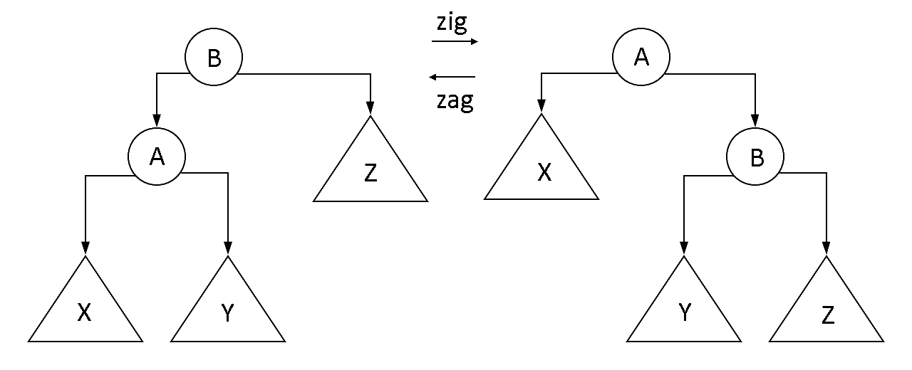

[Hello算法](https://www.hello-algo.com/chapter_hello_algo/)

# 数据结构基础

数据结构是计算机中存储、组织数据的方式。不同数据结构适合不同种类的应用，例如图相较于链表，提供了更丰富的逻辑信息，但需要占用更大的内存空间。

- **逻辑结构**：揭示了数据单元之间的逻辑关系

  - **线性结构**：数据按照一定顺序排列。包括数组、列表、栈、队列等

  - **树状结构**：数据从顶部向下按层次排列。包括树、堆

  - **网状结构**：复杂的网络关系。包括图

  - **集合结构**：数据之间没有逻辑关系。包括哈希表

- **物理结构**：反映了数据在计算机内存中的储存方式

  - **顺序存储**：逻辑上相邻的数据单元存储在物理上相邻的存储单元中
  - **链接存储**：物理位置和逻辑关联不相关；每个数据单元附加指针用于描述逻辑关系
  - **索引存储**：使用索引表储存逻辑关系
  - **散列存储**：使用数据单元的散列值直接计算出数据储存地址

注意：凡是有名有姓的数据结构，肯定早就有优秀的实践了。学习数据结构不是为了重造轮子，而是为了理解各种数据结构的原理、性能差异，为学习算法打下基础

## 线性表

线性表，也叫**列表**（List）是存储线性结构数据的结构。有两种实现方式：

- **数组**（Array） / **向量**（Vector）：将相同类型的元素存储在连续的内存空间中
  - 访问、插入、删除的复杂度分别是$O(1), \ O(N), \ O(N)$
  - 数组空间不可随意改变，若需要扩容，首先新分配内存空间，然后将元素依次复制过去，复杂度$O(N)$；插入N次才需要扩容，因此扩容的平均复杂度是$\frac{O(N)}{N} = O(1)$

- **链表**（Linked List）：不同元素的物理位置不必相邻，而是通过索引相连接。它进行插入、删除操作时不需要移动大量元素，更容易动态管理内存，但是访问必须循链接访问
  - 访问、插入、删除的复杂度分别是$O(N), \ O(1), \ O(1)$
  - 可以任意扩容。不过由于内存分散，缓存击中率较差


## 栈与队列

**栈**（Stack）是一种特殊的线性表，它只能在表的一个固定端插入和删除数据，具有后进先出（Last In First Out，LIFO）特性

它既可以用数组实现，也可以用链表实现。两种实现方式，出入栈的复杂度都是$O(1)$，不过由于链表实现每次入栈都要创建新节点，效率稍差

**队列**（Queue）和栈类似，也是一种特殊的线性表。和栈不同的是，队列只允许在表的一端插入数据，而在另一端删除数据，具有先进先出（First In First Out，FIFO）特性

队列同样可以用数组或链表实现。使用数组实现时须额外记录队列首位位置，将数组当作环形操作。两种实现方式出入队复杂度都是$O(1)$

## 散列表

散列表（Hash Table）又称哈希表，通过散列函数建立键值对（Key-Value Pair）之间的映射，将每个键映射到一个桶（存储值的容器），实现高效的查询。散列表可以用数组配合将Key映射到数组索引的散列函数实现。散列表访问、插入、删除的复杂度都是$O(1)$

多个key的散列值重复的情况称作**哈希冲突**（Hash Collision）。遇到哈希冲突时可以通过扩容解决；同时也可以改良数据结构，使散列表在遇到冲突时也能正常工作（当然，会导致效率降低等副作用），在负载因子较高时扩容

- **链式地址**：桶中不直接存储值，而是存储一个链表，将所有冲突键值对都放在该链表中
- **开放寻址**：桶中同时存储键值对，遇到冲突时将键值对装进下一个可用的桶

散列函数有很多设计方法，比如：

```python
def mul_hash(key: str) -> int:
    """乘法哈希"""
    hash_ = 0
    for c in key:
        hash_ = 31 * hash_ + ord(c)
    hash_ = hash_ % 1000000007
    return hash_ % HMAP_CAPACITY

def rot_hash(key: str) -> int:
    """旋转哈希"""
    hash_ = 0
    for c in key:
        hash_ = (hash_ << 4) ^ (hash_ >> 28) ^ ord(c)
    hash_ = hash_ % 1000000007
    return hash_ % HMAP_CAPACITY
```

其中倒数第二步对大质数取模，可以提升哈希值均匀性。如果key周期性和容量恰好有公因数，就会导致堆积。比如取模前的值是`0, 40, 80, 120, 160， ...`，容量为16，则取模后的值是`0, 8, 0, 8, 0 ...`；对质数17取模，则得到`0, 6, 12, 1, 7`，不容易堆积。有些教科书推荐使用质数容量，不过工程中一般使用均匀的散列函数 + 2的幂次容量

## 二叉树

二叉树是有层次的数据结构，其中每个节点都有一个父节点、两个子节点（根节点除外，它没有父节点）

- 树的常用术语
  - 节点所在的层（level）：从顶至底递增，根节点所在层为1
  - 节点的度（degree）：节点的子节点的数量
  - 节点的深度（depth）：从根节点到该节点所经过的边的数量。
  - 节点的高度（height）：从距离该节点最远的叶节点到该节点所经过的边的数量。
- 常见二叉树类型
  - 完美二叉树（perfect binary tree）：所有层的节点都被完全填满
  - 完全二叉树（complete binary tree）：仅允许最底层最右边的节点不完全填满
  - 真二叉树（Proper Binary Tree），完满二叉树（full binary tree）：除了叶节点之外，其余所有节点都有两个子节点
  - 平衡二叉树（balanced binary tree）：任意节点的左子树和右子树的高度之差的绝对值不超过1

二叉树通常用类似于链表的方式实现；对于完美二叉树，也经常用数组实现，其中`array[i]`的子节点是`array[2*i + 1]`和`array[2*i + 2]`。不完美的二叉树也可以用数组实现，此时需要用空值标记不存在的节点

遍历复杂度为$O(N)$

- 广度优先
  - 层序遍历：逐层从左到右访问节点
- 深度优先
  - 先序遍历：<u>节点</u>、左子树、右子树
  - 中序遍历：左子树、<u>节点</u>、右子树
  - 后序遍历：左子树、右子树、<u>节点</u>

## 图

图（Graph）由顶点（Vertex）和边（Edge）组成。评价复杂度时，一般包含顶点数$V$和边数$E$两部分，并且，不难看出，边数至多为$O(V^2)$

- 图的分类
  - 无向图（undirected graph）和有向图（directed graph）
  - 连通图（connected graph）和非连通图（disconnected graph）
  - 有权图（weighted graph）
- 图的术语
  - 两顶点之间存在边相连时，称这两顶点邻接（Adjacent）
  - 顶点A到顶点B经过的边构成的序列被称为从A到B的路径（Path）
  - 一个顶点拥有的边数称作度（Degree）。对于有向图，还分为入度（In-Degree）和出度（Out-Degree）

### 实现

图可以用邻接矩阵或邻接表实现

* **邻接矩阵**（Adjacency Matrix）：使用矩阵$M$记录边，数组$V$记录所有顶点。$M_{ij}$表示节点$V_i$和$V_j$之间的边
  * 添加、访问、删除边的时间复杂度都是$O(1)$
  * 添加、删除顶点的时间复杂度是$O(V^2)$
  * 空间复杂度$O(V^2)$。特别地，对于无向图，$M_{ij}$和$M_{ji}$等价，可以只记录上三角部分
* **邻接表**（Adjacency List）：使用V个链表记录图，每个链表首元素表示顶点，其余元素表示与该顶点邻接的顶点
  * 如果$E \ll V^2$，使用邻接能大大节约空间。邻接表访问单条边的效率不如邻接矩阵，批量方式处理同一个顶点的关联边时效率比邻接矩阵还要高
  * 复杂度和实现细节、图的结构有关。假设用一个数组记录所有链表，链表长度$O(1)$，那么添加、访问、删除边的时间复杂度是$O(1)$，添加、删除顶点的时间复杂度是$O(V + E)$

### 遍历

* **广度优先搜索**（Breadth first search，BFS）：**与起始点距离越近的越先访问**。类似于树的就是层次遍历
  1. 将所有节点标记为未访问
  2. 定义一个FIFO队列（前沿集）存储将要访问的节点，选定一个起始节点，加入前沿集
  3. 从前沿集取出一个节点，访问它，将它标记为已访问，然后将它所有未访问邻居加入前沿集
  4. 重复第三步直到前沿集空。对于无向图，此时所有连通分量（Connected Component）都被访问；对于有向图，所有可达分量（Reachable Component）都必定被访问过了。如果还有没访问的，重新选取起始节点，重复第二步
  5. 时间复杂度分析：每个节点访问一次，每条边都要访问（寻找邻居），时间复杂度$O(V+E)$
  6. 空间复杂度分析：需要记录哪些已访问节点、前沿集，空间复杂度$O(V)$
  7. 访问顺序不唯一。第三步中按照什么顺序把邻居放进去都可以

* **深度优先搜索**（Depth First Search，DFS）：尽可能深地搜索，直到节点V相连节点全都被遍历过之后，回溯到发现V的节点
  1. 类似于BFS，时间复杂度$O(V + E)$，空间复杂度$O(V)$

# 算法基础

算法是解决特定问题的操作步骤。它与数据结构紧密相关，体现为以下三个方面：

- 数据结构为算法提供了结构化存储的数据，以及操作数据的方法
- 数据结构本身仅存储数据信息，结合算法才能解决特定问题。
- 算法通常可以基于不同的数据结构实现，但执行效率可能相差很大，选择合适的数据结构是关键

研究算法时，重点考量算法的**时间复杂度**、**空间复杂度**，两者表示随着数据量变大时，运行时间、内存占用的**增长趋势**，用大O记号表示

- **最好复杂度**：最佳情况下的复杂度，比如查找时第一个数就找到了（一般没什么意义）
- **最坏复杂度**：最糟情况下的复杂度，比如查找时找到最后才找到，它是算法复杂度的上界。不加说明时一般指最坏复杂度
- **平均复杂度**：随机输入时的复杂度
- **分摊复杂度**：周期性操作分摊到每次操作的复杂度。比如往长度为$N$的数组中写入数据，写满了就扩容到原本容量的两倍。每过$O(N)$时间扩容一次，每次扩容的时间复杂度是$O(N)$，因此分摊到每次写入，分摊复杂度为$O(1)$

## 排序

排序算法评价有几方面：

- 效率：时间、空间复杂度
- 稳定性：排序完成后，相同元素的顺序有没有改变
- 自适应：输入部分排序时效率是否更高

### 归并排序

```c++
template <typename T>
void merge_sort(List<T> list, int left, int right)
{
    // 对[left, right)范围的元素做并归排序
    if (right == left) {
        return;
    } else {
        // 分别对前半段和后半段做归并排序
        int mid = (right - left) / 2;
        merge_sort(list, left, mid);
        merge_sort(list, mid, right);
        // 将前后两端归并（合并两个有序列表，并且保持有序性）
        merge(list, left, mid, list, mid, right);
    }
}
```

使用归并排序时，随着每次递归，排序被拆分为两个子列表的排序，直到被拆分为0个或1个元素。然后，将这些子序列再合并起来，就得到完整的有序序列。

对于向量，不难看出二路归并的时间为Θ(M + N)。使用递推法分析时间复杂度，对长度为N的序列进行归并排序相当于排序两个长度N/2的序列，再将他们归并，故$T(N) = 2 \times T(\frac{N}{2}) + O(N)$；再考虑边界条件，长度为1时直接返回，故$T(1) = O(1)$
$$
\left\{
\begin{aligned}
    T(N) & = 2 \times T(\frac{N}{2}) + \Theta(N) \\
    T(1) & = \Theta(1)
\end{aligned}
\right.\\[6ex]

let \ S(N) = \frac{T(N)}{N} \\
\begin{alignat}{0}
\therefore S(N) &= 2 \times S(\frac{N}{2}) + \Theta(1) \\
&= k \times S(\frac{N}{2^k}) + \Theta(k) \\[1ex]
&= logN \times S(1) + \Theta(logN) \\[1ex]
&= \Theta(logN) \\[2ex]
\therefore T(N) &= \Theta(NlogN)
\end{alignat}
$$
对于列表，归并的复杂度仍相同，但划分时为了确定中点需要O(N)的时间，总体的时间复杂度仍然是O(NlogN)。假设不按照中点划分，而是定长区段，用递推法可分析得复杂度为O(N^2)。特别地，当某一段的长度为1，退化为插入排序

# 数据结构

## 堆

堆（Heap）是一种特殊的二叉树。它是完全二叉树，且其中每个节点的值均大于等于两个子节点的值（最大堆，Max Heap），或每个节点的值均小于等于两个子节点的值（最小堆，Min Heap）。本笔记以最大堆为例进行说明。它通常用数组实现，有两个关键操作：

- 入堆，Push，插入一个元素，复杂度$O(log(N))$
  1. 将元素插入到树的末尾
  2. 比较该元素和它的父节点。若它比父节点大，则与父节点交换
  3. 重复步骤2，直到不需要交换。此过程称作“Shift Up”
- 出堆，Pop，删除堆顶元素（即根节点，它是堆中最大/最小值），复杂度$O(log(N))$
  1. 弹出堆顶元素，然后把堆底的元素移动到堆顶
  2. 比较该元素和它的两个子节点。将它与较大的子节点交换
  3. 重复步骤2，直到不需要交换。此过程称作“Shift Down”

初始化堆的方法是将数据复制到数组中，从底向上层序遍历，一边遍历一边Shift Down。此操作称作堆化（Heapify），复杂度为$O(N)$

简易复杂度分析：假设是完美二叉树，有一半节点是叶节点，不需交换；四分之一的节点高度为2，交换至多一次；八分之一节点交换至多二次，以此类推，因此总复杂度为$T(N) = \frac{N}{2} + \frac{2N}{4} + \frac{3N}{8} + ...$。令$a_k = \sum_k \frac{k}{2^k}$，则$T(N) = \frac{N}{2} a_{logN} \approx \frac{N}{2} a_{\infty}$，用$2 \cdot a_k - a_k$裂项不难计算得到$a_{\infty} = 2$，因此$T(N) \approx N$

## 霍夫曼编码树

* **基础知识**：前缀无歧义编码（prefix-free code）是一种解码时不产生歧义的编码，它要求任意两字符的二进制编码互相不是对方的前缀。假设对字符串"MESSAGE"进行编码，方式为

| A    | E    | G    | M    | S    |
| ---- | ---- | ---- | ---- | ---- |
| 00   | 01   | 10   | 110  | 111  |

用一棵二叉树表示这个编码，

```
    root
  ┌───┴───┐
  0       1
┌─┴─┐   ┌─┴─┐
A   E   G  ┌┴┐
           M S
```

从左到右地扫二进制串，遇到0就移动到左节点，遇到1就移动到右节点，遇到叶就输出一个字符，并且回到根节点。如此，就能够得到解码后的结果。显然，只要所有字符都处于叶节点，编码就是无歧义的

**Huffman编码**算法是一种生成最优带权编码的算法。其流程是：

1. 用每个单字符构造编码树，形成PCF森林
2. 选中权重最低的两棵树，合并成一棵。合并后树的权重等于合并前两棵树的权重之和。合并方式同一般的PCF编码树
3. 重复第二步，直到全部合并成一棵树

用这个算法产生的编码树称作Huffman编码树

## 二叉搜索树

如果二叉树中任一个节点，左子树的所有节点 &le; 本节点 &le; 右子树的所有节点，它是一棵二叉搜索树。不难发现，二叉搜索树的充要条件是中序遍历单调非降

* **搜索**：从根节点开始，如果节点值 \< key，移动到右节点；如果节点值 \> key，移动到左节点，重复直到无法移动或者节点值 = key为止

* **插入**：先进行搜索，找到最后落到的位置，然后插入为这个位置的子节点

* **删除**：首先找到要删除的节点；如果它只有一个分支，删除它并将这个分支接到它原来的位置；如果有两个分支，找到它左子树最大的孩子（或者右子树最小的孩子），这个孩子必定是单分支的（否则就会有更大 / 更小的子节点），将这个孩子的子树接到孩子的位置，并将孩子移动到要删除的节点的位置

* **旋转**：也称作zigzag，属于等价变换，是调整平衡的方式




不难看出，时间复杂度 = 树高。最优情况，$O(logN)$；随机生成（n! 种顺序产生的树高平均）O(logN)；随机组成（n个节点的所有不同二叉树高平均）$O(\sqrt{N})$；最坏O(N)

实际上，因为一组数据经常有单调次序，构建出的二叉树经常很高，需要进行平衡。平衡的目标有理想平衡（树高恰好为$\lfloor \log_{2} N \rfloor$）、适度平衡（比理想平衡放松一些，比如不超过O(logN)）
