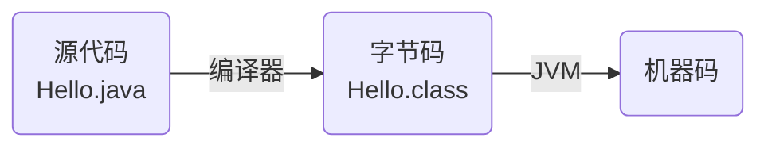
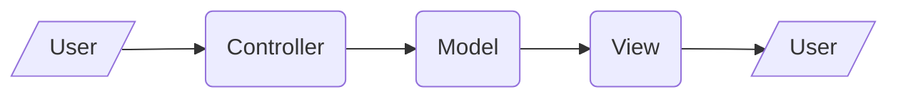

# 简介

## Java平台

Java平台分为三个版本，用于不同场景：

- **Java ME**（Micro Edition）：功能精简，用于嵌入式设备
- **Java SE**（Standard Edition）：旧称J2SE。包含所有基本功能，用于一般的应用程序
  - LTS版本包括Java 8（2014）、Java 11（2018）、Java 17（2021）、Java 21（2023）、Java 25（2025）
- **Java EE**（Enterprise Edition）：旧称J2EE，标准名称Jakarta EE。在Java SE基础上指定了许多规范，如Web容器、消息队列，并提供相应标准库。常用于服务器程序
  - Java EE提供了许多API（大多数为接口、抽象类），但并没有完整实现。它们由Weblogic等第三方软件实现，因此必须运行在这些软件的环境中
  - 从2010年代开始，Java EE的生态位逐渐被Spring替代。Spring吸收Java EE的设计思想，提供了一套替代Java EE的方案，且整合了工程实现

## 开发、运行环境

Java是编译型语言，兼具解释型语言的特性。Java源代码首先编译为字节码，再由JVM解释执行。编译过程中会进行语法检查和静态类型校验，因此能避免纯解释型语言运行时才能发现错误的缺点；编译得到的字节码在所有平台上都能运行，也能避免编译型语言在不同系统间的移植性问题



**开发环境**：JDK（Java Development Kit）

- 编译器`javac`、调试器`jdb`、打包工具`jar`等
- **运行环境**：JRE（Java Runtime Environment）
  - JVM（Java Vritual Machine）`java`
  - 运行库


## Java程序基础

Java是严格的面向对象语言——除了基本类型之外，一切皆对象，所有代码都放在类中，哪怕是main函数也要写成类的静态方法。**一个文件包含一个类，且文件名必须和类名相同**（特别地，可以额外包含非`public`类，它们不受上述限制）

```java
public class HelloWorld {
    public static void main(String[] args) {  // main方法，程序执行入口
        System.out.println("Hello World");
    }
}
```

**目录层次必须和包层次一致**（源文件目录层次没有硬性规定，但大多数工具都要求这么做；编译后的Class文件则必须按照包层次存放，否则ClassLoader找不到对应的Class文件）。例如，包名为`learn_java.mypackage`，则源代码应该放在`src/learn_java/mypackage/`目录下，编译后的class文件应该放在`bin/learn_java/mypackage/`目录

编译运行过程：

```bash
# 编译
javac Main.java   # 编译为字节码 Main.class
javac -cp $jar_path Main.java  # 引用依赖
javac -d bin src/Main.java     # 编译，并在bin目录下按照包名自动生成目录结构

# 打包。将class文件、资源文件等打包为一个jar文件。使用和zip相同的算法
jar -cvf Main.jar Main.class  # 将Main.class打包为Main.jar

# 运行
java Main          # 运行Main.classs
java -jar Main.jar # 运行Main.jar
java -cp .;$jar_path Main  # 在"."和$jar_path下寻找Main.class和依赖
```

# 流程控制

和C基本相同。比C多一个数组的for循环

```java
int [] numbers = {0, 1, 2, 3};
for (int x: numbers) {
    System.out.print(x);
    System.out.print(", ");
}
```

# 数据类型

Java的数据类型分两类：

- 基本类型：`byte`，`short`，`int`，`long`，`boolean`，`float`，`double`，`char`
- 引用类型：`class`，`interface`等

## 数值

整数`byte, short, int, long`、浮点数`float, double`、布尔值`bool`

```java
// 整数
byte b = 97;
short s = 32767;
int i = 0;
long lng = 1L;
// 浮点数
float f = 3.2f;
double d = 3.2D;
```

彼此兼容的变量进行赋值时，进行隐式类型转换，变成精度较高的那个；无法自动转换时可以强制类型转换

```java
i = s + 1;   // short隐式转换为int
i = (int)d;  // 将double强制转换为int
```

## 包装类

Java为基本数据类型`int`，`double`等提供了`Integer`，`Double`等包装，基本类和包装类之间可以自动转换，称作Auto Boxing和Auto Unboxing

```java
int i = 100;
Integer n = i;  // Auto Boxing

n.equals(i);    // 包装类的比较
```

包装类提供了大量方法，并支持泛型编程。但其执行效率更低，尽量不要用

## 字符和字符串

Java用单引号表示字符，双引号表示字符串

```java
// 字符
char c = 'a';
int i = c + 1;  // 字符可以隐式转换为整数

// 字符串。注意：String是引用类，不是基本类型
String s = "Hello";
```

[字符串方法](https://www.runoob.com/java/java-string.html)

## 数组

```java
int[] arr1 = new int[10];  // 定义长度为10的空数组
int[] arr2 = {1, 2, 3};    // 定义并初始化
int[][] arr2d = new int[3][3];  // 二维数组
```

数组（Array）过于原始了，更常用的是列表（List）。List是一个接口，而非具体的类，它有多种实现。最常用的是`java.util.ArrayList`和`java.util.LinkedList`

```java
List<int> arr = new ArrayList<>();
arr.add(1);
List<String> colors = Arrays.asList("blue", "red");
String blue = colors.get(0);
```

# 类和对象

## 基础

```java
public class BankAccount {

    // 类变量，所有实例共享此变量
    private static int totalAccounts = 0;

    // 实例的成员变量，每个实例独有
    private String accountHolder;
    private double balance;
    private final String accountNumber;  // final变量，不能重新赋值

    // 构造方法。名字和类名相同，没有返回值，创建对象时自动调用
    public BankAccount(String accountHolder) {
        this.accountNumber = "ACC" + (++totalAccounts);
        this.accountHolder = accountHolder;
        this.balance = 0.0;  // 属性和参数重名时用this加以区分。没重名的时候不需要写this
    }

    // 实例方法
    public void deposit(double amount) {
        balance += amount;
    }
    public void withdraw(double amount) {
        if (amount > balance) {
            System.out.println("余额不足");
            return;
        }
        balance -= amount;
    }

    // getter方法，用于访问私有属性
    public String getAccountHolder() {
        return accountHolder;
    }
    public double getBalance() {
        return balance;
    }

    // 重写（Override）父类方法
    // 注意：重写覆盖父类方法，重载（Overload）则是两个方法同时存在，根据实参类型选择调用
    @Override  // 让编译器检查是不是重载，若不是则报错
    public String toString() {
        return String.format("账户[%s] 户主: %s 余额: %.2f",
            accountNumber, accountHolder, balance);
    }

    // main方法，代码运行的入口
    public static void main(String[] args) {
        BankAccount account = new BankAccount("张三");
        account.deposit(500);
        account.withdraw(200);
        account.withdraw(2000);  // 测试余额不足
        System.out.println(account);  // 调用toString()
    }
}
```

## 抽象类

多个类有通用功能时，可以把通用部分“提取”出来构成抽象类，通过继承抽象类复用通用的成员变量、成员方法

```java
abstract class Vehicle {
    protected String name;
    // 具体方法，所有子类共用
    public Vehicle(String name) {
        this.name = name;
    }
    // 抽象方法：只有方法签名，没有方法体。子类必须自己实现
    public abstract void move();
}
```

抽象类不可实例化。须**继承**抽象类，并实现其中所有抽象方法，才能得到一个可以实例化的类

```java
class Truck extends Vehicle {
    public Truck(String name) {
        super(name);
    }
    @Override
    public void move() {
        System.out.println(name + " 正在沿公路运输货物...");
    }
}
```

## 接口

接口是比抽象类更高一层的抽象。抽象类包含了类的属性和方法，它说明了具体类“是什么”；接口则只是规定类实现特定的方法，规范了具体类“能做什么”

接口中定义方法签名。其中方法都是`public absctract`，且只能是`public absctract`

```java
public interface Movable {
    void move();
}
```

不同于抽象类，接口不被继承，而是由具体类**实现**。一个类可以实现多个接口

```java
public class Truck implements Movable {
    private String name;

    public Truck(String name) {
        this.name = name;
    }

    @Override
    public void move() {
        System.out.println(name + " 正在沿公路运输货物...");
    }
}
```

## 包

包是Java语言的命名空间，可以避免名字冲突。一个类真正的完整名字是`包名.类名`，例如JDK自带的`Arrays`类，其全名是`java.util.Arrays`

包的声明应该放在源文件开头：

```java
package learnjava.util;
```

定义包名之后，这个文件定义的类全名就是`包名.类名`，并且引用同一个包内的其他类时可以省略包名。引用其他包的时候，需要用`包名.类名`，也可以用`import`语句导入，如`import java.util.ArrayList;`，`import java.util.*;`，后者导入`java.util`包的所有类。`import`必须在`package`声明之后、`class`声明之前

目录层次必须和包层次一致。尤其Class文件则必须按照包层次存放，否则ClassLoader找不到对应的Class文件

# IO

## 控制台IO

```java
import java.util.Scanner;

public class Main {
    public static void main(String[] args) {
        Scanner scanner = new Scanner(System.in);
        System.out.print("请输入数字：");
        int num = scanner.nextInt();   // 其他读取方法还有nextLine，nextDouble等
        System.out.println("输入的数字是" + num);
    }
}
```

## 字节流

`java.io.InputStream, OutputStream`的各种子类提供了读写字节流的功能。以文件读写的`FileInputStream, FileOutputStream`为例：

```java
buffer = new byte[1000];

// 读
try (InputStream input = new FileInputStream("readme.txt")) {
    input.read(buffer);
}
// 写
try (OutputStream output = new FileOutputStream("out/readme.txt")) {
    output.write(buffer);
}
```

注意，文件读写都有可能抛出`IOException`

## 字符流

`java.io.Reader, Writer`的各种子类提供了读写字符流的功能。以文件读写的`FileReader, FileWriter`为例：

```java
char[] buffer = new char[1000];

// 读
try (Reader reader = new FileReader("readme.txt", StandardCharsets.UTF_8)) {
    reader.read(buffer);
}
// 写
try(Writer writer = new FileWriter("out/readme.txt")) {
    writer.write(buffer);
}
```

## 文件对象

```java
import java.io.File;

public class Main() {
    public static void main(string[] args) {
        // 文件 / 目录对象
        File f = new File('~/myDir');
        // 方法
        f.getPath();
        f.isFile();
        f.list();
    }
}
```

# 异常处理

使用`try-catch`语句处理异常，用`throw`语句抛出异常

```java
try {
    int[] a = {1, 2};
    a[3] = 3;
} catch (java.lang.ArrayIndexOutOfBoundsException e) {
    e.printStackTrace();
    throw new java.lang.RuntimeException("Exception")
}
```

可以用`throws`关键字指定方法**可能抛出**的异常，交给调用者处理。编译时会检查可能抛出的异常，若没有得到处理就通不过编译。一种取巧的做法是在main后面声明`throws Exception`从而通过编译

```java
import java.util.Arrays;

public class Main {
    // throws关键词说明此方法可能抛出UnsupportedEncodingException
    static byte[] toGBK(String s) throws java.io.UnsupportedEncodingException {
        return s.getBytes("GBK");
    }
    // main可以抛出任何异常。可以通过编译，但遇到异常程序直接崩溃
    public static void main(String[] args) throws Exception {
        byte[] bs = toGBK("中文");
        System.out.println(Arrays.toString(bs));
    }
}
```

# Web编程

## Servlet

### 基础

Servlet就是处理HTTP请求的代码。它运行在应用服务器（Tomcat，Weblogic等）之上，服务器收到HTTP请求后调用Servlet处理，并将响应发送给客户端

注意：应用服务器版本、Servlet API版本、JDK版本必须匹配

```java
import jakarta.servlet.ServletException;
import jakarta.servlet.annotation.WebServlet;
import jakarta.servlet.http.HttpServlet;
import jakarta.servlet.http.HttpServletRequest;
import jakarta.servlet.http.HttpServletResponse;
// Servlet API 5.0+使用jakarta.servlet；4.x及之前的需使用javax.servlet

import java.io.IOException;
import java.io.PrintWriter;

// 使用注解映射地址。应用服务器收到访问"/hello"的请求时调用此Servlet处理
// 旧版本使用web.xml映射
@WebServlet(urlPatterns = "/hello")
public class HelloServlet extends HttpServlet {
    protected void doGet(HttpServletRequest req, HttpServletResponse resp)
            throws ServletException, IOException {
        resp.setContentType("text/html");   // 设置响应头
        PrintWriter pw = resp.getWriter();
        pw.write("<h1>Hello, world!</h1>"); // 写入响应体
        pw.flush();
    }
}
```

`pom.xml`中加入如下依赖：

```xml
<groupId>jakarta.servlet</groupId>
    <artifactId>jakarta.servlet-api</artifactId>
    <version>5.0.0</version>
    <scope>provided</scope>
</dependency>
```

### Session

Session用于在多次HTTP请求之间保存用户信息

首次调用`req.getSession()`时，应用服务器会创建一个`HttpSession`对象，并将其ID通过名为`JSESSIONID`的Cookie发给客户端；用户携带`JSESSIONID`访问服务器时，可以调用`req.getSession`获取该ID对应的`HttpSession`对象。此对象可用于存储用户信息

需要注意，Session对象都在内存中。若Session太多可能消耗大量内存；若需要在服务器集群上部署，需要同步或者配置Sticky Session（反向代理根据`JSESSIONID`决定发往哪个后端服务器）。以上方案都较复杂且有性能问题，因此Session适用于中小型Web应用，大型Web应用需要避免使用Session

```java
@WebServlet("/api/profile")
public class ProfileServlet extends HttpServlet {
    @Override
    protected void doGet(HttpServletRequest request, HttpServletResponse response)
            throws ServletException, IOException {
        response.setContentType("application/json;charset=UTF-8");
        PrintWriter pw = response.getWriter();
        HttpSession session = request.getSession(true);  // 获取 Session

        if (session.getAttribute("user") == null) {
            // 未登录：创建 Session 并初始化
            session.setAttribute("user", "guest");
            pw.println("未登录");
            return;
        }
        // 已登录：正常处理请求
        String user = (String) session.getAttribute("user");
        pw.println("Welcome, " + user);
    }
}
```

```
WEB-INF/
    web.xml     核心配置文件，包括Servlet名、路径映射、Filter顺序等
    database.properties
                数据库配置
    classes/    所有class文件，主要是各个Servlet类。目录结构应该按类名
                如com.learnjava.myservlet应放在classes/com/learnjava/myservlet.class
    lib/        各种依赖文件，例如数据库驱动的jar包
    src/        源代码。目录结构和classes相同
```


### 内部转发

Servlet处理请求时，除了自己处理，还可以交给另一个Servlet处理。下面一行代码将请求转发给处理`/hello`的Servlet处理

```java
req.getRequestDispatcher("/hello").forward(req, resp);
```

### JSP

JSP（Java Server Pages）是将PHP嵌入到HTML中的脚本。在执行前会自动编译为Servlet

```jsp
<h1>Hello, World</h1><br/>
<% out.println("Your IP Address is "); %>
<span style="color:red">
    <%= request.getRemoteAddr() %>
</span>
```

### MVC

MVC设计模式旨在让业务逻辑和网页外观解耦。它由Model、View、Controller三部分组成，**Controller**接收用户的请求，并调用Model进行处理；**Model**执行业务逻辑；最后**View**将数据显示给客户端用户



## Filter

Filter是对HTTP请求进行预处理的组件，常用于日志、登录检查等。多个Filter可以链式进行处理

```java
@WebFilter(urlPatterns = "/*")
public class EncodingFilter implements Filter {
    public void doFilter(ServletRequest request, ServletResponse response, FilterChain chain)
            throws IOException, ServletException {
        HttpServletRequest req = (HttpServletRequest) request;
        HttpServletResponse resp = (HttpServletResponse) response;
        // 判断是否已登录
        HttpSession session = req.getSession(false);
        if (session != null && session.getAttribute("user") != null) {
            chain.doFilter(request, response);  // 已登录，放行
        } else {
            resp.sendRedirect("/login.jsp");    // 未登录，跳转到登录页
        }
    }
}

```

# 工具链

随着项目规模的增大，软件开发就变成了复杂的工程问题，需要引入工具来简化第三方库的使用流程、自动完成编译与打包、提供稳定的运行环境

## Maven

[Maven](https://maven.apache.org/)是Apache基金会提供的项目管理工具，负责依赖管理以及构建流程（常规构建流程包括编译、测试、打包、发布）。其标准目录结构如下：

```bash
maven-project
├── pom.xml   # 项目配置
├── src
│   ├── main
│   │   ├── java       # 源代码
│   │   └── resources  # 资源文件
│   └── test
│       ├── java
│       └── resources
└── target    # 编译、打包生成的文件
```

其中项目配置`pom.xml`（Project Object Model）一般格式如下。Maven工程以`groupId, artifactId, version`作为唯一标识，项目、依赖均如此

```xml
<project>
	<modelVersion desc="POM模型版本">4.0.0</modelVersion>
	<groupId desc="开发者名">com.example.learnjava</groupId>
	<artifactId desc="项目名">hello</artifactId>
	<version desc="当前版本号">1.0</version>
	<packaging>jar</packaging>
	<properties desc="项目属性，比如jdk版本">
        <project.build.sourceEncoding>UTF-8</project.build.sourceEncoding>
		<maven.compiler.release>17</maven.compiler.release>
	</properties>
	<dependencies desc="项目依赖">
        <dependency>
            <groupId>org.slf4j</groupId>
            <artifactId>slf4j-simple</artifactId>
            <version>2.0.16</version>
        </dependency>
	</dependencies>
</project>
```

配置好后，可以用命令`mvn clean package`删除旧构建，并进行编译、打包。此时会自动下载依赖包，默认下载到`%USERPROFILE%/.m2`目录

## Tomcat

从[Apache Tomcat官网](https://tomcat.apache.org/index.html)下载，不同版本支持的Java版本、Servlet API版本不同，可参考[版本选择](https://tomcat.apache.org/whichversion.html)

# 其他

## JavaFX

JavaFX是旧版本的GUI库，当前各版本都不带这个库，因此尝试运行使用JavaFX的软件会报错：

```bash
# 使用Java 8运行的报错。2025年5月以后发行的Java 8版本不包含JavaFX
错误: JavaFX 已从 JDK 8 中删除。

# 使用高版本Java运行的报错
错误: 找不到或无法加载主类 fun.fireline.AppStartUp
原因: java.lang.NoClassDefFoundError: javafx/application/Application
```

解决方法：

1. 安装旧版本Java 8（不推荐）
2. 使用Java 11+版本，下载[JavaFX库](https://gluonhq.com/products/javafx/)，并

```bash
java --module-path "D:/programs/javafx-sdk-21.0.9/lib/" --add-modules "javafx.controls,javafx.fxml" -jar $jar_file
```
