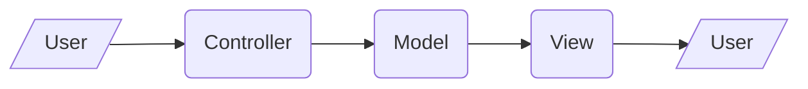
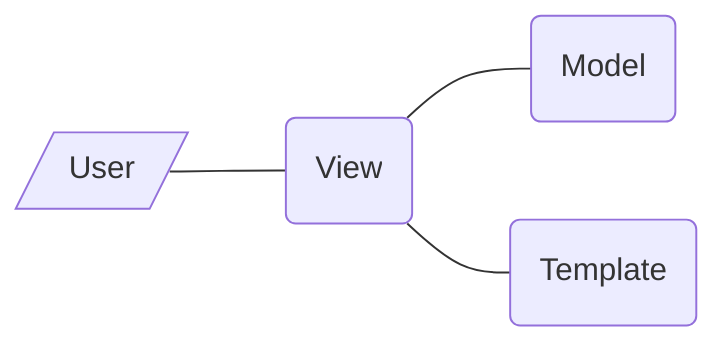

# 基础

```powershell
# 安装
pip install django

# 创建项目，注意用保留词（比如Django，test）做项目名会出问题
python django-admin.py startproject mysite

# 运行服务器，并允许局域网访问
manage.py runserver 0.0.0.0:8000
```

若创建项目时找不到文件，检查有没有将`C:\Program Files\Python\Python38\Scripts\`，`%USERPROFILE%\AppData\Roaming\Python\Python38\site-packages`或者Python安装目录加入PATH环境变量

完成以上步骤之后在浏览器输入`localhost:8000`或者`本机ip:8000`，能看到示例页面。若出现访问权限等问题，需要在`sesttings.py`的`ALLOWED_HOSTS`列表中添加请求访问的设备的ip地址，例如`ALLOWED_HOSTS = ['114.210.194.92']`

## 设计模式

MVC（Model View Controller）和MVT（Model View Template）是两种web设计模式，旨在让数据、逻辑、UI三者解耦。

**MVC**

**Controller**接收用户的请求，并选择相应的Model去处理；**Model**根据Controller的调用操作数据库；最后**View**将数据显示给客户端用户



**MVT**

**View**接收用户的请求，从Model取得数据、从Template取得视图，将两者结合呈现给用户



两种模式非常相似，MVC的Controller、MVT的View都负责业务逻辑；两者的Model都负责数据库的增删改查；MVC的View和MVT的Template都负责视图

两者的区别是，MVC模式中，由View将数据呈现给用户；MVT模式中，Template与数据完全解耦。MVT模式模块间耦合更低，因此更容易扩展。Django使用了MVT模式，它的一般工作流程是：

1. 用户发出请求
2. django解析URL，并选择要调用的View
3. View构造网页，将它呈现给用户。这个过程中可能会调用Model和Template

## 工作流程

1. 创建项目。`python django-admin.py startproject mysite`
2. 创建应用。`python manage.py startapp myapp`
3. 编写View。在`myapp\views.py`编写View函数
4. 添加URL规则。在`urls.py`编写URL规则，django解析URL之后调用上一步编写的View函数，并将返回值呈现给用户

URL规则和View的写法如下。为了方便展示将它们放在一起了，实际操作中不在同一个文件，`urls.py`需要`import myapp.view`

```python
from django.contrib import admin
from django.urls import path
from django.http import HttpResponse

urlpatterns = [
    path('admin/', admin.site.urls),
    path('articles/<slug:title>/<int:section>/', view),
]
# 第一个参数是URL规则，尖括号内的作为关键字参数传给View；第二个参数是View函数

def view(request, title:str, section:int):
    # View构造Http响应
    return HttpResponse(f'{title}</br>section {section}')
```

一种耦合度更低的写法是多级路由，首先创建文件`myapp\urls.py`，在里面写`myapp`用到的URL，然后将它添加到主`urls.py`文件

```python
from django.urls import include

urlpatterns = [
    path('myapp/', include(myapp.urls)),
]
```

这种写法将应用间耦合减到最低，只要有多个应用，就应该用这种写法

# View

View执行业务逻辑，并通过Model操纵数据库、通过Template生成网页代码，最终返回完整网页

```python
from django.shortcuts import render

def response(request):
    context = {'hello': 'Hello, world!', 'list':[0], 'dict':{'a':1}}
    return render(request, 'template.html', context)
```

# Template

Template是网页前端的HTML、CSS和Javascript文件，它们通常还需要填入数据才能显示给用户看。HTML模板一般格式为：

```html
<!-- template.html -->

<h1>
    {{ hello }}
    {{ list.0 }}
    {{ dict.a }}
    <!-- 待填入的数据用双大括号括起来。注意索引用点而不是方括号 -->
    <!-- 数据由View负责填充-->
</h1>
```

然后在`settings.TEMPLATES.DIRS`里面加入模板所在文件夹，比如`TEMPLATES['DIR'] = BASE_DIR / 'templates'`

## 控制流

```html
<!-- if分支 -->
<p>
    
        cond1和cond2均为真
    
        cond1为真，cond2为假
    
        cond1为假
    
</p>

<!-- for循环迭代列表 -->

    <p>{{ paragraph }}</p>

    <p>没有文章</p>


<!-- for循环迭代字典 -->

    

```

除了上面写了的用法之外，还可以在循环内用循环变量`forloop.counter`循环次数、`forloop.counter0`从0计的循环次数、`forloop.first`是否第一次循环、`forloop.last`是否最后一次循环

## 其他

```html
<!-- 包含 -->
(% include "nav.html" %)
```

# Model

Model是对数据库的封装，View通过调用Model进行数据库操作。模型的存在方式是若干模型类，每个类对应数据库的一张表，每个实例对应表中的一行数据，类的各属性对应表的各字段

```python
from django.db import models

class Question(models.Model):
    question_text = models.CharField(max_length=200)
    pub_date = models.DateTimeField('date published')
    votes = models.IntegerField(default=0)
```

将模型类写在`<app_name>/models.py`之后，将应用添加到`settings.py`的`INSTALLED_APPS`中，并通过以下命令建表

```powershell
python manage.py makemigrations <app_name>
python manage.py migrate
```

第一步生成迁移（migration）命令，也就是实际建表的各种指令；第二步执行这些命令。数据库不在版本管理范围内，保留迁移命令等于保留了数据库结构。数据库通过名为`django_migrations`的表记录哪些迁移已经实施

```python
from django.utils import timezone

# 增
q = Question(question_text="What's new?", pub_date=timezone.now(), votes=0)
q.save()
q = Question.objects.create(question_text='idk', pub_date=timezone.now())

# 删

# 改
q0.votes = q0.votes + 1  # q0是一条已有的记录
q0.save()

# 查
q1 = Question.objects.all()
q2 = Question.objects.filter(question_text__startswith='What')
q3 = q2.exclude(pub_date__gte=datetime(2020, 1, 1))  # 用上一次查询结果继续查询，称作链式查询
entry = Question.objects.get(pk=1)    # 检索单一对象
```

查询的基本格式是`field__lookuptype = value`，字段名 双下划线 查询方式 = 值。常用的查询方式有

| 查询方式             | 说明                           |
| -------------------- | ------------------------------ |
| exact, contains      | 精确匹配，包含匹配             |
| startswith, endswith | 以什么开头或结尾               |
| gt, gte, lt, lte     | 大于、大于等于、小于、小于等于 |
| in                   | 包含于列表                     |

在查询方式前加上`i`不区分大小写。比如`name__istartswith = rick`可以匹配到`Rick Astley`

# 其他

## 静态文件

```python
# 在settings.py中声明静态文件夹
STATIC_URL = 'static/'     # 静态文件的url，必须斜杠结尾

STATICFILES_DIRS = [       # 静态文件夹。必须用UNIX格式
    BASE_DIR / "static",
    BASE_DIR / 'myapp/static',
]
```

并且在模板需要使用静态标签

```html


```

如果是生产环境，官方文档建议另外弄一个服务器专门负责图片
