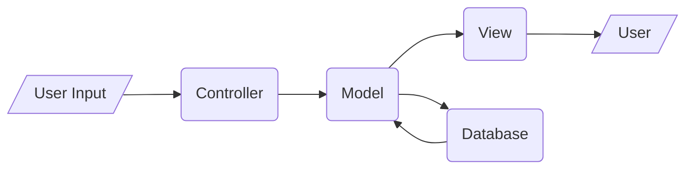
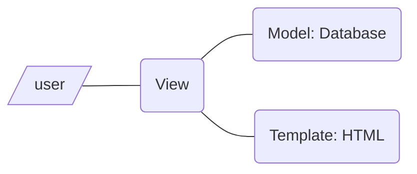

# 基础

```powershell
# 安装
pip install django

# 创建项目，注意用保留词（比如Django，test）做项目名会出问题
# 这个脚本在C:\Program Files\Python\Python37\Scripts\
django-admin.py startproject HelloWorld
```

一个新项目中包含如下内容：

```
.
|-- HelloWorld
|   |-- __init__.py   空的，告诉python这个一个包
|   |-- asgi.py       ASGI兼容的web服务器入口
|   |-- settings.py
|   |-- urls.py
|   `-- wsgi.py
`-- manage.py         交互命令行工具
```

```powershell
# 运行服务器。启动时会在命令行显示提示，能从本地127.0.0.1:8000访问示例页面，从命令行可停止服务器
manage.py runserver

# 运行服务器，并允许局域网访问
manage.py runserver 0.0.0.0:8000
# 在请求访问设备的浏览器地址里面输入"本机ip:8000"访问
# 需要在settings.py的ALLOWED_HOSTS中加入请求访问的设备的ip地址
# 例：ALLOWED_HOSTS = ['114.210.194.92']
# 自机ip：ipconfig；请求访问机器的ip：在没有访问权限的时候访问一次，就能在提示页面看到
```

# MVC与MVT

* MVC



* MVT



非常怪的是，MVC模型的Model和MVT模型的Template大致对应，MVC模型的Database和MVT模型的Model大致对应

# 定义页面

1. 在views.py定义页面内容
2. 在urls.py将内容添加到urlpatterns

## 定义views

`callable[request, *args, **kw]`，其中request为页面url，其余参数取决于urlpattern怎么传参

* 最简单的页面

```python
from django.http import HttpResponse

def response(request):
    return HttpResponse('Hello, world!')
```

* 模板

怎么写模板详见模板一节。在views.py中可以指定内容填充模板

```python
from django.shortcuts import render

def response(request):
    context = {'hello': 'Hello, world!', 'list':[0], 'dict':{'a':1}}
    return render(request, 'template.html', context)
```

## 定义urlpatterns

用一个router定义url规则和对应的view，添加到urlpatterns列表中

```python
from django.urls import path, re_path

urlpatterns = [
    path('index/', views.index, name='main-view'),
    path('articles/<slug:title>/<int:section>/', views.section),
    re_path(r'^bio/(?P<username>\w+)/$', views.bio, name='bio'),
]
```

`path`(*route*, *view*, *kwargs=None*, *name=None*)

route：url规则，尖括号匹配到的东西会被作为命名参数传给view

view：就是上一节定义的东西

kwargs：被传给view

name： [Naming URL patterns](https://docs.djangoproject.com/en/3.1/topics/http/urls/#naming-url-patterns)，没看懂，大概是用来做URL reversing的


`re_path`(*route*, *view*, *kwargs=None*, *name=None*)

route可以正则匹配，匹配到的组会被传给view

# 模板

1. 定义模板
2. 添加模板文件夹
3. 填充模板并显示

## 使用方式

先定义一个HTML文件，待填入数据的部分用双大括号括起来，双大括号中间填变量名。可以支持一般变量、列表、字典，并且可以用过滤器处理变量

```html
<!-- template.html -->

<h1>
    {{ hello }}
    {{ list.0 }}
    {{ dict.a }}
    
    <!-- 过滤器示例，默认值。可以用多个过滤器，左结合 -->
    {{ whatever|default:"nothing"}}
</h1>
```

然后在`settings.TEMPLATES.DIRS`里面加入模板所在文件夹。注意settings中定义了变量BASE_DIR表示项目根目录（manage.py所在目录）

最后在views.py中定义如何填充模板（详见定义页面的view部分）

## 模板的控制流

```html
<!-- if-else -->
<p>
    (% if cond1 and cond2 %)
        cond1和cond2均为真
    (% elif cond1 %)
        cond1为真，cond2为假
    (% else %)
        cond1为假
    (% endif %)
</p>

<!-- 判断变量相等。ifnotequal同理 -->
<p>
    (% ifequal var1 var2 %)
        var1 == var2
    (% endifequal %)
</p>

<!-- for循环迭代列表 -->
<p>
    (% for var in list %)
        {{var}}
    (% empty %)
        空空如也
    (% endfor %)
</p>

<!-- for循环迭代字典 -->
<p>
    (% for k, v in dict.items %)
        {{k}} -- {{v}}
    (% endfor %)
</p>
```

除了上面写了的用法之外，还可以在循环内用循环变量`forloop.counter`循环次数、`forloop.counter0`从0计的循环次数、`forloop.first`是否第一次循环、`forloop.last`是否最后一次循环

## 其他

```html
<!-- 包含 -->
(% include "nav.html" %)
```

# 创建应用

django的应用就是一个web应用，专职某件事的网络应用程序。它是一个包，应该创建在manage.py的同一级目录

```powershell
# 创建应用。以投票应用polls为例
python manage.py startapp polls
```

```python
# 在polls/views.py定义view
from django.http import HttpResponse

def index(request):
    return HttpResponse("You're at the polls index.")
```

```python
# 在polls/urls.py（需要自己创建）定义应用的urlpattern
from django.urls import path
from . import views

urlpatterns = [
    path('', views.index, name='index'),
]
```

```python
# 在mysite/urls.py包括项目的urlpattern
from django.urls import include, path

urlpatterns = [path('polls/', include('polls.urls'))]
```

# 静态文件

```python
# 在settings.py中声明静态文件夹
STATIC_URL = '/static/'    # 静态文件的url，必须斜杠结尾

STATICFILES_DIRS = [       # 静态文件夹。必须用UNIX格式
    BASE_DIR / "static",
    'D:/valhalla/pic',
]
```

原理好像是当url中遇到了STATIC_URL时，就到静态文件夹找文件

```html
<!-- 方法1 -->



<!-- 方法2 -->


<!-- 方法3：在view层填充路径 -->

```

如果是生产环境，官方文档建议另外弄一个服务器专门负责图片