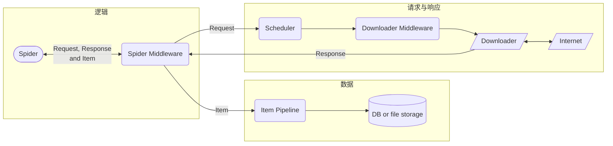

# 基础

```shell
scrapy startproject tutorial       # 创建项目
cd tutorial
scrapy genspider My "example.com"  # 创建新的爬虫
scrapy crawl My                    # 开始爬虫

scrapy shell "http://example.com"  # 交互式处理页面
scrapy -h
```

Scrapy的基本数据流如下（也可参考[完整架构](https://docs.scrapy.org/en/latest/topics/architecture.html)）。其中，Spider是必须实现的，其余东西是可选的



除了从命令行启动之外，还可以[从python脚本启动](https://docs.scrapy.org/en/latest/topics/practices.html#run-from-script)

```python
from scrapy.crawler import CrawlerProcess
from .spiders.My import MySpider

process = CrawlerProcess()
process.crawl(MySpider)
process.start()
```

# 爬虫控制

## Spider

Spider类用于控制爬虫逻辑：从哪个页面开始爬、爬到之后如何解析数据、下一步要请求哪些URL

```python
import scrapy

class MySpider(scrapy.Spider):
    name = 'my_spider'                            # 名字。同一项目的spider不可重名
    allowed_domains = 'quotes.toscrape.com'       # 域名白名单，只爬这个域名的东西
    start_urls = ['https://quotes.toscrape.com']  # 初始URL，从这里开始爬
    
    def parse(self, response:scrapy.Response) -> Iterable[scrapy.Request, scrapy.Item, dict] :
        # 提取网页数据，装在字典中返回（也可以继承scrapy.Item定义自己的容器）
        # 后续交给Item Pipeline处理，详见处理数据一节
        for quote in response.css("div.quote"):
            yield {
                "text": quote.css("span.text::text").get(),
                "author": quote.css("small.author::text").get(),
                "tags": quote.css("div.tags a.tag::text").getall(),
            }
        # 提取超链接，构造请求。后续交给Scheduler处理，详见请求与响应一节
        next_page = response.css("li.next a::attr(href)").get()
        if next_page is not None:
            next_page = response.urljoin(next_page)
            yield scrapy.Request(next_page, callback=self.parse)
```

## Request与Response

```python
# 构造Request
req = scrapy.http.Request(
    url = 'example.com',
    callback = MySpider.parse,
    method = 'POST',
    headers = {'User-Agent': 'Mozilla/5.0 (Windows NT 10.0)'},
    cookies = {'uuid': 'AH2oUVECM5VX7F7s0'},  # 也可以用List[dict]
    body = b'[null, null, "zh-cn"]'
)
```

Scrapy还提供了若干[Request子类](https://docs.scrapy.org/en/latest/topics/request-response.html#request-subclasses)，包括表单、JSON，它们主要用于POST请求

```python
# Response类的属性
print(
    response.url,     # 如：'http://www.example.com'
    resposne.status,  # 如：200
    response.headers, # 如：{b'server': [b'nginx'], b'Content-Type': [b'text/html;charset=UTF-8']}
    response.body
)
# Response类的方法
new_url = response.urljoin('robots.txt')  # 拼接绝对URL
div = resposne.xpath('//div')             # XPath选择器。返回所有选中元素的SelectorList
p = response.css('p::text')               # CSS选择器。返回所有选中元素的SelectorList

# SelectorList使用方法
div.extract()       # 提取全部节点内容，返回List[str]
div.re(r'id=\d*')   # 对全部节点做正则匹配，扁平化装进List[str]

# Selector使用方法
p0 = p[0]
p0.extract()      # 获取节点内容。HTML和XML文档会将百分号转义字符会被转换回普通字符，并返回str
p0.re(r'id=\d*')  # 正则匹配搜索节点内容，返回List[str]
p0.attrib         # 获取HTML attribute，返回dict
```

## Link Extractor

从HTTP响应提取链接

```python
from scrapy.linkextractors import LinkExtractor

extractor = LinkExtractor(
    allow = r'menu*',              # 正则匹配，Union[str, List]
    allow_domains = 'example.com',
    deny_extensions = []           # 若不指定，默认为scrapy.linkextractors.IGNORED_EXTENSIONS
    restrict_xpaths = '//div'      # 只提取这个XPath内的链接，Union[str, List]
)

links = extractor.extract_links(response)
```

## Spider Middleware

Spider处理的所有数据（Request，Response，Item）都会先经过Spider Middleware，常用于过滤响应、处理异常

https://docs.scrapy.org/en/latest/topics/spider-middleware.html

# 处理数据

## Feed Export

[Feed Export](https://docs.scrapy.org/en/latest/topics/feed-exports.html)直接将回调函数（一般是Spider的`parse`方法）返回的数据（`dict`或者`Item`对象）保存到一个文件

```shell
scrapy crawl my_spider -o "example.json"
```

## Item Pipeline

可以用[Item Pipeline](https://docs.scrapy.org/en/latest/topics/item-pipeline.html)处理抓到的数据，比如清理数据、存储数据。使用Item Pipeline需要以下代码

```python
# 定义Item类（一般放在items.py）。Item仅仅是一个数据容器
class TutorialItem(scrapy.Item):
    title = scrapy.Field()
    body = scrapy.Field()

# 回调函数将数据装进Item对象（一般在Spider类中）并返回
def parse(self, response):
    item = TutorialItem()
    item['title'] = response.xpath('//title/text()').extract()
    item['body'] = response.body
    yield item

# 另一种装Item的方式是利用ItemLoader（比上面的例子稍微方便了一丁点）
def parse_loader(self, response):
    loader = scrapy.loader.ItemLoader(TutorialItem(), response=response)
    loader.add_xpath('title', '//title/text()')
    loader.add_value('body', response.body)
    yield loader.load_item()

# 定义Item Pipeline（一般放在pipelines.py），回调函数返回的Item对象会自动交给它处理
class Pipeline():
    def process_item(self, item, spider):
        with open(f'{item['title']}.html', 'wb') as fp:
            fp.write(item['body'])
        return item  # 必须返回item对象或raise scrapy.exceptions.DropItem
```

可以定义多个Item Pipeline，用流水线方式处理Item，根据`settings.py`配置的数字从小到大处理（数字取值为0~1000）

```python
ITEM_PIPELINES = {
    "tutorial.pipelines.PreprocessPipeline": 100
    "tutorial.pipelines.TutorialPipeline": 300,
}
```

## 下载文件

可以使用`scrapy.pipelines.file.FilesPipeline`和`scrapy.pipelines.images.ImagesPipeline`下载，向它们提供URL，就能用Scrapy的Downloader下载

# 请求与响应

## Scheduler

https://docs.scrapy.org/en/latest/topics/scheduler.html

## Downloader Middleware

https://docs.scrapy.org/en/latest/topics/downloader-middleware.html

# 其他

[流量控制](https://docs.scrapy.org/en/latest/topics/autothrottle.html)

## 日志

scrapy自带[logging模块支持](https://docs.scrapy.org/en/latest/topics/logging.html)，每个spider类都有自己的logger
