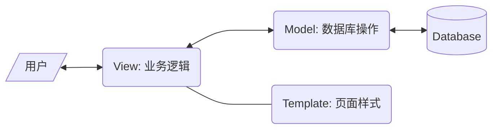
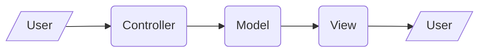
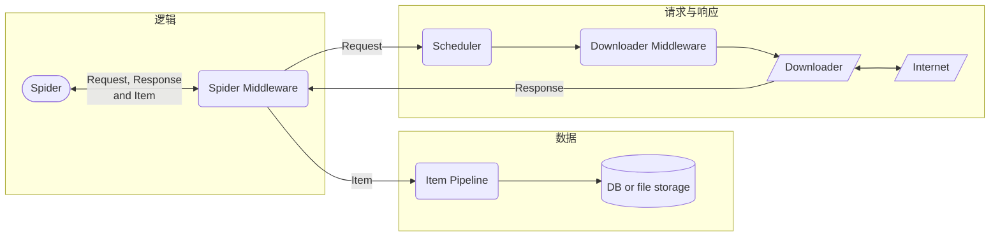

# Requests - HTTP请求

[Requests](https://requests.readthedocs.io/en/latest/)在python原生库urllib、第三方库urllib3的基础上，提供了方便易用的HTTP功能

## 请求与响应

```python
import requests

# 简单请求
response = requests.get(
    'example.com',
    params={'page', '1'},                     # GET参数
    headers={'User-Agent': 'Mozilla/5.0'}     # 请求头
    cookies={'SESSIONID':'8A25432CEC745A1C'}  # Cookie
)

# 响应
r = get_response
r.status_code   # 状态码 
r.headers       # 响应头, dict
r.text          # 文本格式的响应体
r.content       # 二进制格式的响应体
r.json()        # 用json解码的响应体
```

## 会话

Session对象可进行会话管理，在多个请求之间复用请求头、自动管理Cookie、复用TCP连接。[参考](https://requests.readthedocs.io/en/latest/user/advanced/)

```python
s =  requests.Session()

# 设置会话参数。这些参数在后续请求都会使用；若服务器Set-Cookie也会在会话中自动使用
sess.headers.update({'User-Agent': 'Mozilla/5.0'})   # 请求头
sess.cookies.set('_SESSID', '1CvdAc0VkE13nc')        # Cookie
sess.proxies = {'http': '192.168.0.1:8080'}          # Proxy

# 请求资源
domain = 'https://example.com'
try:
    # GET请求，并用BeautifulSoup分析响应
    response = sess.get(f'{domain}/thread', params={'file': 'a.png'})
    soup = BeautifulSoup(response.text, 'html.parser')
    token = soup.find('input', {'name': '_token'})['value']
    # POST请求。注意：此处添加的header只在此次请求生效
    sess.post(f'{domain}/thread', header={'X-TOKEN': token}, data={'text':'example'})
except Exception as e:
    print(str(traceback.format_exc()))
```

需要对请求进行额外处理，比如修改自动生成的`Content-Length`头以实现HTTP请求走私，可以用prepared request

```python
sess = requests.Session()
req = Request('GET', 'example.com')
# 生成prepared request并做特殊处理
prep = req.prepare()
prep.body = 'GET /secret HTTP/1.1\r\nHost: example.com\r\n\r\n'
# 发出请求
sess.send(prep)
```

## 其他

忽略SSL

```python
requests.packages.urllib3.disable_warnings()
requests.get('https://example.com', verify=False)
```

# Django - Web应用框架

## 基础

```powershell
# 安装
pip install django

# 创建项目，注意用保留词（比如Django，test）做项目名会出问题
python -m django startproject mysite
cd mysite

# 创建网页应用
python manage.py startapp myapp

# 运行服务器，并允许局域网访问
manage.py runserver 0.0.0.0:8000
```

完成以上步骤之后在浏览器输入`localhost:8000`或者`本机ip:8000`，能看到示例页面。若出现访问权限等问题，需要在`sesttings.py`的`ALLOWED_HOSTS`列表中添加请求访问的设备的ip地址，例如`ALLOWED_HOSTS = ['114.210.194.92']`

### 设计模式

Django使用MVT设计模式。MVT指Model，View，Template，它们分别负责数据库操作、业务逻辑、页面渲染

1. 用户发出请求，Django接收到请求后，根据`urls.py`的配置调用`view`函数
2. `views.py`中的`view`函数执行业务逻辑。需要操作数据库时调用`models.py`中的`model`类访问数据库（换句话说，`model`把SQL操作包装好，业务逻辑使用`model`作为中介访问数据库）
3. 读取`template`文件，渲染为最终呈现给用户的样子，最后返回响应



另一种常见的设计模式是MVC（Model View Controller），它是MVT的前身。**Controller**接收用户的请求，并选择相应的Model去处理；**Model**操作数据库；最后**View**将数据显示给客户端用户



MVC模式中页面样式和数据仍有耦合；MVT模式模块间耦合更低。因此MVT更容易扩展

### 工作流程

1. 创建项目。`python django-admin.py startproject mysite`
2. 创建应用。`python manage.py startapp myapp`
3. URL路由规则和View。这两个写好之后就能提供基本的服务了

```python
from django.contrib import admin
from django.urls import path
from django.http import HttpResponse

# 放在urls.py
# 第一个参数是URL规则，尖括号内的作为关键字参数传给View；第二个参数是View函数
urlpatterns = [
    path('admin/', admin.site.urls),
    path('articles/<slug:title>/<int:section>/', view),
]

# 放在views.py，负责构造HTTP响应
def view(request, title:str, section:int):
    return HttpResponse(f'{title}</br>section {section}')
```

较复杂的网站应使用多级路由。这种写法将应用间耦合减到最低，只要有多个应用，就应该用这种写法

```python
from django.urls import include

urlpatterns = [
    path('myapp/', include(myapp.urls)),
]
```

## View

View执行业务逻辑，并通过Model操纵数据库、通过Template生成网页代码，最终返回完整网页

```python
from django.shortcuts import render

def response(request):
    context = {'hello': 'Hello, world!', 'list':[0], 'dict':{'a':1}}
    return render(request, 'template.html', context)
```

## Template

Template是网页前端的HTML、CSS和Javascript文件，它们通常还需要填入数据才能显示给用户看。HTML模板一般格式为：

```html
<!-- template.html -->

<h1>
    {{ hello }}
    {{ list.0 }}
    {{ dict.a }}
    <!-- 待填入的数据用双大括号括起来。注意索引用点而不是方括号 -->
    <!-- 数据由View负责填充-->
</h1>
```

然后在`settings.TEMPLATES.DIRS`里面加入模板所在文件夹，比如`TEMPLATES['DIR'] = BASE_DIR / 'templates'`

### 控制流

Template中可以使用一些简单的控制逻辑：

```html
<!-- if分支 -->
<p>
    
        cond1和cond2均为真
    
        cond1为真，cond2为假
    
        cond1为假
    
</p>

<!-- for循环迭代列表 -->

    <p>{{ paragraph }}</p>

    <p>没有文章</p>


<!-- for循环迭代字典 -->

    

```

除了上面写了的用法之外，还可以在循环内用循环变量`forloop.counter`循环次数、`forloop.counter0`从0计的循环次数、`forloop.first`是否第一次循环、`forloop.last`是否最后一次循环

### 其他

```html
<!-- 包含 -->
(% include "nav.html" %)
```

## Model

Model类是对数据库的封装，View通过调用Model进行数据库操作。通常设计为：每个模型类对应数据库的一张表，每个实例对应表中的一行数据，类的各属性对应表的各字段

```python
from django.db import models

class Question(models.Model):
    question_text = models.CharField(max_length=200)
    pub_date = models.DateTimeField('date published')
    votes = models.IntegerField(default=0)
```

将模型类写在`<app_name>/models.py`中，将应用添加到`settings.py`的`INSTALLED_APPS`中，并通过以下命令建表

```powershell
python manage.py makemigrations <app_name>
python manage.py migrate
```

第一步生成迁移（migration）命令，也就是实际建表的各种指令；第二步执行这些命令。数据库不在版本管理范围内，保留迁移命令等于保留了数据库结构。数据库通过名为`django_migrations`的表记录哪些迁移已经实施

```python
from django.utils import timezone

# 增
q = Question(question_text="What's new?", pub_date=timezone.now(), votes=0)
q.save()

# 删

# 查
q1 = Question.objects.all()
q2 = Question.objects.filter(question_text__startswith='What')
q3 = q2.exclude(pub_date__gte=datetime(2020, 1, 1))  # 用上一次查询结果继续查询，称作链式查询
entry = Question.objects.get(pk=1)    # 检索单一对象

# 改
q0.votes = q0.votes + 1  # q0是一条已有的记录
q0.save()
```

查询的基本格式是`field__lookuptype = value`，字段名 双下划线 查询方式 = 值。常用的查询方式有

| 查询方式             | 说明                           |
| -------------------- | ------------------------------ |
| exact, contains      | 精确匹配，包含匹配             |
| startswith, endswith | 以什么开头或结尾               |
| gt, gte, lt, lte     | 大于、大于等于、小于、小于等于 |
| in                   | 包含于列表                     |

在查询方式前加上`i`不区分大小写。比如`name__istartswith = rick`可以匹配到`Rick Astley`

## 其他

### 静态文件

```python
# 在settings.py中声明静态文件夹
STATIC_URL = 'static/'     # 静态文件的url，必须斜杠结尾

STATICFILES_DIRS = [       # 静态文件夹。必须用UNIX格式
    BASE_DIR / "static",
    BASE_DIR / 'myapp/static',
]
```

并且在模板需要使用静态标签

```html


```

如果是生产环境，官方文档建议另外弄一个服务器专门负责图片

# Scrapy - 爬虫框架

## 基础

```shell
scrapy startproject tutorial       # 创建项目
cd tutorial
scrapy genspider My "example.com"  # 创建新的爬虫
scrapy crawl My                    # 开始爬虫

scrapy shell "http://example.com"  # 交互式处理页面
scrapy -h
```

Scrapy的基本数据流如下（也可参考[完整架构](https://docs.scrapy.org/en/latest/topics/architecture.html)）。其中，Spider是必须实现的，其余东西是可选的



除了从命令行启动之外，还可以[从python脚本启动](https://docs.scrapy.org/en/latest/topics/practices.html#run-from-script)

```python
from scrapy.crawler import CrawlerProcess
from .spiders.My import MySpider

process = CrawlerProcess()
process.crawl(MySpider)
process.start()
```

## 爬虫控制

### Spider

Spider类用于控制爬虫逻辑：从哪个页面开始爬、爬到之后如何解析数据、下一步要请求哪些URL

```python
import scrapy

class MySpider(scrapy.Spider):
    name = 'my_spider'                            # 名字。同一项目的spider不可重名
    allowed_domains = 'quotes.toscrape.com'       # 域名白名单，只爬这个域名的东西
    start_urls = ['https://quotes.toscrape.com']  # 初始URL，从这里开始爬
    
    def parse(self, response:scrapy.Response) -> Iterable[scrapy.Request, scrapy.Item, dict] :
        # 提取网页数据，装在字典中返回（也可以继承scrapy.Item定义自己的容器）
        # 后续交给Item Pipeline处理，详见处理数据一节
        for quote in response.css("div.quote"):
            yield {
                "text": quote.css("span.text::text").get(),
                "author": quote.css("small.author::text").get(),
                "tags": quote.css("div.tags a.tag::text").getall(),
            }
        # 提取超链接，构造请求。后续交给Scheduler处理，详见请求与响应一节
        next_page = response.css("li.next a::attr(href)").get()
        if next_page is not None:
            next_page = response.urljoin(next_page)
            yield scrapy.Request(next_page, callback=self.parse)
```

### Request与Response

```python
# 构造Request
req = scrapy.http.Request(
    url = 'example.com',
    callback = MySpider.parse,
    method = 'POST',
    headers = {'User-Agent': 'Mozilla/5.0 (Windows NT 10.0)'},
    cookies = {'uuid': 'AH2oUVECM5VX7F7s0'},  # 也可以用List[dict]
    body = b'[null, null, "zh-cn"]'
)
```

Scrapy还提供了若干[Request子类](https://docs.scrapy.org/en/latest/topics/request-response.html#request-subclasses)，包括表单、JSON，它们主要用于POST请求

```python
# Response类的属性
print(
    response.url,     # 如：'http://www.example.com'
    resposne.status,  # 如：200
    response.headers, # 如：{b'server': [b'nginx'], b'Content-Type': [b'text/html;charset=UTF-8']}
    response.body
)
# Response类的方法
new_url = response.urljoin('robots.txt')  # 拼接绝对URL
div = resposne.xpath('//div')             # XPath选择器。返回所有选中元素的SelectorList
p = response.css('p::text')               # CSS选择器。返回所有选中元素的SelectorList

# SelectorList使用方法
div.extract()       # 提取全部节点内容，返回List[str]
div.re(r'id=\d*')   # 对全部节点做正则匹配，扁平化装进List[str]

# Selector使用方法
p0 = p[0]
p0.extract()      # 获取节点内容。HTML和XML文档会将百分号转义字符会被转换回普通字符，并返回str
p0.re(r'id=\d*')  # 正则匹配搜索节点内容，返回List[str]
p0.attrib         # 获取HTML attribute，返回dict
```

### Link Extractor

从HTTP响应提取链接

```python
from scrapy.linkextractors import LinkExtractor

extractor = LinkExtractor(
    allow = r'menu*',              # 正则匹配，Union[str, List]
    allow_domains = 'example.com',
    deny_extensions = []           # 若不指定，默认为scrapy.linkextractors.IGNORED_EXTENSIONS
    restrict_xpaths = '//div'      # 只提取这个XPath内的链接，Union[str, List]
)

links = extractor.extract_links(response)
```

### Spider Middleware

Spider处理的所有数据（Request，Response，Item）都会先经过Spider Middleware，常用于过滤响应、处理异常

https://docs.scrapy.org/en/latest/topics/spider-middleware.html

## 处理数据

### Feed Export

直接将回调函数（一般是Spider的`parse`方法）返回的数据（`dict`或者`Item`对象）[保存到一个文件]((https://docs.scrapy.org/en/latest/topics/feed-exports.html))

```shell
scrapy crawl my_spider -o "example.json"
```

### Item Pipeline

可以用[Item Pipeline](https://docs.scrapy.org/en/latest/topics/item-pipeline.html)处理抓到的数据，比如清理数据、存储数据。使用Item Pipeline需要以下代码

```python
# 定义Item类（一般放在items.py）。Item仅仅是一个数据容器
class TutorialItem(scrapy.Item):
    title = scrapy.Field()
    body = scrapy.Field()

# 回调函数将数据装进Item对象（一般在Spider类中）并返回
def parse(self, response):
    item = TutorialItem()
    item['title'] = response.xpath('//title/text()').extract()
    item['body'] = response.body
    yield item

# 另一种装Item的方式是利用ItemLoader（比上面的例子稍微方便了一丁点）
def parse_loader(self, response):
    loader = scrapy.loader.ItemLoader(TutorialItem(), response=response)
    loader.add_xpath('title', '//title/text()')
    loader.add_value('body', response.body)
    yield loader.load_item()

# 定义Item Pipeline（一般放在pipelines.py），回调函数返回的Item对象会自动交给它处理
class Pipeline():
    def process_item(self, item, spider):
        with open(f'{item['title']}.html', 'wb') as fp:
            fp.write(item['body'])
        return item  # 必须返回item对象或raise scrapy.exceptions.DropItem
```

可以定义多个Item Pipeline，用流水线方式处理Item，根据`settings.py`配置的数字从小到大处理（数字取值为0~1000）

```python
ITEM_PIPELINES = {
    "tutorial.pipelines.PreprocessPipeline": 100
    "tutorial.pipelines.TutorialPipeline": 300,
}
```

### 下载文件

可以使用`scrapy.pipelines.file.FilesPipeline`和`scrapy.pipelines.images.ImagesPipeline`下载，向它们提供URL，就能用Scrapy的Downloader下载

## 其他

Scheduler：https://docs.scrapy.org/en/latest/topics/scheduler.html

Downloader Middleware：https://docs.scrapy.org/en/latest/topics/downloader-middleware.html

流量控制：https://docs.scrapy.org/en/latest/topics/autothrottle.html

### 日志

scrapy自带[logging模块支持](https://docs.scrapy.org/en/latest/topics/logging.html)，每个spider类都有自己的logger

# Websockets - Web Socket服务器与客户端

## 服务器

```python
import asyncio
from websockets.asyncio.server import serve

async def echo(websocket):
    async for message in websocket:
        await websocket.send(message)

async def main():
    async with serve(echo, "localhost", 8765) as server:
        await server.serve_forever()

if __name__ == "__main__":
    asyncio.run(main())
```

## 客户端

```python
import asyncio
import websockets
from websockets.exceptions import ConnectionClosed

URL = 'ws://example.com'
HEADER = {'Cookie': 'accessToken=ZXhhbXBsZQ=='}

# 简单收发数据
async def hello():
    async with websockets.connect(URL, additional_headers=HEADER) as ws:
        try:
            await websocket.send("Hello world!")   # 发送数据
            message = await websocket.recv()       # 接收数据
        except ConnectionClosed:
            continue  # 自动重连
        except KeyboardInterrupt:
            break     # Ctrl+C 退出
    return message
```

更复杂的应用可以用Consumer和Producer设计模式：

```python
async def consumer_handler(websocket):
    # Consumer Handler处理接收到的消息
    async for message in websocket:
        await consume(message)

async def producer_handler(websocket):
    # Producer Handler处理要发送的消息
    while True:
        try:
            message = await produce()
            await websocket.send(message)
        except ConnectionClosed:
            break

async def connect_ws():
    async with websockets.connect(URL, additional_headers=HEADER) as ws:
        await asyncio.gather(
            consumer_handler(ws),
            producer_handler(ws)
        )
```

# Beautiful Soup - 提取HTML数据

Beautiful Soup是从HTML和XML中提取数据的库。它支持`html.parser`解析器和`lxml`解析器，提供了易用的接口

安装：`pip install beautifulsoup4`

```python
from bs4 import BeautifulSoup

# 初始化解析器
soup = BeautifulSoup(html_str, 'html.parser')  # 调用python标准库的html.parser解析器


# 查找标签
soup.find_all('a', attrs={'id':'link1', 'href':True}) # 查找<a id="link1" href="任意值">标签
soup.find_all(string="查找标签内容") # 可以是字符串、正则(re.compile)、函数
soup.find_all('a', limit=5)   # 只找前5个
soup.find('a')                # 只找一个

# CSS选择器
soup.css.select('div.header a')
soup.css.select_one('div.header a')

# 访问元素
tag = soup.find('p', limit=1)
tag.name     # 标签名（title）
tag.string   # 标签内容
tag.attrs    # 标签属性
tag['id']    # 另一种访问标签属性的方法
tag['class'] # 多值属性，解析为列表

# 子节点
tag.children, tag.descendants, tag.next_sibling
```

# Selenium - 浏览器自动化

Selenium是一套浏览器自动化工具，常用于网页应用测试

参考：[Selenium文档](https://www.selenium.dev/zh-cn/documentation/)，[Selenium教程](https://www.runoob.com/selenium/selenium-tutorial.html)

```python
from selenium import webdriver
from selenium.webdriver.common.by import By

driver = webdriver.Chrome()
driver.get("http://example.com/") # 打开网页
pw_elem = driver.find_element(By.ID, "passwd") # 选择页面元素
pw_elem.send_keys("123456") # 操作元素
driver.close() # 关闭标签页
driver.quit()  # 关闭浏览器
```

## 浏览器引擎简介

浏览器引擎（Borwser Engine），也叫浏览器内核，是负责渲染网页的组件。主流的引擎包括

- **Gecko**：俗称“Firefox内核”，1997年由网景公司推出，目前由Mozilla主导开发
- **Webkit**：开源，由KHTML（一个已经过时的开源浏览器引擎）分支出来，目前由苹果等公司开发
- **Blink**：分支自Webkit（刚分支出来时叫Chromium，现在也有人把它叫做Chromium或者Chrome内核），目前主要由Google开发
- **Trident**：俗称“IE内核”，由微软开发，早已停止开发，但部分旧网站（需要用IE打开的那些）需要Trident引擎渲染

三大主流引擎（Gecko，Webkit，Trident）都是开源的。目前主流浏览器使用引擎是

- Firefox使用Gecko
- Safari、iOS的其他浏览器使用Webkit
- Chrome、Opera、Edge、安卓的浏览器主要使用Blink
- 国产浏览器主要使用Blink，或者Blink + Trident双内核

## 启动浏览器

```python
from selenium import webdriver

# 启动选项
options = webdriver.ChromeOptions()
options.add_argument("--headless") # 无头模式
options.add_argument("--proxy-server=localhost:8080")  # 启动浏览器的命令行参数
options.add_argument("--user-data-dir=C:\\SeleniumChromeProfile")
# 注意：Chrome禁止用自动化工具控制默认profile。最好创建一个profile专门给selenium用
options.add_extension("example_plugin.zip")            # 加载扩展程序

# 驱动程序
# Selenium会自动检测浏览器版本并下载驱动程序，安装到 %USERPROFILE%/.cache/selenium
# 也可手动指定驱动程序
service = webdriver.ChromeService(executable_path="path/to/driver")

# 启动浏览器
driver = webdriver.Chrome(service=service, options=options)
```

## 模拟交互

页面导航

```python
driver.get("http://example.com")  # 打开网页，并等待网页加载完成（即onload回调执行完毕）
driver.refresh()  # 刷新页面

# 页面信息
print(driver.current_url)
print(driver.title)

# 切换页面
win = driver.windle_handles[1]
driver.switch_to.window(win)   # 切换到第二个标签页
iframe = driver.find_element(By.ID, "frame")
driver.switch_to.frame(iframe) # 切换到iframe

# 处理弹窗
from selenium.webdriver.common.alert import Alert
alert = Alert(driver)
alert.send_keys("输入文本")
alert.accept()  # 或者alert.dismiss()
```

与网页元素交互

```python
# 定位元素。有By.ID，By.XPATH，By.CSS_SELECTOR等多种方式
from selenium.webdriver.common.by import By
search_box = driver.find_element(By.CSS_SELECTOR, "#search input")
search_btn = driver.find_element(By.ID, "submit")

# 访问元素
print(search_box.get_attribute("placeholder"))
print(search_btn.text)

# 获取元素状态
ok = all(
    search_btn.is_displayed(),  # 是否显示
    search_btn.is_enabled(),    # 是否启用
    search_btn.is_selected()    # 选框是否被选中
)
search_btn.rect  # 坐标、尺寸信息

# 鼠标、键盘操作
search_btn.click() # 点击
search_box.clear()          # 清空输入框
search_box.send_keys("foo") # 键盘输入
from selenium.webdriver.common.keys import Keys
search_box.send_keys(Keys.CONTROL + "a")  # 输入不可打印字符

# 执行Javascript
driver.execute_script("window.scrollTo(0, document.body.scrollHeight);")
ret = driver.execute_script("return 1;")  # 执行JS并获取结果
```

对于复杂操作，可以使用Actions接口模拟硬件输入

```python
from selenium.webdriver.common.action_chains import ActionChains

actions = ActionChains(driver)
actions.move_to_element(clickable) \
    .pause(1) \
    .click() \
    .perform()
```

其他常用操作有：

- 点击：`click, double_click, context_click`
- 拖放：`drag_and_drop, click_and_hold, release``
- 键盘：`send_keys`

## 等待策略

默认配置下，Selenium等待HTML所有资源加载完成，然后继续运行代码。但如果网站使用异步加载，HTML资源加载完成的时候，部分资源还没加载出来（未显示或者不存在），试图用selenium访问这些元素会报错`selenium.common.exceptions.NoSuchElementException`。因此Selenium还提供了两种等待机制：

- 隐式等待：设置全局超时秒数，定位元素失败时等待至多这么久。此方法简单易用，但是不够灵活，比如无法等待元素变为可点击状态
- 显式等待：在代码中添加等待指令，运行到该处时按照指令等待

两种等待策略不可混合使用，否则等待时间不可预测

```python
# 隐式等待。每次定位元素失败时等待至多5秒
driver.implicitly_wait(5)

# 显式等待
# 其中，wait.until的参数是Callable[[], bool]，代码将等待到它返回True为止
from selenium.webdriver.support.ui import WebDriverWait
wait = WebDriverWait(driver, timeout=2)
wait.until(lambda _: element.is_enabled())

# expected_conditions模块提供了许多常用的等待条件
from selenium.webdriver.support import expected_conditions as EC
elem = (By.ID, "checkbox")  # 此参数是查找元素的关键字元组。也可以是元素本身
wait.until(EC.element_to_be_clickable(elem))
```

# Playwright - 浏览器自动化

Playwright是微软开发的网络应用程序自动化测试框架

Playwright使用自己编译的浏览器、驱动，避免浏览器自动更新导致测试环境变化（这一点和Selenium不同，Selenium使用电脑上已安装的浏览器，以及浏览器官方驱动）。安装playwright库之后要手动安装浏览器和驱动，安装位置在`%USERPROFILE/AppData/Local/ms-playwright`

```shell
pip install playwright        # 安装playwright库
playwright install chromium   # 安装浏览器
```

## 基础

```python
from playwright.sync_api import sync_playwright
from playwright.sync_api import Playwright, Browser  # 可以用作type hint

# 启动 Playwright driver 进程
with sync_playwright.start() as p:
    # 启动浏览器
    chromium = p.chromium.launch(headless=False, proxy={"server":"127.0.0.1:8000"})
    # 打开新窗口，不同context之间Cookie、LocalStorage等状态不共享
    context = chromium.new_context()
    # 打开网页
    page = context.new_page()
    page.goto("http://example.com")
    page.wait_for_timeout(1000)  # 等待1秒
    # 操作网页
    page.locator("#keyword").fill("Hello")
    page.locator("#submit").click()
    # 关闭网页
    page.close()
# 退出with块时自动关闭浏览器，同时关闭所有context、page
```

除了以上用法之外，Playwright还提供了一套异步api（若无说明，本笔记其他部分均使用同步api）

```python
import asyncio
from playwright.async_api import async_playwright, Playwright

async def run(playwright: Playwright):
    browser = await playwright.chromium.launch()
    page = await browser.new_page()
    await page.goto("http://example.com")
    # other actions...
    await browser.close()

async def main():
    async with async_playwright() as playwright:
        await run(playwright)
asyncio.run(main())
```

## 定位网页元素

[Playwright文档](https://playwright.dev/python/docs/locators#locating-elements)鼓励用人类用户视角定位网页元素，不建议使用CSS选择器或XPath选择元素。理由是网页布局变化时DOM变更，容易导致CSS选择器和XPath失效，相比之下贴近用户的定位方式更可靠

```python
# 用标签的 ARIA role 定位
# 参考：https://www.w3.org/TR/html-aria/#docconformance
# 常见Role有：link, button, checkbox, tables等
button = page.get_by_role("button", name="Sign In")
checkbox = page.get_by_role("checkbox", name=re.compile("subscribe"))

# 用文字定位
div = page.get_by_text("Welcome")

# 定位输入框<input>
page.get_by_placeholder("请输入密码")  # input标签的placeholder属性
page.get_by_label("Password")         # 与input关联的label标签

# 定位图片
page.get_by_alt_text("banana")  # 根据img标签的alt属性

# 定位容器、链接
page.get_by_title("首页")  # 根据span、a等标签的title属性
```

虽然文档从测试稳定性的角度出发不推荐CSS、XPath，但它们的能力比Playwright提供的定位工具强大太多了，而且用id、class定位也很可靠。合适的时候应该毫不犹豫的使用

```python
button = page.locator("css=button")
button = page.locator("xpath=//button")
# 前缀css=、xpath=可以省略，Playwright会自动判断是哪一种
```

匹配到多个元素可用以下方式处理

```python
locagor = page.locator(".highlight")

all_highlight = locator.all()  # 获取全部元素，list[Locator]
first, second, last = locator.first(), locator.nth(1), locator.last()  # 获取首个、第n个、末尾元素
count = locator.count()   # 匹配到元素的数量
```

## 模拟交互

定位到的网页元素是[Locator](https://playwright.dev/python/docs/api/class-locator)对象，用其方法与网页元素交互。也可参考[教程](https://www.byhy.net/etc/playwright/04/)

```python
link = page.get_by_role("link", name="Test Page")

# 读取元素内容
print(link.inner_text())  # 元素内的文本
print(link.inner_html())  # 元素内全部内容
print(link.get_attribute("href"))  # 元素属性
# 判断元素状态
ok = link.is_visible() and link.is_enabled()

# 鼠标操作
link.hover()
link.click()
link.dbclick()

# 键盘操作
pw = page.locator("#password")
pw.clear()
pw.fill("123456")
```

## Tracing

Tracing功能可以记录所有网络活动，以及每一步操作详情

```python
browser = playwright.chromium.launch()
context = borwser.new_context()
context.trace.start(screenshots=True, snapshots=True, sources=True)
# snapshot: 记录网络活动和DOM；screenshots: 截图；sources: 保存源代码并与网页操作联动
page = context.new_page()
page.goto("http://example.com")
context.trace.stop(path="trace.zip")  # 将记录保存到文件
```

记录之后，可通过`show-trace`功能查看

```shell
python -m playwright show-trace "trace.zip"
```

