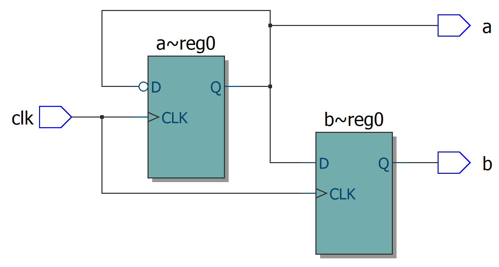

参考教程：https://www.chipverify.com/verilog/verilog-tutorial

在线练习&仿真：https://hdlbits.01xz.net/wiki/Problem_sets

# Verilog简介

Verilog是一种硬件描述语言（Hardware Description Language，HDL），它的语法和C语言相似，但是本质是完全不同的：C语言编译后是顺序执行的指令，而Verilog综合（synthesize）后是一个电路。它可以从不同抽象级别描述一个硬件电路：

| level                                  | description                                                  |
| -------------------------------------- | ------------------------------------------------------------ |
| Switch Level，开关级                   | 控制各种mos器件实现功能                                      |
| Gate Level，门级                       | 用各种门实现                                                 |
| Register Transfer Level，RTL，数据流级 | 描述寄存器数据流，一般用assign和各种wire实现，也有说凡是能综合的都可以叫做RTL级 |
| Behavior Level，行为级                 | 描述系统算法行为，主要用always块实现                         |

Verilog是不断发展的语言，其中比较重要的有Verilog-1995和Verilog-2001这两个标准

# 常量与标识符

常量的表示方式是`[size]'[base_format][number]`

```verilog
8'b0000_0000
9'h1FA
-6'd3           // 负数
"Hello, world!" // 字符串，ascii，一个字符1字节

// 符号常量
parameter MSB = 7;

// 定义带有parameter的模块
module counter
    #(parameter N = 2) // 如果IO不需要参数，在module内部声明parameter，效果一样
    (
        input clk, rst_n, en,
        output reg[N-1:0] out
    );
    
    always @(posedge clk) begin
        // 计数
    end
endmodule

// 使用带有parameter的模块
counter #(.N(4)) c0 (.clk(clk), .rst_n(rst_n), .en(en));
```

标识符由数字、字母（区分大小写）、下划线、dollar符号`$`组成，不能以dollar或者数字开头，不能与保留关键字重名

# 数据类型

Verilog描述的是硬件，因此数据类型的定义和高级语言截然不同

## Net

Net数据类型是连线的抽象，它不能储存值，取值取决于它的驱动电路（Driver）。由于wire是最为常用的Net类型，wire和Net之间有时不严格区分

以下列出部分Net类型：

| name      | description                                        |
| --------- | -------------------------------------------------- |
| wire      | 普通连线                                           |
| tri       | 有多个驱动器的线。与wire完全一样，仅用来提高可读性 |
| wand, wor | 线与（wire and），线或（wire or）                  |

Net可以用assign语句来连线（Variable不行），可以用<span style="background-color:#FFFF00">assign语句实现组合逻辑电路</span>

```verilog
wire i1, i2;
wire out;
wire [1:0] data;

assign out = i1 & i2;
assign data = {i2, i1};

// 假设给一个net加多个驱动源，当不同驱动源的电平不同时连线的电平为X
assign out 1'b1;   // 如果i1 & i2 == 0，out = X

// implicit assignment
wire out_implicit = i1 & i2;
```

## Variable

Variable是一种能储存数据的电路的抽象，比如D触发器。有时也叫做register或者register variable

| name    | description              |
| ------- | ------------------------ |
| reg     | short for register       |
| integer | 32 bits wide             |
| time    | 64 bits wide             |
| real    | floating point，不可综合 |

Variable有<span style="background-color:#FFFF00">阻塞赋值与非阻塞赋值</span>两种连接方式

```verilog
a <= c;   // non blocking，不同非阻塞赋值并发执行，顺序无所谓
b = c;    // blocking，这一句执行完之前后面的不能执行（即：这一句的结果会影响之后的值）
```

* <span style="background-color:#FFFF00">时序电路中使用非阻塞赋值</span>

```verilog
always @(posedge clk) begin
    a <= ~a;
    b <= a;
end
```



可见时钟正跳变沿到来时b的D输入还是上一个周期的a，故输出始终有`b == ~a`

* <span style="background-color:#FFFF00">组合逻辑电路中使用阻塞赋值</span>

```verilog
always @(*) begin
    a = a & in;
    b = a;
end
```


如果违反以上两个原则，比如在时序逻辑电路中使用阻塞赋值`a = ~a; b = a;`，综合后就编程a经过一个非门连到b的D端，当比较复杂的时候会产生一大坨难以理解的逻辑门 / 查找表。在组合逻辑使用非阻塞赋值或者在一个always块中混合使用两种赋值同理

## Scalar, Vector and Array

Scalar是宽度为1bit的数据，Vector是宽度大于1bit的数据，Array是多个数据的阵列

```verilog
wire clk;        // 声明wire scalar
reg [7:0] addr;  // 声明reg vector，方括号中是[msb:lsb]
reg y [11:0];    // 声明scalar reg array，数列深度为12，每个1bit宽
reg [7:0] mem [1:0][3:0]  // 声明vector reg array，2行4列，每个8bit宽

addr[0] = 1;     // 访问msb
addr[7:4] = 4'hF // part-select
y[11] = 1'b1;    // 访问Array，注意scalar array不能整体赋值而vector可以
mem[0][0] = 8'haa;  // 将0行0列元素赋值0xAA
```

# 模块

<span style="background-color:#FFFF00">可综合的代码都要包含在module中</span>。module描述了一个具有特定逻辑功能的电路模块，它包含若干输入和输出端口（Port）以及内部的逻辑电路。以下是一个同步清零的D触发器module：

```verilog
module dff(d, clk, rst_n, q);
    // 声明IO
    input d;
    input clk;
    input rst_n;
    output reg q;

    // 逻辑功能
    always @ (posedge clk) begin
        if (!rst_n)
            q <= 0;
        else
            q <= d;
    end
endmodule
```


一个module中可以包含其他的module，比如下例是一个4bit移位寄存器：

```verilog
module shift_reg(
    // 也可以在开头这里声明port的IO方向。这是verilog 2001的规定
    input d,
    input clk,
    input rst_n,
    output q
);
    // 声明内部连线
    wire [2:0] q_net;

    // 实例化(instantiate)D触发器
    dff u0 (d, clk, rst_n, q_net[0]);   // Port connection by ordered list
    dff u1 (.d(q_net[0]), .clk(clk), .rst_n(rst_n), .q(q_net[1]));  // by name
    dff u2 (.d(q_net[1]), .clk(clk), .rst_n(rst_n), .q(q_net[2]));
    dff u3 (.d(q_net[2]), .clk(clk), .rst_n(rst_n), .q(q));
endmodule
```


端口连线时，可以用如`.name()`的方式表示引脚悬空

`input`和`inout`类型的端口要被外部电路驱动，因此不能是reg类型

开发时，会用一个top-level module包含整个系统，顶层模块不会被其他的模块实例化。模拟仿真时使用的testbench也算一种顶层模块

# 运算符

和C的运算符基本相同。特别在此列出位运算符

| Symbol     | Performance |
| ---------- | ----------- |
| &          | 与          |
| \|         | 或          |
| ~          | 非          |
| ^          | 异或        |
| `<<`, `>>` | 左移、右移  |

位运算符可以组合使用，例如`~&`与非，`~^`同或

不同之处：==, !=遇到x, z时结果为x; ===， !==要求完全一致
位拼接运算符 {1'b0, 1'b1}, {var_1, 4{var_2}, 2'b10}。例1结果位2'b01，例2中将var_1, 4个var_2, 2'b10拼接到一起（必须声明位数）
缩减运算符：&B，第一位与第二位与，结果与第三位与，如此类推直到最后一位

# 控制流

if, while, for同C语言，x与z被判定为假

case 类似c的switch，但是没有break，因为电路不可能从一个触发器“跳出”
casez 忽略（不比较)z
casex 忽略z, x

```verilog
case (something)
    value: begin
        //do something while "something==value"
    end
    othervalue: begin
        //do something while "something==othervalue"
    end
    default: begin
        //do something while "something" is none of the above
    end
endcase
```

forever 语句       无限循环，必须写在initial块
repeat(次数) 语句  重复指定次数

# Always Block

当信号跳变时将会触发，<span style="background-color:#FFFF00">block中的语句顺序进行，不同的block并行执行</span>。跳变条件可以是边沿敏感（正跳变或者负跳变）或者电平敏感（电平变化），但不能有的信号是边沿敏感、有的信号是电平敏感

```verilog
module tff(input d, input clk, input rst_n, output reg q);
    always @(posedge clk or negedge rst_n) begin
        if (!rst_n)
            q <= 1'b0;
        else
            q <= q;
    end
endmodule
```

可以用always block实现组合逻辑电路：

```verilog
module combo (input a, b, c, d, e,
              output reg z);
    always @ ( a or b or c or d or e) begin
        z = ((a & b) | (c ^ d) & ~e);
    end
endmodule
```


上图是Quartus综合的结果，reg变量z综合为组合逻辑的输出，而不是寄存器或者触发器。使用Vivado综合，得到的是一个查找表。如果更改项目的硬件，综合结果大概还会有不同吧

# Generate Block

应该算一种特殊的宏，综合的时候展开成合适的结构

```verilog
genvar i;   // 声明generate variable，综合后它并不存在
generate
    for (i=0; i < 8; i++) begin
        // do something, e.g. instanciate an array of submodules
    end
    
    // 也可以用generate if和generate case，但是因为generate块展开之后是不存在的，
    // 应该只能用parameter作为条件
endgenerate
```

# 仿真

## testbench编写

一般定义一个专门用来仿真的testbench顶层模块，产生几个虚拟的信号提供给被测试的模块，观察测试输出是否正确。有许多只能在仿真时进行的操作，以下列出常用的几个

```verilog
module testbench();
    wire clk, foo, bar;             // 声明仿真时需要用到的变量
    some_sub_module sub(foo, bar);  // 被仿真的模块
    
    always #10 clk = ~clk;

    // initial block，在仿真开始/硬件上电时运行一次
    // 如果包含了寄存器初始化以外的内容就不可以综合，因此最主要用途是仿真
    initial begin
        clk <= 0;        // 仿真时变量都可以显示赋值，而且如果不赋初值就会变成X
        foo <= 0;
        bar <= 0;
        #10 foo = 1;     // 显式延时，不可综合
        #20 bar = 1;
        #400 $finish;    // 结束仿真
    end

    always @(posedge clk) begin
        $display("%d", foo);
        $wrirte("%d", bar);  // display输出完会自动换行，write不会
    end
endmodule
```

## ModelSim使用

1. File - New - Library，选择文件夹（之后仿真产生的文件都会放在这里。也可以给它起别名），确认之后这个文件夹会显示在Library面板
2. Compile - Compile，选择所有需要仿真的源文件。编译成功之后Library面板下会多出它们编译出的module
3. 双击top-level module，会打开Wave面板，Sim面板和Objects面板
4. 在Objects面板选择需要查看的波形，添加到Wave面板，Simulate - Run