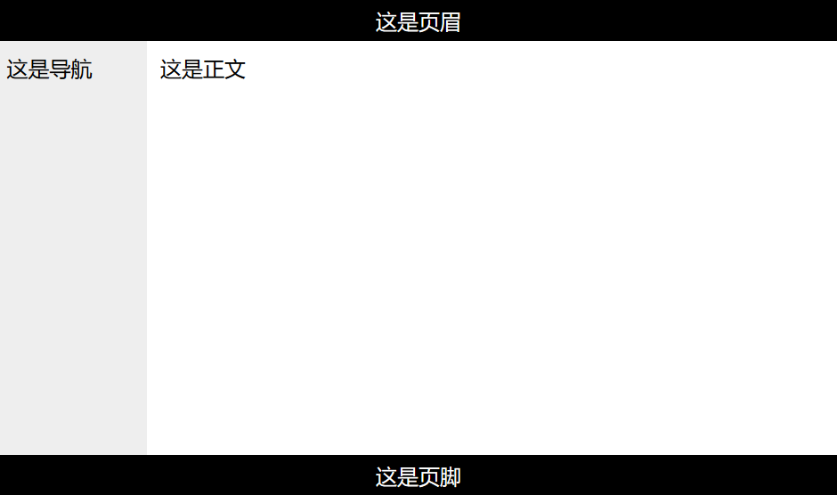

# HTML，CSS与JavaScript

HTML定义了网页的内容，CSS 描述了网页的布局，JavaScript描述网页的行为。较为成熟的开发模式是分别设计HTML、CSS和JavaScript，然后在HTML里面调用另外两者。简单的网页可以把全部东西塞进html里，但考虑可维护性，还是强烈不建议这么做

# HTML

HTML（超文本标记语言，Hyper-Text Markup Language）是用于创建网页的标准标记语言

HTML由多个**元素**（Element）组成。元素由起始标签、元素的内容、终止标签构成，例如`<p>Hello, World</p>`。元素可以没有内容，甚至可以在起始的同时终止（比如，换行标签`<br />`。一些不规范写法将其写成`<br>`，可能会被当作缺少终止标签）

元素常具有**属性**（Attribute），属性用键值对表示，且属性值必须用引号括起来；属性通常写在开始标签。例：`<a href="example.html">链接</a>`

## 基础

```html
<!DOCTYPE html>   <!-- 声明是html5文档。建议用小写标签 -->
<html>            <!-- 根元素 -->
    <head>            <!-- head标签是元数据 -->
        <title>文档标题</title>
        <meta charset="utf-8">
        <base href="//www.runoob.com/images/" target="_blank">     <!-- 默认链接 -->
        <link rel="stylesheet" type="text/css" href="mystyle.css"> <!-- 外部样式 -->
    </head>

    <body>            <!-- body包含了可见的内容 -->

        <h1>一级标题</h1>
        <p>段落</p>
        <a href="http://www.google.com">超文本链接</a>
        
            <!-- 宽度为页面的100%，高度30像素。会自动拉伸图片，如果宽高只指定一个就能保持宽高比 -->
        <br>  <!-- 换行。源代码中的连续空白、空行都会被当作一个空格 -->
        <hr>  <!-- 分割线 -->

        <p>字体
            <b>粗体(bold)</b>
            <i>斜体(italic)</i>
            <strong>加重，通常也被渲染为粗体</strong>
            <em>着重，常被渲染称斜体</em>
            <sub>下标</sub>
            <sup>上标</sup>
            <del>删除线</del>
        </p>

        <p style="color:blue;margin-left:20px;">
            内联样式。常用样式：
            background-color   背景颜色
            font-family        字体
            color              文字颜色
            font-size          文字尺寸，如20px
            text-align         对齐方式，如center
            在旧版本，有font, center, strike标签，color, bgcolor属性用来实现样式
            现在建议只使用style
        </p>

        <!-- 图像 -->
        

        <!-- 表格 -->
        <table width="500" border="1" cellpadding="10">
            <caption>标题</caption>
            <tr>
                <th colspan="2">Header 1</th>
                <!-- th表示表头，colspan表示跨列（即一个占两列），rowspan表跨行-->
            </tr>
            <tr>
                <td>row 1, cell 1</td>
                <td>row 1, cell 2</td>
            </tr>
            <tr>
                <td>row 2, cell 1</td>
                <td>row 2, cell 2</td>
            </tr>
        </table>

        <li>无序列表</li>
        <ol>
            <li>li套在ol里为有序列表</li>
        </ol>

        <div>
            块级元素，经常当作容器
        </div>
  </body>
</html>
```

## 布局

以CSS定位div元素布局为例

```html
<!DOCTYPE html>
<html>
    <head>
        <title> example </title>
        <meta charset="utf-8">
        <link rel="stylesheet" href="style.css">
    </head>

    <body>
        <div id="header">这是页眉</div>
        <div id="nav">这是导航</div>
        <div id="section">这是正文</div>
        <div id="footer">这是页脚</div>
    </body>
</html>
```

```css
#header {
    background-color:black;
    color:white;
    text-align:center;
    padding:5px;
}
#nav {
    line-height:30px;
    background-color:#eeeeee;
    height:300px;
    width:100px;
    float:left;
    padding:5px;
}
#section {
    width:350px;
    float:left;
    padding:10px;
}
#footer {
    background-color:black;
    color:white;
    clear:both;
    text-align:center;
    padding:5px;
}
```

效果如下：



## 实体引用

实体引用（Character Entity Reference）相当于HTML的转义字符，格式是`&entity_name;`

| 实体引用        | 显示的字符        |
| --------------- | ----------------- |
| `&lt; &gt;`     | `< >`             |
| `&amp;`         | `&`               |
| `&apos; &quot;` | `' "`             |
| `&#25105;`      | 我（unicode字符） |

# XML

XML（EXtensible Markup Language）是类似HTML的标记语言，但注重传输数据而非显示数据。XML没有预定义标签，标签名对大小写敏感，允许嵌套元素（但必须是严格的嵌套），每个XML文档有且仅有一个根元素

## XML命名空间(XML Namespaces)

`<前缀:标签名 xmlns:前缀="命名空间">`
`<root xmlns:前缀="命名空间">`（在根元素中声明）
一个命名空间被定义后，拥有相同前缀的元素都与该空间相关联
命名空间通常使用对应的url

## XHTML

XHTML是结合了XML和HTML的一种标记语言
语法规则大体与XML相同，功能大体与HTML4相同

# CSS

CSS（层叠样式表，Cascading Style Sheets）定义了HTML样式。它由若干条规则构成，如

```css
p   /*选择器*/
{
    color: red;  /*属性&值*/
    text-align: center;
}
```

“层叠”指多个规则可以叠加起来对同一个元素生效

## CSS选择器

**简单选择器**

```css
/*元素选择器。选中所有<p>元素*/
p {color: red;}

/*id选择器。选中id属性为main的元素，如<h1 id="main">*/
#main {color: blue;}

/*类选择器。选中class属性为main的元素，如<h2 class="main">*/
.main {color: green;}
```

**属性选择器**

```css
/*具有role属性的元素*/
[role] {color: olive}

/*role属性值为navigation的元素*/
[role="navigation"] {color: purple;}
```

属性选择器有许多变体，语法是将`[attribute="value"]`中的等号替换为其他运算符

| 符号 | 例子           | 说明                 | 例子                        |
| ---- | -------------- | -------------------- | --------------------------- |
| `~=` | `[role~=navi]` | 属性包含独立词navi   | `<div role="navi">`         |
| `|=` | `[role|=navi]` | 属性开头是独立词navi | `<div role="navi sidebar">` |
| `^=` | `[role^=navi]` | 属性开头是navi       | `<div role="navigation">`   |
| `$=` | `[role$=navi]` | 属性结尾是navi       | `<div role="panavi">`       |
| `*=` | `[role*=navi]` | 属性包含navi         | `<div role="panavim">`      |

前两个的“独立词”指用空格、横线分割开的完整词，比如`p[lang~=en]`能匹配到`<p lang="en-us">`、`<p lang="en Zh">`，但是匹配不到`<p lang="enable">`

**组合器**

```css
/*后代选择器。<div>元素内的所有<p>元素*/
div p {background-color: white;}

/*子选择器。<div>子元素中的所有<p>元素*/
div > p {background-color: silver;}

/*相邻兄弟选择器。紧随<div>之后的<p>元素*/
div + p {background-color: gray;}

/*通用兄弟选择器。与<div>同级的所有<p>元素*/
div ~ p {background-color: black;}
```

**其他**

伪类（pseudo-class）选择器：选择特殊状态的元素，比如鼠标悬停、已访问的链接

伪元素（pseudo-element）选择器：选择元素的指定部分，比如首字母、元素之前或之后

## 使用样式表

```html
<head>
    <!-- 外部样式表 external style sheet -->
    <link rel="stylesheet" type="text/css" href="mystyle.css">

    <!-- 内部样式表 internal style sheet -->
    <style>
        hr {color:sienna;}
        p {margin-left:20px;}
        body {background-image:url("images/back40.gif");}
    </style>
</head>

<body>
    <!-- 内联样式 inline style -->
    <p style="color:sienna;margin-left:20px">这是一个段落。</p>
</body>
```

当样式重复定义时，冲突属性取最后定义的

# JavaScript

## 语法

### 数据类型与变量

JavaScript是弱类型的动态语言。动态指变量不与某个类型绑定，弱类型指操作涉及不匹配的类型时，进行隐式类型转换而不抛出错误

JS有7种基本类型 + 1种引用类型，引用类型又可以细分为许多种子类型：

```javascript
// 基本类型
let x;      // Undefined
x = null;   // Null
x = 1.5;    // Number
x = 'Joe';  // String，单引号或者双引号均可
x = true;   // Boolean
x = BigInt("1234567890");   // BigInt
const sym = Symbol("foo");  // Symbol

// 引用类型
const arr = [1, 2, 3];  // 数组
const obj = {name:"John", age:14};  // 对象
const dat = new Date();

// 获取类型。注意typeof是个特殊运算符，不是函数
typeof arr;

// 显式类型转换
x = Number("3.2");   // 转化为数字
x = parseInt(x);     // 转化为整数
x = String("x");     // 字符串
```

**声明变量**

声明变量有若干种方式。建议普通变量用`let`声明，常量和引用类型变量（列表、对象等）用`const`声明

```javascript
let b;  // let声明，作用域为当前block
var c;  // var声明，作用域延伸到当前block之外
const d = 0;  // const声明，不允许再次赋值
```

**字符串**

```javascript
let text = 'some string';
text.replace('pattern', 'repl')

// 常用属性和方法
text.length;       // 字符串长度
text.slice(0, 2);  // 截取片段。此例子返回前两个字符。可以用负数索引，也可以省略第二个参数
text.charAt(0);    // 获取指定位置字符。也可以用str[0]
text.trim();       // 去除头尾空白
text.split(' ');   // 分割

// 正则表达式
// 格式：/表达式内容/[修饰]；常用修饰：i不区分大小写，g全局匹配，m多行匹配
let pattern = /regexp/gi;
text.includes(pattern);  // 返回是否匹配到（布尔值）
text.match(pattern);     // 返回包含了每个匹配的列表
text.search(pattern);    // 返回匹配子串起始位置
text.replace(/some/g, 'random');  // 替换

// Template Literal 格式化字符串。使用反引号
let firstName = "John";
let lastName = "Doe";
let text = `Welcome ${firstName}, ${lastName}!`;
```

**列表**

```javascript
// 定义与访问。注意，用const声明列表
const cars = ["Saab", "Volvo", "BMW"];
console.log(cars[0]);
cars[100] = "Opel";  // 超出范围不会报错，但是3~99全部变成undefined

// 常用方法
const fruits = ["Banana", "Orange", "Apple", "Mango"];
fruits.pop();             // 弹出末尾元素
fruits.push("Kiwi");      // 在末尾添加元素
fruits.shift();           // 弹出首个元素
fruits.unshift("Lemon");  // 在开头插入元素
fruits.slice(0, 3);       // 截取第0~第3个元素
fruits.splice(2, 0, "Lemon", "Kiwi");  // 在2号位置插入Lemon和Kiwi，然后删除0个元素
fruits.concat(["Lemon", "Kiwi"]);      // 拼接列表
fruits.sort(function(a, b){return a-b});
fruits.indexOf("Apple");  // 寻找元素位置

// 使用高阶函数的方法。约定接受三个参数：func(value, index, array)
fruits.map(func);     // 将func作用于每个元素，返回其返回值构成的列表
fruits.filter(func);  // 用func检查每个元素，返回通过检查（返回值为真）的元素构成的列表
fruits.every(func);   // all(fruits.map(func))
fruits.some(func);    // any(fruits.map(func))
```

**对象**

```javascript
// 定义对象
const car = {
    type:"Fiat",
    model:"500",
    color:"white",
    create_description: function() {
        return this.type + " " + this.model;
    }
};

// 访问对象
console.log(car.type);
car["model"] = 404;
```

### 运算符

算数运算符（`+-*/%`)，赋值运算符（`=, +=, -=, *=, /=, %=`），自增自减（`++, --`），条件（`? :`），比较（`>, <, ==, >=, <=, !=`）和大部分编程语言相同，以下列出独特的运算符

```javascript
a === b;   // 绝对等于，值和类型均相等
a !== b;   // 不绝对等于，值或类型不相等
```

### 控制流

```javascript
// if分支
if (time < 10) {
    console.log("Good morning");
} else if (time < 20) {
    console.log("Good day");
} else {
    console.log("Good evening");
}

// switch分支
// switch ... case ... default，同C

// for循环
const fruits = ["Banana", "Orange", "Apple", "Mango"];
let text = "<ul>";
for (let i=0; i<fruits.length; i++) {
    text += "<li>" + fruits[i] + "</li>";
}
text += "</ul>";

// for in循环
const person = {fname:"John", lname:"Doe", age:25};
for (let p in person) {
  console.log(p + " " + person[p]);
}

// while循环，do/while循环
// 略

// break和continue：跳出循环、跳过本次迭代
// 还可以给代码块加标签，跳出指定的代码块
var x = false;
label:
{
    // do something
    if (x) break label;
    // do some other things
}

// 错误处理
try {/*do something*/}
catch(err) {/*发生错误之后执行这段*/}
finally {/*不论有没有捕捉到错误都会运行*/}

//抛出异常
let exception = "Runtime Error";
throw exception;  // 异常可以是字符串、数字、逻辑值或对象
```

### 函数

用关键字function声明函数，函数内变量生存期为函数执行期间，作用域为函数内；函数外变量的生存期为网页存续期间，作用域为整个网页

```javascript
// 定义函数
function func(a, b) {
    return a * b;
}

// 调用函数
let x = func(3, 4);
console.log(x);
```

## 调用

### 代码块

JavaScript以代码块的形式嵌入到html，一般定义在head中或者body的底部。其中的代码在网页加载时会被运行一次，之后还可以事件处理器等方式调用

```html
<head>
    <!-- 使用外部脚本 -->
    <script src="myScript.js"></script>

    <!-- 在head中写脚本 -->
    <script>
        function funcInHead() {document.getElementById("demo").innerHTML="Head";}
    </script>
</head>

<body>
    <p id="demo">Javascript Demo</p>
    <button type="button" onclick="funcInHead()"> Button1 </button>
    <button type="button" onclick="funcInBody()"> Button2 </button>

    <!-- 在body底部写脚本 -->
    <script>
        function funcInBody() {document.getElementById("demo").innerHTML="body";}
    </script>
</body>
```

### 事件

事件是用户的某种动作，比如鼠标点击、按键、调整页面大小等。将JavaScript代码绑定给HTML的事件处理器就能在事件发生时自动调用代码，如：

```html
<button onclick="this.innerHTML = Date()"> 获取当前时间 </button>
```

更常见的做法是不把onclick属性写死在html里面，而是用JavaScript把代码动态绑定到事件处理器。将页面内容与网页行为分离能大大降低开发和维护的难度

```javascript
// 定义事件处理函数
bgChange(event) {
  const rndCol = 'rgb(' + random(255) + ',' + random(255) + ',' + random(255) + ')';
  e.target.style.backgroundColor = rndCol;
}

// 把这个函数绑定到全部Button
const buttons = document.querySelectorAll('button');
for (let i = 0; i < buttons.length; i++) {
  buttons[i].onclick = bgChange;
}
```

- EventListener

相比于事件处理器属性，事件监听器允许给一个事件绑定多个行为，还能很方便地动态管理这些行为

```javascript
const btn = document.querySelector('button');
btn.addEventListener('click', bgChange);
btn.removeEventListener('click', bgChange);
```

**常用HTML事件**

| 事件        | 含义                         |
| ----------- | ---------------------------- |
| onchange    | HTML 元素改变                |
| onclick     | 用户点击 HTML 元素           |
| onmouseover | 用户在一个HTML元素上移动鼠标 |
| onmouseout  | 用户从一个HTML元素上移开鼠标 |
| onkeydown   | 用户按下键盘按键             |
| onload      | 浏览器已完成页面的加载       |

## HTML DOM

DOM（文档对象模型，Document Object Model）是描述文档的树状结构。JavaScript可以通过操作DOM访问网页元素。JavaScript提供了丰富的DOM API，使用`document`、`console`等对象就能访问网页内容，如：

```javascript
document.getElementById("demo").innerHTML = "Hello World";
```

此例子将首个id为demo的元素内容更改为Hello World

**获取网页元素**

```javascript
let element = document.querySelector("p.intro");
const elements = document.querySelectorAll("p.intro");
```

**访问网页元素**

```javascript
element.innerHTML = "Hello";          // 访问元素的内容
let ei = element.getAttribute("id");  // 访问元素的属性
```

