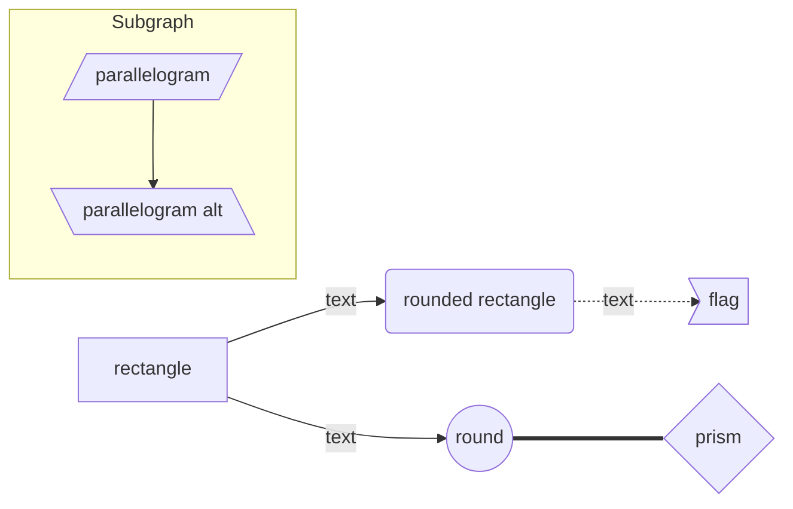
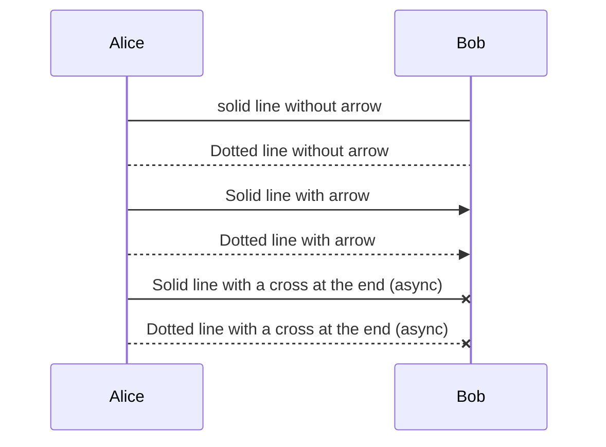
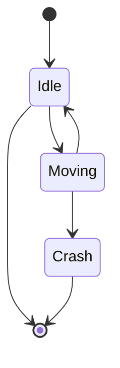
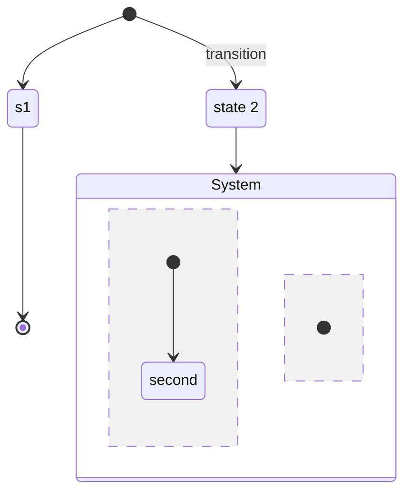

# Mermaid

## Flow Chart



## Sequence Diagram



## State Diagram






# flow

```flow
# 定义节点
st=>start: Start
op=>operation: Operation
cond=>condition: Condition
sub=>subroutine: Subroutine
io=>inputoutput: I/O
e=>end

# 连接节点
st->op->cond
cond(yes)->sub->io->e
cond(no)->e
```

