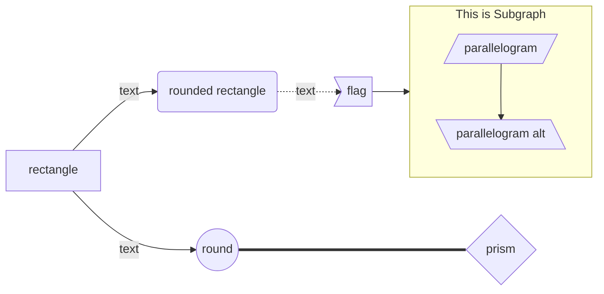
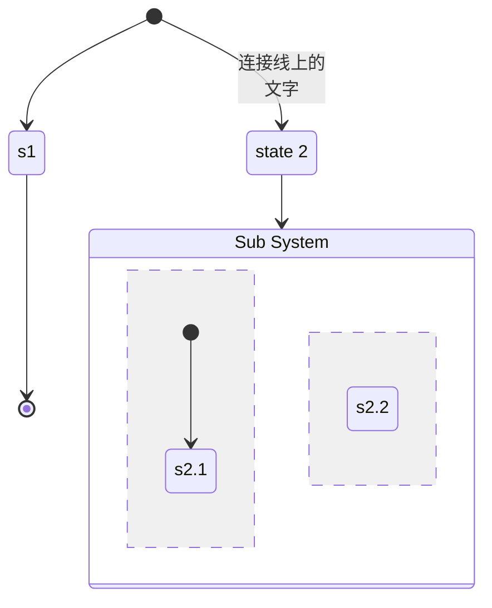

# VSCode

vscode的设置都存储在settings.json中，每个键值对对应一项设置

```json
{
    "workbench.colorTheme": "Default Dark+",
    "editor.rulers": [
        79,
        120
    ]
}
```

部分文件位置：

设置：`%APPDATA%\Code\User\settings.json`（`%APPDATA% = C:\Users\current_user\AppData\Roaming`）

扩展：`%USERPROFILE%\.vscode\extensions`（`%USERPROFILE% = C:\Users\current_user`）

## language-specific settings

```json
"[verilog]": {
    "files.autoGuessEncoding": true
}

"files.associations": {
    "*.va": "verilog"
}
```

# Vim

## 模式

用vim编辑时，需要在不同模式间切换。在Normal模式按下下表的快捷键进入对应模式，其他模式Esc回到Normal

| Keystroke | Mode         | Description                  |
| --------- | ------------ | ---------------------------- |
| i         | Insert       | 类似一般的文本编辑器         |
| v         | visual       | 选择                         |
| :         | Command Line | 执行命令（执行后回到Normal） |
| shift + r | Replace      |                              |
| shift + v | Visual Line  |                              |
| ctrl + v  | Visual Block |                              |

## Normal

**移动光标**

| Keystroke              | Usage                                                |
| ---------------------- | ---------------------------------------------------- |
| `hjkl`                 | 左、下、上、右                                       |
| `wbe`                  | word（下一个词）、begin（词的开头）、end（词的结尾） |
| `0^$`                  | 行的开头、第一个非空白字符、行的结尾                 |
| `HML`                  | 屏幕顶、屏幕中间、屏幕底                             |
| `ctrl + u`, `ctrl + d` | 上下滚屏                                             |
| `gg, G`                | 文件开头、文件结尾                                   |

**搜索**

1. `/`（正向搜索），或`?`（反向搜索）
2. 输入搜索关键字，Enter
3. 按n和N查看各个结果

**编辑**

| Keystroke     | Usage                                                        |
| ------------- | ------------------------------------------------------------ |
| `oO`          | 下方 / 上方插入行                                            |
| `d, c`        | 删除（delete），更改（change，相当于delete然后进入Insert模式） |
| `dd`          | 删除一行                                                     |
| `x`           | 删除一个字符                                                 |
| `u, ctrl + r` | 撤销 & 重做（undo & redo）                                   |
| `y, p`        | 复制 & 粘贴（yank & paste）                                  |

另外，部分指令可以指定范围：

```shell
h5j         # 向下移动5行
d3w         # 删除3个词
d2d         # 删除2行
yy          # 复制一行
y^          # 复制这行剩余内容
```

## Visual

此模式用于选择文本。v，V分别选中字符、选中行

## Command-Line

| Command         | Usage               |
| --------------- | ------------------- |
| `:q`            | quit (close window) |
| `:w`            | write (save file)   |
| `:e [filename]` | open file for edit  |

# Mermaid

## Flow Chart



## State Diagram



# Word

## 多级列表与标题

1. 开始 - 段落 - 多级列表
2. 在列表库 / 当前列表中选一个 / 点击文档中的一个列表编号（若选了，则以选中的样式为基础 / 对选中的列表进行编辑）
3. 定义新的多级列表 - 打开“更多”选项 - 将级别链接到样式

若勾选“正规形式编号”，则强制编号格式统一，如实现“第一章 - 1.1节“（不勾选会变成”第一章 - 一.1节“）

## 样式

**隐藏不需要的样式**：开始 - 样式 - 右下角的小标记 - 管理样式（一个有铅笔的小图标） - 推荐，可以隐藏不想看见的样式

**更改样式的大纲级别**：选中要修改的样式 - 右键 - 修改 - 格式 - 段落 - 常规 - 大纲级别

## 页眉与页脚

插入 - 页眉和页脚

不同部分的页眉页脚不同，比如说从第三页开始标页码：首先在分节处插入布局 - 分隔符 - 分节符，然后选中页眉页脚，设计 - 导航 - 取消链接到前一节

调整页眉的横线：选中页眉 - 开始 - 段落 - 边框 - 无边框

## 公式

- **行宽**：如果想要公式和普通的行一样宽，选中公式，右键，段落 - 取消“如果定义了文档网格，则对齐到文档网格”
- **编号**：输入`公式#编号`然后回车。若想自动编号，使用插入 - 文本 - 文档部件 - 域 - AutoNum
- **空格**：`\ensp`，`\emsp`

## 尾注

引用 - 脚注 - 插入尾注

默认在脚注与正文之间有一条分割线，删除方法是

1. 视图 - 大纲
2. 引用 - 脚注 - 显示备注
3. 在备注界面选择尾注 - 尾注分隔符，删除掉
4. 关闭备注，退出大纲视图

另外，默认脚注格式是上标，修改方法是

- 引用 - 脚注 - 右下角的小箭头
- 查找和替换（Ctrl+H）
  - 查找内容：更多 - 特殊格式 - 尾注标记（或者直接输入`^e`，并选中区分全/半角选项）
  - 替换为：`[^&]`（`^&`是通配符，此格式用方括号括起序号），并设置格式 - 字体 - 取消上标

# Visio

## 解决字符间距变化问题

有时候复制粘贴到word之后字符间距变化。解决方法a) 换用较大字体；b) 导出为矢量图再导入到word

## 修改字体

Visio字体由其Master shape的style定义（[来源](https://social.technet.microsoft.com/Forums/ie/en-US/f1642572-dc3b-4baa-a3cd-8e252571cf89/how-to-set-default-font-in-visio-2016?forum=visiogeneral)）

**修改style全局修改字体**

1. 文件 - 选项 - 高级 - 以开发人员模式运行（这一步好像可以省略）
2. 文件 - 选项 - 自定义功能区 - 开发工具，设置之后会显示开发工具选项卡
3. 开发工具 - 绘图资源管理器
4. 绘图资源管理器 - 样式 - 主题，右键，定义样式 - 更改 - 文本，设置想要的字体、字号

## 打开旧版文件

部分旧版文件（比如`.vss`文件）需要修改信任中心才能打开：

1. 文件 - 选项 - 信任中心 - 信任中心设置
2. 文件阻止设置 - 选中要打开的文件类型
3. 受信任位置 - 添加文件所在位置
4. 打开文件

# Libre Office

菜单无法正常显示：Tools - Options - LibreOffice - VIew - 勾选Use OpenGL
