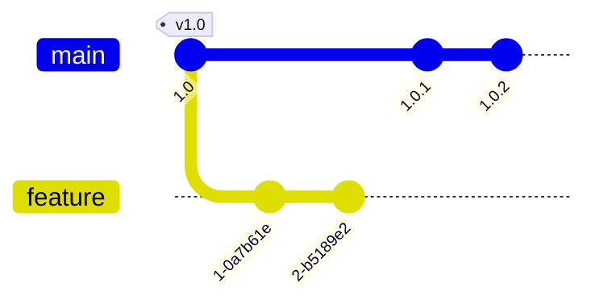
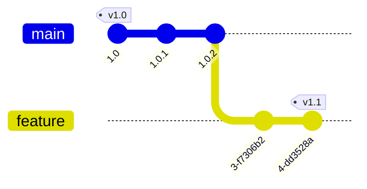

# 基本概念

## 工作区，暂存区和版本库

工作区（working directory）就是我们看见的文件目录；暂存区（index / stage）标记了下一次要提交的内容，通常在`.git/index`文件夹；版本库（repository）是`.git`文件夹下的其他东西，包括了所有历史版本和快照。版本库内的内容总是有办法恢复的，但是没有commit的内容可以被弄丢


git版本库里有三类对象：blob，文件快照；tree，某次提交的文件目录结构和文件的blob对象索引；commit，包含提交的元信息、tree索引和指向上一次commit的索引

## HEAD指针和分支

git中有一个特殊指针HEAD，它指向当前活动的分支。当进行提交时，活动分支自动向前移动到新的commit。另外，如果HEAD不指向一个分支，称作detached HEAD状态

# 常用指令

## 文件操作

```bash
# 查看仓库状态（HEAD位置、有哪些文件被修改、etc.）
git status
git status --branch --short  # 包含当前branch和文件状况的简短报告。很实用

# 查看提交历史
git log
git log HEAD ^HEAD~5        # 列出最近5次提交
git log --graph --oneline   # 类似树状输出，只输出简洁信息
git log app.py              # 查看文件的提交历史
git show 3e635d:app.py      # 查看某次提交的文件内容（注意：路径不能用反斜杠）

# 暂存修改
git add --all

# 提交修改
git commit
git commit -a        # 提交所有修改（包括未暂存的）
git commit --amend   # 修订提交，将现在暂存区里的更改合并到上一个提交

# 恢复文件
git restore app.py   # 丢弃工作区修改，恢复到HEAD版本
git restore --source 3e635d app.py  # 恢复到指定版本

# 单个文件版本切换
git checkout --patch <branch> <file>
```

## stash

stash指令能够把当前工作区储存起来，主要用于储存脏的工作区，比如写到一半时需要转到另一个分支做别的事情

```bash
# 储存工作区，并将工作区恢复到HEAD
git stash

# 查看stash
git stash list          # stash列表
git stash show [stash]  # 查看更改。stash参数是stash list显示的全名或编号

# 恢复stash
git stash pop [stash]   # 将最后的（或者指定的）stash恢复到工作区，并删除（有冲突时不删除）
git stash apply [stash] # 同上，但不删除

# 删除stash
git stash drop [stash]
```

## 远程仓库

```bash
# 查看远程仓库
git remote -v             # 查看远程仓库列表
git remote show $repo     # 查看远程仓库的信息（$repo是自定义的名称）

# 编辑远程仓库
git remote add $repo $url  # 添加远程仓库
git remote remove $repo    # 移除远程仓库
git remote rename $repo $new_repo_name  # 重命名远程仓库

# 和远程仓库同步数据
git fetch $repo  # 从远程仓库抓取
git pull         # 从远程仓库拉取
git push $repo $branch  # 推送到远程仓库
```

同步数据以分支为单位。本地分支绑定到远程上游分支（Upstream Branch），同步操作都是在当前分支和对应远程上游分支之间进行。首次push时需要绑定上游分支：

```bash
git push -u origin main  # 将当前分支绑定到origin仓库的main分支
```

## 分支

```bash
git branch -a    # 查看分支
git branch $branch_name    # 创建分支
git switch $branch_name    # 切换分支。旧写法：git checkout $branch_name
git switch -c $branch_name # 创建分支并切换。旧写法：git checkout -b $branch_name

git merge feature      # 将feature分支合并到当前分支
git branch -d feature  # 删除feature分支

git rebase main        # 将当前分支的变基到main分支
git rebase -i HEAD~3   # 交互模式编辑最近3个提交
```

**变基**是重写提交历史的命令。例如，主分支1.0版本更新后，开发者一边在main分支修bug，一边在feature分支开发新功能。一段时间后提交历史变成这样：



变基功能可以将feature分支的”基底“移动到最新版本。feature分支原来是从v1.0分出来的这就是它的”基底“；变基命令将它的”基底“移动到main分支的最新位置了



变基之后`git merge feature`，再删掉feature分支就能获得一份线性、无分叉的提交记录，避免直接合并导致提交历史变成蜘蛛网。但是，rebase会改变commit hash，如果其他人pull过变基之前的feature分支，会产生仓库冲突。一般原则是：**禁止对push过的提交进行变基**

rebase指令还可以修改提交历史，常用于**整理合并提交历史**

## 标签

标签是指向某次提交的标记。但和分支不同，标签通常不会移动，常用来标记版本号

```bash
# 查看标签
git tag --list "v1.8.*"
git show $tag_name

# 创建标签
git tag -a v1.4 -m "some message about the annotated tag" 9fceb02

# 删除标签
git tag -d <tag>

# 推送标签
git push origin $tag_name    # 推送一个标签
git push origin --tags       # 推送全部标签
git push --delete $tag_name  # 移除远程仓库的标签
```

# 工作流程

整体流程

```bash
# 创建并切换到新分支。此举在于让master相对独立，不至于大家一起编辑master
git checkout -b dev

# 编辑文件，并在分支内提交更改
git commit -a

# 当master发生更改时，与主干同步。方便日后合并分支
git fetch origin
git rebase origin/master

# 合并提交。将分支内的多个commit合并为一个
# 方法1
git rebase -i origin/master
# 方法2
git reset HEAD~5
git add --all
git commit -am "Here's the bug fix that closes #28"

# 推送。如果因合并提交导致分支历史改变，git push --force
git push

# 确认无误后，合并到master分支
git merge master
```

全部在master上弄的偷懒办法

```bash
# 修改并提交
git commit -a

# 拉取master分支，并合并。有问题就手动解决
git fetch
git merge origin/master

# 推送
git push
```

# 其他

## 守护进程

git daemon是git内置的极简服务器

```bash
# 启动服务
git daemon --base-path="D:\git" --export-all

# 从git daemon复制
git clone git://192.168.0.1/repo

# git daemon默认不允许push（因为daemon没有权限控制，push有安全隐患）
# 以下两种方法可以允许push:
# 1. 设置单个仓库的push许可
git config daemon.receivepack true
# 2. 启动daemon时全局允许push (此方法好像有些问题)
git daemon --enable=receive-pack

# push的时候可能出现unable to set SO_KEEPALIVE on socket错误
# 需要在从机上执行以下指令
git config --global sendpack.sideband false
```

## gitignore

`.gitignore`文件规定了不纳入git管理的文件模式。每行是一条规则，使用glob模式（一种简化的正则表达式，包括`*, ?, []`，`**`匹配任意中间目录）递归应用于整个工作区。特别地，以`/`开头防止递归，以`/`结尾指定目录，以`!`开头表示取反

```bash
# 斜杠开头匹配根目录文件
/*.txt      # 忽略根目录的.txt文件，但不忽略其他文件夹的.txt文件
/foo/bar    # 注意：如果有其他斜杠，则不限定根目录。此规则效果和foo/bar相同

# 斜杠结尾匹配目录
build/      # 忽略名为build的目录（它们的子目录、子文件都被忽略）

# 星号匹配斜杠以外的东西
doc/*.txt   # 忽略 doc/notes.txt，但不忽略 doc/server/arch.txt

# 双星号匹配包括斜杠的任意字符
doc/**/*.pdf  # 忽略 doc/ 目录及其所有子目录下的pdf文件

# 感叹号取消忽略
# 忽略sim目录下的所有内容，但是不忽略makefile
# 注意：如果用sim/，那么sim被整个忽略，其中的文件用!也不能排除
sim/**
!sim/makefile
```

## 如何写Commit Message

此指导原则适用于绝大多数项目。大团队可能有更严格的格式规范、可能需要加上Issue ID等元数据，但内容主体还是按照以下方式书写的

- **内容**：一行总结+具体说明
  - 总结应该简要说明该提交起到什么作用（不需要描述具体改了什么，这部分放在具体说明中解释）
  - 具体说明应该包含：具体改动了哪些内容、是什么（有关代码起什么作用）、为什么（为何需要修改）、怎么做（做出了什么修改）
- **句式**
  - 英文：使用祈使语气，而不是陈述语气。总结以动词开头，使用第一人称现在时
    - 一个简单判断标准是把它放进这句话：If applied, this commit will `[commit message]`
    - 例如，Refactor subsystem X for readability是一个合格的总结；Fixed bug with Y就不是
  - 中文：使用动宾短语作总结，不要用陈述句
- **格式**：总结在50字符之内，总结与具体说明之间空一行

# Github

## SSH Authentication (Windows)

若未特别说明，以下操作在git bash内完成

1. 检查有没有SSH密钥：`C:\Users\<user>\.ssh\`文件夹内有没有密钥文件（一般是`id_rsa`和`id_rsa.pub`）
2. 如果没有，在电脑上生成SSH密钥对
3. `eval "$(ssh-agent -s)"`（应该会输出Agent pid）
4. `ssh-add <私钥文件>`
5. 添加到账户：[settings](https://github.com/settings/profile) - SSH and GPG keys - New SSH key - title是给自己看的，key是公钥文件的内容（以文本格式打开然后复制粘贴）
6. 测试能否连接：`ssh -T git@github.com`，成功会输出 You've successfully authenticated。

如果安装了Cadence，由于Cadence设置了环境变量HOME，git无法正确找到密钥，需要将密钥复制到Cadence安装目录下的.ssh文件夹（删除或者更改HOME的值可能使cadence的软件出问题）。或者用git bash `ssh -vT git@github.com`看看git去哪里找密钥来找问题

## Timed out

出现`Failed to connect to github.com port 443 after 20000 ms: Timed out`错误大概率是因为代理设置

首先关闭系统代理；然后执行`git config --global --unset http.proxy`和`git config --global --unset https.proxy`

## 代理

本次操作使用代理：

```bash
git -c http.proxy="http://127.0.0.1:7890" clone $repo
```
