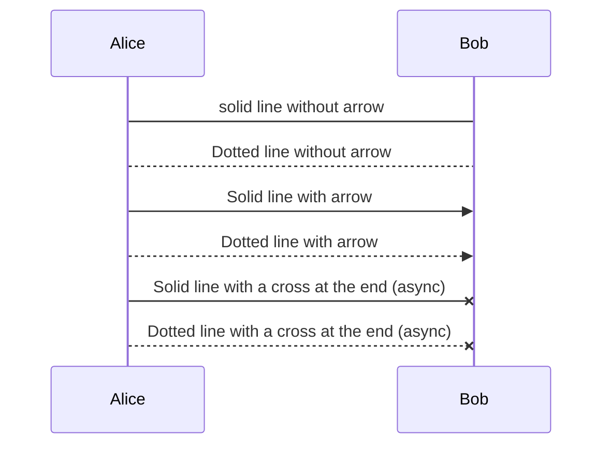
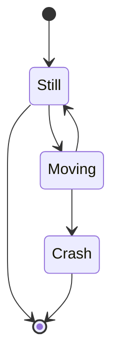
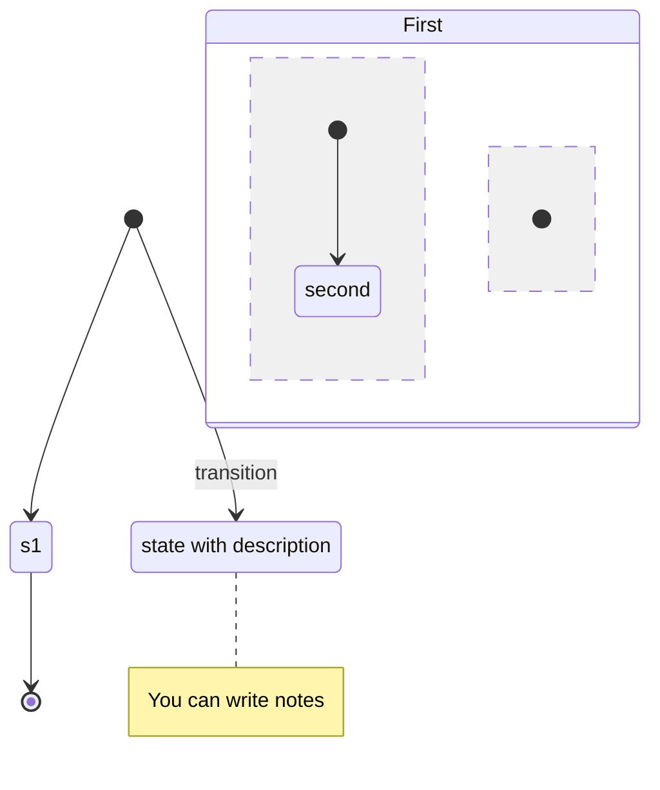

# Mermaid

## Flow Chart

```mermaid
%% 声明图的种类和方向
%% 流程图的方向：TD(top-down), BT(bottom-top), RL(right-left), LR(left-right)
graph LR
    %% 声明节点，id["text"]
    A[rectangle]
    B(rounded rectangle)
    C((round))

    %% 连线
    %% 文档中还说能用A --- B & C的方式连同级节点，但是这个版本的typora渲染不出来
    A --text--> B --- C
    A ==> C
    
    %% 声明的同时连线
    C -.->|text| D>flag]
    C === E{"prism"}  %% 当标签中有特殊字符，如括号时，用双引号
    

    %% 子图
    subgraph one
        F[/parallelogram/] --> G[\parallelogram alt\]
    end
```

## Sequence Diagram



## State Diagram






# flow

```flow
# 定义节点
st=>start: Start
op=>operation: Operation
cond=>condition: Condition
sub=>subroutine: Subroutine
io=>inputoutput: I/O
e=>end

# 连接节点
st->op->cond
cond(yes)->sub->io->e
cond(no)->e
```

