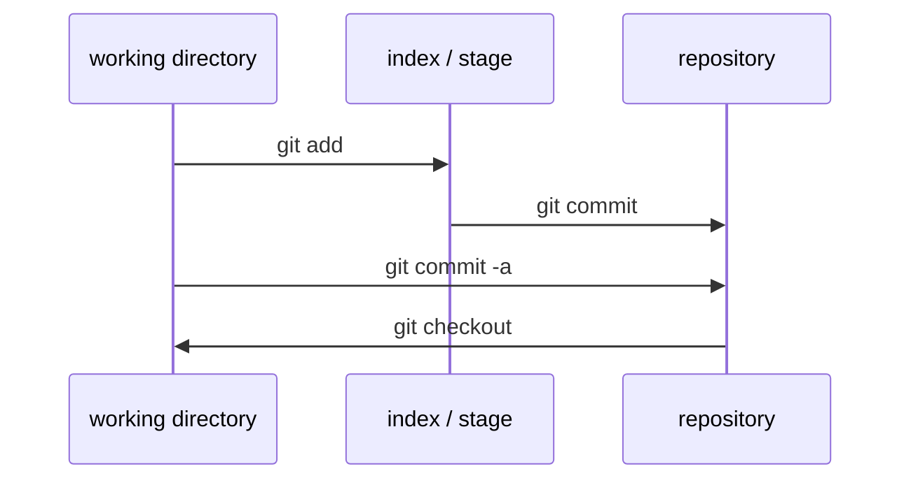
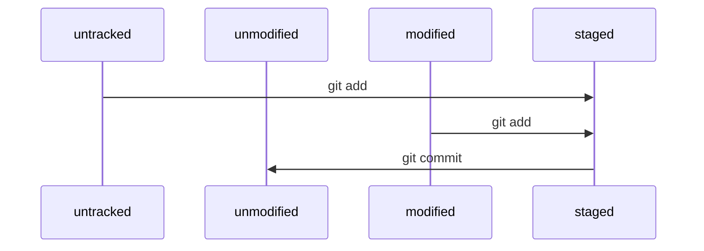

# 基本概念

## 工作区，暂存区和版本库

工作区（working directory）就是我们看见的文件目录；暂存区（index, or stage）标记了下一次要提交的内容，通常在`.git/index`文件夹；版本库（repository）就是`.git`文件夹下的其他东西，包括了所有历史版本和快照。版本库内的内容总是有办法恢复的，但是没有commit的内容可以被弄丢




## 文件状态



## gitignore

`.gitignore`文件规定了不纳入git管理的文件模式。每行是一条规则，使用glob模式（一种简化的正则表达式，包括`*, ?, []`，`**`匹配任意中间目录）递归应用于整个工作区。特别地，以`/`开头防止递归，以`/`结尾指定目录，以`!`开头表示取反

```
#-------------------------------------------------------------------------------
# 文件

# 忽略所有的.txt文件
*.txt

# 忽略根目录的.txt文件，但不忽略其他文件夹的.txt文件
/*.txt

# 忽略a文件夹下的.txt文件，但不忽略a的子文件夹中的.txt文件
a/*.txt

# 跟踪所有的lib.txt，即便你在前面忽略了.txt文件
!lib.txt

#-------------------------------------------------------------------------------
# 文件夹

# 忽略所有名为 build 的文件夹以及它们的子文件夹，但不忽略子目录中的文件
build/

# 忽略 doc/notes.txt，但不忽略 doc/server/arch.txt
doc/*.txt

# 忽略 doc/ 目录及其所有子目录下的 .pdf 文件
doc/**/*.pdf
```

## 分支

git版本库里有三类对象：blob，存储文件快照；tree，记录文件目录结构和若干blob对象索引；commit，记录了提交的元信息、一个tree索引和指向上一次提交的commit索引（合并分支产生的提交，指向多个父commit对象）

分支就是指向commit对象的可变指针，一般用master表示主支

git中有一个特殊指针HEAD，它指向某个分支，标志着当前的分支。当进行提交时，HEAD以及当前分支自动向前移动

# 常用指令

## 获取git仓库

```bash
 # 在当前目录下建立.git子目录，即初始化一个仓库
git init

# 克隆git仓库
# source是仓库地址，比如user@server:path/to/repo.git
git clone <source> [name]
```

## 用户配置

```bash
git config [--global] user.name "name"
git config [--global] user.email "addr@mail.com"

## 文件操作

```bash
# 添加文件/暂存修改
git add <file>

# 移除文件
# 注意，删除文件却不移除不会从git中去除文件；如果有未提交的修改，不能直接移除（防止数据丢失）
git rm <file>

# 移动/重命名
# 相当于移动文件、git rm old、git add new，效果和分开做完全一样
git mv <src> <dest>

# 取消暂存，注意这个操作可能丢弃数据，尽量把全部修改都暂存了再reset
git reset

# 提交修改
git commit
git commit -a        # 提交所有修改（包括未暂存的）
git commit --amend   # 修订提交，将现在暂存区里的更改合并到上一个提交

# 撤销修改到上一次提交
git checkout -- <file>
```

## 检查文件

```bash
# 检查状态（查看modified，staged）
git status

# 查看文件区别
git diff

# 查看提交历史
git log
```

## 远程仓库

```bash
# 查看远程仓库
git remote -v             # 查看远程仓库表
git remote show <remote>  # 查看一个远程仓库的信息

# 添加、移除远程仓库
git remote add <remote> <url>
git remote remove <remote>

# 重命名远程仓库
git remote rename <old> <new>

# 从远程仓库抓取
git fetch <remote>

# 从远程仓库拉取
git pull

# 推送到远程仓库
git push <remote> [branch]
```

## 标签

git有两种标签，轻量标签（lightweight）与附注标签（annotated），前者是一次提交的别名，后者可以包含各种信息，如打标签者的名字、邮箱、时间等

```bash
# 查看标签
git tag [--list pattern]
git show <tag>

# 创建标签（注意默认的push不会把标签push到远程仓库）
git tag [-a -m <message>] <tag> [commit]

# 删除标签
git tag -d <tag>
```

## 分支

```bash
# 查看分支
git branch [-v]

# 创建分支
git branch <branch>

# 切换分支
git checkout <branch>

# 创建同时切换
git checkout -b <branch>

# 合并分支（将目标分支合并到当前分支）
git merge <branch>

# 删除分支
git merge -d <branch>
```

